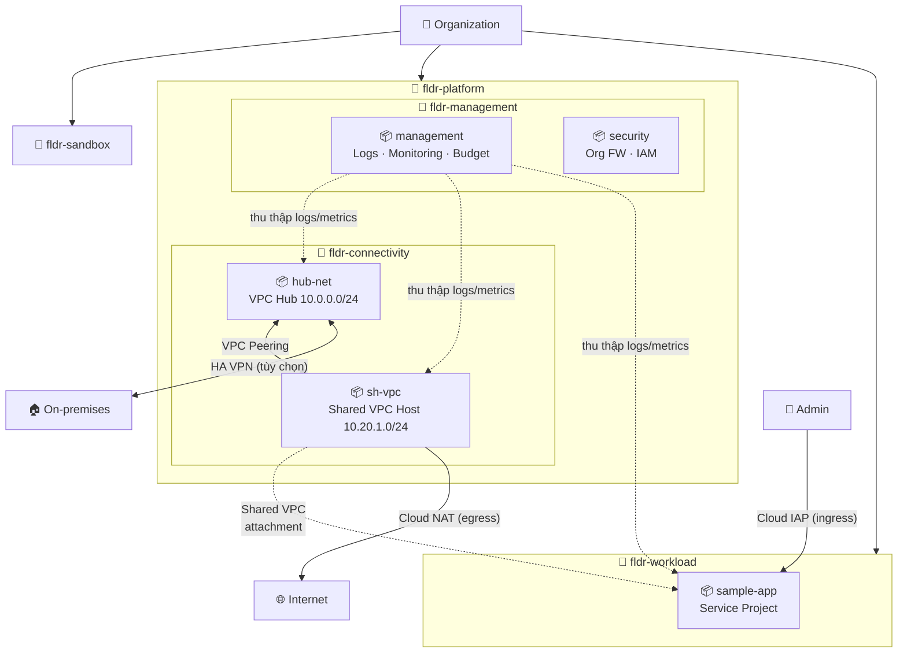
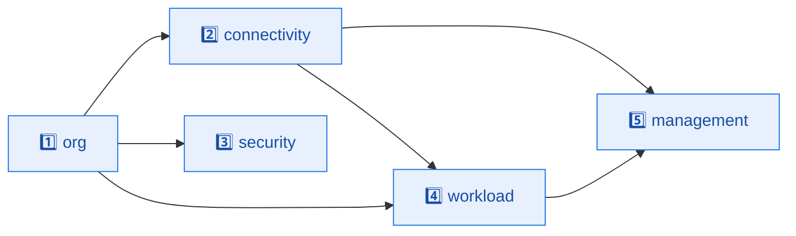

<div align="center">

# 🌌 Enterprise Google Cloud Landing Zone

### *Bộ khung hạ tầng (IaC) cấp Doanh nghiệp trên Google Cloud — chuẩn hóa, an toàn, sẵn sàng Production*

<br>

[](https://www.terraform.io/)
[](https://cloud.google.com/)
[](https://cloud.google.com/about/locations)
<br>

🏗️ **Hub-and-Spoke Network** &nbsp;•&nbsp; 🔐 **Zero-Key Impersonation** &nbsp;•&nbsp; 📊 **Centralized Observability**

<br>

> *Một câu lệnh `terraform apply` — một nền móng Cloud an toàn, có quản trị, sẵn sàng cho Day-2 Operations.*

</div>

---

## 📌 Mục lục

- [💡 Giới thiệu dự án](#-giới-thiệu-dự-án)
- [🎯 Đối tượng & kịch bản áp dụng](#-đối-tượng--kịch-bản-áp-dụng)
- [⚡ Tổng quan nhanh](#-tổng-quan-nhanh)
- [🗺️ Sơ đồ kiến trúc tổng thể](#️-sơ-đồ-kiến-trúc-tổng-thể)
- [🧱 Kiến trúc 5 lớp Stack](#-kiến-trúc-5-lớp-stack)
- [✨ Tính năng nổi bật](#-tính-năng-nổi-bật)
- [🛠️ Công nghệ sử dụng](#️-công-nghệ-sử-dụng)
- [📂 Cấu trúc thư mục](#-cấu-trúc-thư-mục)
- [📖 Bản đồ tài liệu & hướng dẫn](#-bản-đồ-tài-liệu--hướng-dẫn-navigation)
- [🤝 Lời ngỏ & đóng góp cộng đồng](#-lời-ngỏ--đóng-góp-cộng-đồng)

---

## 💡 Giới thiệu dự án

**GCP Enterprise Landing Zone** là một dự án cá nhân mã nguồn mở, cung cấp một **bộ khung hạ tầng nền móng (foundation)** chuẩn hóa cấp độ Doanh nghiệp trên nền tảng Google Cloud, được xây dựng hoàn toàn bằng **Terraform** theo phương pháp Infrastructure as Code (IaC) khai báo 100%.

Trong thực tế, hầu hết các doanh nghiệp khi bắt đầu hành trình lên Cloud đều mắc chung một sai lầm: **vội vàng tạo project và triển khai ứng dụng trước, rồi mới nghĩ đến quản trị và bảo mật sau**. Hệ quả là một mớ hỗn độn không thể kiểm soát — project mọc lên tự phát, dải IP chồng lấn, quyền truy cập (IAM) bị cấp tràn lan, nhật ký nằm rải rác khắp nơi và chi phí thì vượt tầm kiểm soát. Việc dọn dẹp "món nợ kỹ thuật" này về sau tốn kém gấp nhiều lần so với việc làm đúng ngay từ đầu.

Dự án này ra đời để giải quyết tận gốc bài toán đó. Thay vì để mỗi đội nhóm tự xoay xở, nó thiết lập sẵn một **"trạm hạ cánh" (Landing Zone)** — một môi trường đã được quy hoạch chặt chẽ về mạng, danh tính, bảo mật, giám sát và tài chính — để các đội ứng dụng chỉ việc "hạ cánh" workload của mình vào một nền tảng an toàn, có lan can bảo vệ (guardrails) sẵn sàng, mà không cần bận tâm tới sự phức tạp của routing, VPN hay chính sách bảo mật phía dưới.

Toàn bộ hạ tầng được phân rã thành **5 lớp stack độc lập** (org, connectivity, security, workload, management), mỗi lớp sở hữu một tài khoản Terraform Runner riêng và một prefix state file riêng biệt — giúp **cô lập bán kính ảnh hưởng (blast radius)**: một sai sót ở lớp này không thể làm sập lớp khác. Đây chính là tư duy thiết kế của **Google Cloud Architecture Framework** được hiện thực hóa thành mã nguồn có thể tái sử dụng.

### 🎯 Những bài toán dự án giải quyết

| Vấn đề nhức nhối khi lên Cloud "tự phát" | Cách Landing Zone xử lý |
|------------------------------------------|--------------------------|
| 🔓 **IAM mất kiểm soát** — quyền cấp tùy tiện, dùng key JSON tĩnh dễ rò rỉ | Mô hình **Impersonation không key tĩnh** + Org Policy chặn tạo SA Key |
| 🌐 **IP chồng lấn** giữa các phòng ban, xung đột khi nối VPN về on-prem | Quy hoạch **CIDR tập trung** theo mô hình Hub-and-Spoke + Shared VPC |
| 📦 **Project lộn xộn**, không tách được chi phí, đặt tên tùy hứng | **Project Factory** + cây Folder chuẩn hóa + tách Billing Account |
| 📉 **Logs rải rác**, khó audit, chi tiêu vượt trần không ai biết | **Log Sinks tập trung** + Log Views phân quyền + Budget cảnh báo |
| 🚪 **Phơi bày bề mặt tấn công** — VM gắn IP Public, mở SSH ra Internet | **Org Policy chặn IP Public** + Cloud NAT (egress) + Cloud IAP (ingress) |

---

## 🎯 Đối tượng & Kịch bản áp dụng

Kiến trúc phân rã trách nhiệm (Separation of Duties) trong dự án hướng đến các vai trò thực tiễn:

1. **Cloud & Platform Infrastructure Team**:
   - Sử dụng để khởi dựng nhanh môi trường đáp ứng yêu cầu vận hành chung (Shared Services) của toàn bộ doanh nghiệp.
   - Bàn giao hạ tầng mạng sạch sẽ cho các App Team phát triển mà không sợ bị ảnh hưởng chéo.
2. **Security & Compliance Auditors**:
   - Kiểm soát tự động an toàn thông tin thông qua hệ thống chính sách **Organization Policies** áp từ trên xuống (luôn bật Secure Boot, bắt buộc Uniform Bucket Level Access, chặn IP Public, chặn tạo SA Key tĩnh).
3. **Application Development Team**:
   - Thừa hưởng dải mạng con (Subnets) được phân chia an toàn thông qua cơ chế **Shared VPC Host-Service** để tạo VM/workload chạy ứng dụng mà không cần biết cấu hình routing/VPN phức tạp phía sau.

---

## ⚡ Tổng quan nhanh

<div align="center">

| Hạng mục | Giá trị |
|:---------|:--------|
| 🌍 **Vùng triển khai** | `asia-southeast1` (Singapore) |
| 🧱 **Số lớp stack** | 5 stack độc lập (org · connectivity · security · workload · management) |
| 📦 **Số project khởi tạo** | 5 project qua Project Factory (sinh ID ngẫu nhiên) |
| 🌐 **Mô hình mạng** | Hub-and-Spoke · 2 VPC custom-mode · VPC Peering 2 chiều |
| 🔐 **Cơ chế xác thực** | Service Account Impersonation (zero static key) |
| 🛡️ **Guardrails** | 7 Organization Policies bắt buộc |
| 📊 **Giám sát** | 3 Log Sinks · Log Views · 3 Alert Policies · 2 Dashboards · Budget |
| 🔧 **Terraform** | `>= 1.14.6` |
| ☁️ **Google Provider** | `6.50.0` (+ google-beta · time · random) |

</div>

---

## 🗺️ Sơ đồ kiến trúc tổng thể



> 💡 Truy cập quản trị đi qua **Cloud IAP** (không cần Bastion Host, không cần IP Public); chiều ra Internet đi qua **Cloud NAT**. Kết nối lai (Hybrid) tới Datacenter on-prem qua **HA VPN** được bật tùy chọn khi khai báo IP/secret.

---

## 🧱 Kiến trúc 5 lớp Stack

Mỗi stack là một thư mục Terraform **độc lập hoàn toàn** — có backend state riêng, Runner SA riêng và được apply theo thứ tự phụ thuộc. Việc tách lớp giúp cô lập rủi ro và cho phép các đội khác nhau vận hành song song mà không giẫm chân nhau.

| # | Stack | Vai trò chính | Thành phần tiêu biểu |
|:-:|:------|:--------------|:---------------------|
| 1️⃣ | [`org/`](org/) | **Nền móng tổ chức** | Cây Folder, Project Factory (5 project), 7 Org Policies guardrails |
| 2️⃣ | [`connectivity/`](connectivity/) | **Mạng Hub-and-Spoke** | 2 VPC, Shared VPC, Peering, Cloud NAT, DNS nội bộ, HA VPN |
| 3️⃣ | [`security/`](security/) | **Bảo mật & phân quyền** | Org Firewall Policies, IAM cho admin, IAP & Log View access |
| 4️⃣ | [`workload/`](workload/) | **Tài nguyên ứng dụng** | VM/workload mẫu gắn vào Shared VPC (sample-app) |
| 5️⃣ | [`management/`](management/) | **Quan trắc & tài chính** | Log Sinks, Log Views, Dashboards, Alert Policies, Budget |



---

## ✨ Tính năng nổi bật

<table>
<tr>
<td width="50%" valign="top">

### 🔐 Bảo mật & Danh tính
- **Zero-Key Impersonation** — không có file SA Key JSON tĩnh nào được ghi ra đĩa hay đẩy lên git
- **7 Organization Policies** bắt buộc: chặn IP Public, bắt buộc Shielded VM & OS Login, cấm tạo SA Key, ép Uniform Bucket Level Access, khóa vùng triển khai
- **Separation of Duties** — 5 Runner SA tách biệt, mỗi đội chỉ chạm được stack của mình
- **State Isolation** — mỗi SA chỉ ghi được đúng prefix state của mình

</td>
<td width="50%" valign="top">

### 🌐 Mạng & Kết nối
- **Hub-and-Spoke** với 2 VPC custom-mode + VPC Peering 2 chiều
- **Shared VPC** tách Host/Service — App Team dùng subnet mà không cần biết routing
- **Cloud NAT** cho egress, **Cloud IAP** cho ingress — không phơi bày IP Public
- **HA VPN** kết nối Hybrid về on-premises (bật tùy chọn) + **DNS nội bộ** private zone

</td>
</tr>
<tr>
<td width="50%" valign="top">

### 📊 Quan trắc & Vận hành
- **Log Sinks tập trung** — 3 sink gom logs toàn Org về Management project
- **Hot/Cold tiering** — Log Bucket nóng 90 ngày + GCS Archive lạnh 365 ngày
- **Log Views phân quyền** — đọc logs theo từng project nguồn
- **Alert + Budget** — cảnh báo CPU/RAM/Disk và chi tiêu vượt ngưỡng qua email

</td>
<td width="50%" valign="top">

### 🧩 Trải nghiệm IaC
- **100% khai báo** — toàn bộ hạ tầng tái lập được từ mã nguồn
- **5 stack độc lập** — cô lập blast radius, apply song song
- **Project Factory** — sinh project chuẩn hóa, tự gắn Billing & Folder
- **Script bootstrap** — tự động hóa khởi tạo SA & phân quyền chỉ với vài lệnh

</td>
</tr>
</table>

---

## 🛠️ Công nghệ sử dụng

| Lĩnh vực | Công nghệ / Dịch vụ |
|:---------|:--------------------|
| **IaC & Tooling** | Terraform `1.14.6`, Google Cloud SDK (`gcloud`), Bash scripts |
| **Providers** | `hashicorp/google 6.50.0`, `google-beta 6.50.0`, `time 0.14.0`, `random 3.9.0` |
| **Tổ chức & Quản trị** | Resource Manager (Folders/Projects), Project Factory, Organization Policies |
| **Mạng** | VPC, Shared VPC, VPC Peering, Cloud Router, Cloud NAT, HA VPN, Cloud DNS |
| **Bảo mật** | IAM, Service Account Impersonation, Org Firewall Policies, Cloud IAP |
| **Quan trắc** | Cloud Logging (Sinks/Buckets/Views), Cloud Monitoring, Dashboards, Billing Budgets |
| **State Backend** | Google Cloud Storage (GCS) với Object Versioning + khóa IAM theo prefix |

---

## 📂 Cấu trúc thư mục

```text
landing-zone/
├── 📁 org/             # Layer 1 — Folders, Projects, Org Policies
├── 📁 connectivity/    # Layer 2 — VPC, Shared VPC, NAT, DNS, VPN, Peering
├── 📁 security/        # Layer 3 — Org Firewall, IAM, IAP/Log View access
├── 📁 workload/        # Layer 4 — VM/workload gắn Shared VPC
├── 📁 management/      # Layer 5 — Log Sinks, Views, Dashboards, Budget
├── 📁 scripts/         # Bootstrap: tạo Seed Project, Runner SA, phân quyền
│   ├── config.sh       #   → biến môi trường (bạn điền)
│   ├── roles.sh        #   → bảng phân quyền (thêm/bớt role tại đây)
│   ├── lib.sh          #   → hàm trợ giúp gcloud
│   └── 01/02/03-*.sh   #   → các script chạy chính
├── 📁 docs/            # Tài liệu chuyên sâu (kiến trúc, IAM, triển khai, Day-2)
└── 📄 README.md        # Tài liệu tổng quan (bạn đang đọc)
```

---

## 📖 Bản đồ Tài liệu & Hướng dẫn (Navigation)

Để xem hướng dẫn chi tiết về từng mảng kỹ thuật cụ thể trong dự án, vui lòng truy cập các liên kết chuyên đề dưới đây:

| Tài liệu | Nội dung |
|:---------|:---------|
| **[🌐 Thiết kế Kiến trúc Mạng & Topology](docs/architecture.md)** | Cấu trúc cây Folder, sơ đồ Hub-and-Spoke, quy hoạch dải IP CIDR và firewall cấp cao |
| **[🔑 Quản lý Danh tính & IAM Security](docs/iam-roles.md)** | Mô hình Impersonation, quyền của 5 SA Runner và cơ chế khóa prefix State bucket |
| **[🚀 Cẩm nang Triển khai Từng Bước](docs/deployment.md)** | Hướng dẫn từng lệnh từ bootstrap ban đầu đến thứ tự apply hạ tầng |
| **[🛠️ Vận hành & Checklist Day-2](docs/day2-ops.md)** | Xoay vòng, mở rộng hạ tầng (thêm project/subnet) và checklist trước Production |

---

## 🤝 Lời ngỏ & Đóng góp cộng đồng

Mình xây dựng dự án này với mong muốn chia sẻ những kiến thức thực tế về kiến trúc hạ tầng GCP và các best practices trong vận hành IaC ở quy mô doanh nghiệp. Đây là nơi mình đúc kết lại cách tổ chức một Landing Zone bài bản — từ phân lớp stack, quản trị danh tính, quy hoạch mạng cho tới giám sát và kiểm soát chi phí.

Toàn bộ hạ tầng và tệp cấu hình đã được rà soát, dọn dẹp gọn gàng và kiểm thử cú pháp cẩn thận. Dù vậy, không có thiết kế nào là hoàn hảo — vì thế mọi góp ý, phản hồi hay đề xuất cải tiến từ cộng đồng đều rất được hoan nghênh:

- **Gửi phản hồi**: Mở [Issues](https://github.com/) để báo lỗi hoặc cùng thảo luận về kiến trúc.
- **Đóng góp mã nguồn**: Gửi Pull Request (PR) để tối ưu mã nguồn hoặc mở rộng tính năng.
- **Ủng hộ**: Nếu bộ khung Landing Zone này giúp ích cho công việc hoặc việc học của bạn, hãy tặng dự án một ⭐️ trên GitHub nhé!
