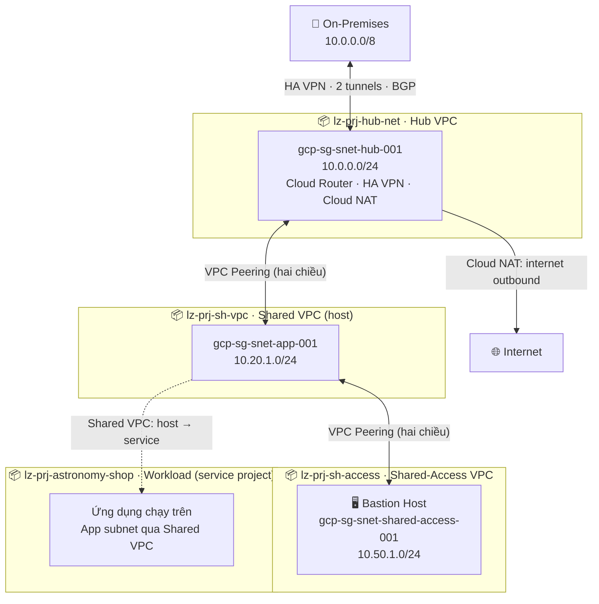
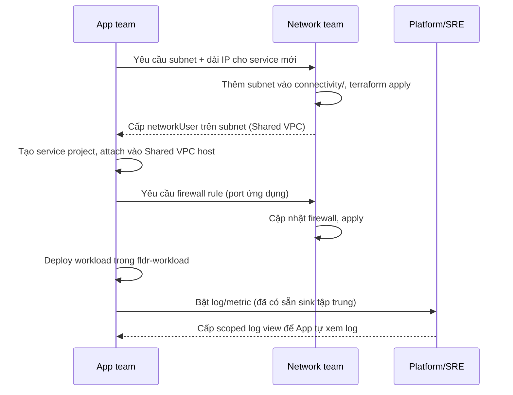
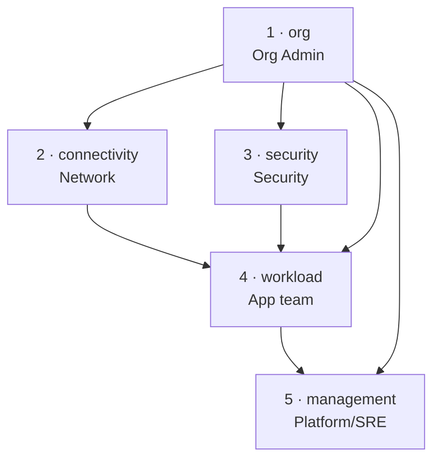

<div align="center">

# ☁️ GCP Landing Zone — Terraform

**Nền tảng Google Cloud cấp doanh nghiệp, dựng bằng Infrastructure as Code**

Mô hình mạng **Hub-and-Spoke** · Kiến trúc **layered-stack** · Khu vực **`asia-southeast1` (Singapore)**


</div>

---

## 📑 Mục lục

1. [Landing Zone là gì & vì sao cần?](#1-landing-zone-là-gì--vì-sao-cần)
2. [Bức tranh tổng thể](#2-bức-tranh-tổng-thể)
3. [Quyền sở hữu theo đội nhóm (Ownership)](#3-quyền-sở-hữu-theo-đội-nhóm-ownership)
4. [Các kịch bản phối hợp giữa các team](#4-các-kịch-bản-phối-hợp-giữa-các-team)
5. [Kiến trúc source code](#5-kiến-trúc-source-code)
6. [Hướng dẫn sử dụng](#6-hướng-dẫn-sử-dụng)
7. [Lưu ý & vận hành về sau](#7-lưu-ý--vận-hành-về-sau)
8. [Tech Stack](#8-tech-stack)

---

## 1. Landing Zone là gì & vì sao cần?

<details open>
<summary><b>▸ Nhấn để mở rộng / rút gọn</b></summary>

> **Landing Zone** là nền móng (*foundation*) được chuẩn hóa để vận hành workload trên Google Cloud một cách **an toàn — có quản trị — mở rộng được**, ngay từ ngày đầu tiên.

Khi một tổ chức bắt đầu lên cloud mà không có Landing Zone, mỗi đội tự tạo project, tự dựng VPC, tự cấp quyền… dẫn đến mạng chồng dải IP, quyền cấp tràn lan, không có log tập trung, chi phí mất kiểm soát. Landing Zone giải quyết tận gốc bằng cách **thiết lập sẵn khung tổ chức, mạng, bảo mật và giám sát** theo best practice — để các đội ứng dụng chỉ việc "hạ cánh" workload vào một môi trường đã an toàn.

### Giá trị cốt lõi

| 🎯 Vấn đề khi không có Landing Zone | ✅ Landing Zone này giải quyết |
|---|---|
| Project tạo lộn xộn, không phân tầng | Phân cấp **folder** rõ ràng + **project factory** đặt tên nhất quán |
| Mạng chồng IP, không kiểm soát luồng | **Hub-and-Spoke**, Shared VPC, peering, dải IP quy hoạch sẵn |
| Ai cũng có quyền, không least-privilege | **Service account riêng từng project** + org policies bắt buộc |
| Lộ máy ra internet, SSH tùy tiện | Cấm external IP toàn org, truy cập qua **Bastion / IAP** |
| Không biết ai làm gì, log rải rác | **Logging tập trung** (hot + cold archive) + scoped log view |
| Chi phí "vỡ trận" cuối tháng | **Budget alert** nhiều ngưỡng + dashboards giám sát |

### Dành cho ai?

- **Đội Platform / Cloud Engineering** cần dựng nhanh một nền tảng tuân thủ quản trị.
- **Đội ứng dụng (App teams)** muốn triển khai workload mà không phải lo hạ tầng mạng/bảo mật.
- **Đội Security & Compliance** cần một môi trường có guardrails (org policies) thực thi tự động.
- Làm **reference architecture** để nhân rộng cho nhiều môi trường/dự án khác.

</details>

---

## 2. Bức tranh tổng thể

<details open>
<summary><b>▸ Nhấn để mở rộng / rút gọn</b></summary>

### 2.1 Kiến trúc tổ chức (folder & project)

```
Organization
│
├── 📁 fldr-platform                      ← Hạ tầng dùng chung (Platform team sở hữu)
│   │
│   ├── 📁 fldr-management
│   │   ├── 📦 gcp-platform-management    Log buckets · Monitoring · Dashboards · Budget
│   │   └── 📦 gcp-platform-security      KMS · Secret Manager · Security Command Center
│   │
│   └── 📁 fldr-connectivity
│       ├── 📦 lz-prj-hub-net             Hub VPC · Cloud Router · HA VPN · Cloud NAT
│       ├── 📦 lz-prj-sh-vpc              Shared VPC host project
│       └── 📦 lz-prj-sh-access           Shared-Access VPC · Bastion Host
│
├── 📁 fldr-workload                      ← Workload sản xuất (App teams sở hữu)
│   └── 📦 lz-prj-astronomy-shop          Ứng dụng mẫu, dùng Shared VPC
│
└── 📁 fldr-sandbox                       ← Thử nghiệm (hiện để trống — dự phòng)
```

> **💡 Vì sao `lz-prj-sh-access` nằm trong `fldr-connectivity`?**
> `lz-prj-sh-access` chứa **Shared-Access VPC + Bastion Host** — đây là thành phần **hạ tầng mạng**, nên nó được xếp cùng nhóm với `lz-prj-hub-net` và `lz-prj-sh-vpc` trong `fldr-connectivity` (xem [org/projects.tf](org/projects.tf#L88)). Folder `fldr-sandbox` được tạo sẵn nhưng **hiện chưa chứa project nào**, dành cho nhu cầu thử nghiệm về sau.

### 2.2 Sơ đồ network topology



| Subnet | CIDR | VPC | Project | Mục đích |
|--------|------|-----|---------|----------|
| `gcp-sg-snet-hub-001` | `10.0.0.0/24` | Hub | `lz-prj-hub-net` | VPN termination · Router · NAT |
| `gcp-sg-snet-app-001` | `10.20.1.0/24` | Shared | `lz-prj-sh-vpc` | Workload (qua Shared VPC) |
| `gcp-sg-snet-shared-access-001` | `10.50.1.0/24` | Shared-Access | `lz-prj-sh-access` | Bastion Host |

**Luồng chính:**
- 🔗 **On-prem ↔ Hub:** HA VPN 2 tunnel chạy BGP, là điểm kết cuối duy nhất cho kết nối lai.
- 🔁 **Hub ↔ Shared / Shared ↔ Shared-Access:** VPC Peering hai chiều — Hub đóng vai trò transit, mọi spoke đi qua Hub để tới on-prem.
- 🏠 **Shared VPC:** `lz-prj-sh-vpc` là host, `lz-prj-astronomy-shop` mượn subnet `10.20.1.0/24` để chạy workload mà không cần tự quản mạng.
- 🌐 **Cloud NAT:** workload ra internet qua NAT ở Hub, **không** cần public IP.

</details>

---

## 3. Quyền sở hữu theo đội nhóm (Ownership)

<details open>
<summary><b>▸ Nhấn để mở rộng / rút gọn</b></summary>

Landing Zone được thiết kế để **nhiều đội cùng vận hành mà không giẫm chân nhau**. Mỗi folder/stack có một **đội chủ quản (owner)** chịu trách nhiệm thay đổi, các đội khác chỉ có quyền ở mức cần thiết (least privilege).

### 3.1 Bản đồ phân quyền theo folder

| Folder / Phạm vi | Đội chủ quản | Vai trò chính | Quyền tiêu biểu |
|------------------|--------------|----------------|------------------|
| 🏢 **Organization** (gốc) | **Cloud Foundation / Org Admin** | Tạo folder, project, áp org policy, gán billing | `organizationAdmin`, `folderAdmin`, `billing.admin`, `compute.xpnAdmin` |
| 📁 **fldr-connectivity** | **Network team** | Quản VPC, subnet, peering, NAT, VPN, DNS, Bastion | `compute.networkAdmin`, `dns.admin` |
| 📁 **fldr-management** | **Platform / SRE team** | Logging, monitoring, dashboards, budget | `logging.admin`, `monitoring.admin`, `billing.viewer` |
| 📁 **fldr-management → security** | **Security team** | KMS, Secret Manager, Security Command Center | `cloudkms.admin`, `secretmanager.admin`, `securitycenter.admin` |
| 📁 **fldr-workload** | **App / Product teams** | Triển khai & vận hành ứng dụng trên Shared VPC | `compute.instanceAdmin`, `compute.networkUser`, `logging.logWriter` |
| 📁 **fldr-sandbox** | **Mọi đội (tự phục vụ)** | Thử nghiệm, không ràng buộc production | quyền rộng hơn trong phạm vi cô lập |

### 3.2 Service account vận hành (least privilege)

Mỗi project có một service account riêng, chỉ giữ đúng quyền cần thiết — định nghĩa tại [security/iam.tf](security/iam.tf):

| Service Account | Thuộc project | Quyền | Đội phụ trách |
|-----------------|---------------|-------|----------------|
| `gcp-sg-sa-hub-net-001` | hub-net | `compute.networkAdmin`, `dns.admin`, `compute.xpnAdmin` (org) | Network |
| `gcp-sg-sa-sh-vpc-001` | sh-vpc | `compute.networkAdmin` | Network |
| `gcp-sg-sa-sh-access-001` | sh-access | `monitoring.metricWriter`, `logging.logWriter` | Network / Platform |
| `gcp-sg-sa-astronomy-shop-001` | astronomy-shop | `monitoring.metricWriter`, `logging.logWriter` | App team |

> **⚠️ Hiện trạng triển khai:** Để đơn giản hóa demo, IAM cấp người dùng hiện gán toàn bộ vai trò org-level cho **một** principal (`var.user_email` trong [security/iam.tf](security/iam.tf)). **Trong môi trường thật**, hãy thay bằng **Google Groups theo đội** (vd `grp-network-admins@`, `grp-platform-sre@`, `grp-security@`, `grp-app-astronomy@`) và gán vai trò ở **cấp folder** thay vì cấp org, theo đúng bảng phân quyền ở mục 3.1. Đây là thay đổi nên thực hiện trước khi đưa lên production.

### 3.3 Ma trận RACI (ai làm gì khi thay đổi)

> **R**esponsible (thực thi) · **A**ccountable (chịu trách nhiệm cuối) · **C**onsulted (tham vấn) · **I**nformed (được thông báo)

| Hành động | Org Admin | Network | Platform/SRE | Security | App team |
|-----------|:--------:|:-------:|:------------:|:--------:|:--------:|
| Tạo folder / project mới | **A/R** | C | C | C | I |
| Sửa org policy (guardrails) | A | C | C | **R** | I |
| Thay đổi VPC / subnet / peering | I | **A/R** | C | C | I |
| Mở firewall cho ứng dụng | I | **A/R** | I | C | **C** |
| Cấp dải IP cho workload mới | I | **A/R** | I | I | C |
| Triển khai / cập nhật ứng dụng | I | I | C | I | **A/R** |
| Thay đổi cấu hình logging/monitoring | I | I | **A/R** | C | I |
| Quản lý secret / KMS key | I | I | C | **A/R** | C |
| Điều chỉnh ngân sách (budget) | A | I | **R** | I | C |

</details>

---

## 4. Các kịch bản phối hợp giữa các team

<details open>
<summary><b>▸ Nhấn để mở rộng / rút gọn</b></summary>

Dưới đây là những luồng làm việc thực tế thường gặp, cho thấy Landing Zone giúp các đội phối hợp **trơn tru và an toàn** ra sao.

### 🟢 Kịch bản A — App team triển khai workload mới



**Điểm mấu chốt:** App team **không** được trực tiếp sửa mạng. Họ yêu cầu Network team — đảm bảo dải IP và firewall luôn được kiểm soát tập trung.

### 🟠 Kịch bản B — Truy cập vận hành qua Bastion (không lộ máy ra internet)

Org policy **cấm external IP toàn org**; chỉ Bastion Host được ngoại lệ (xem [org/org-policies.tf](org/org-policies.tf)).

1. Kỹ sư đăng nhập Bastion qua **IAP / OS Login** (không cần VPN cá nhân).
2. Từ Bastion (trong Shared-Access VPC, peering tới Shared VPC), truy cập nội bộ tới workload.
3. Mọi phiên truy cập đều đi qua **OS Login** → có danh tính, có log → Security team audit được.

> Network team sở hữu Bastion; Security team định nghĩa ai được cấp `osLogin`; App team là người dùng cuối.

### 🔵 Kịch bản C — Kết nối lai (Hybrid) về on-premises

1. **Network team** bật HA VPN trong [connectivity/vpns.tf](connectivity/vpns.tf) bằng cách điền tham số trong `connectivity/terraform.tfvars`.
2. **Security team** cung cấp/duyệt `vpn_shared_secret_*` qua Secret Manager (không commit).
3. Hai tunnel BGP thiết lập tới on-prem; route lan tỏa qua Hub VPC tới các spoke.
4. **App team** workload truy cập được tài nguyên on-prem mà không cần cấu hình gì thêm.

### 🟣 Kịch bản D — Siết guardrail / phản ứng sự cố bảo mật

1. **Security team** phát hiện rủi ro (vd: cần chặn thêm một loại tài nguyên).
2. Security cập nhật **org policy** trong [org/org-policies.tf](org/org-policies.tf), chạy `plan`, **tham vấn** Network/App về tác động.
3. Org Admin duyệt & apply ở stack `org`.
4. Thay đổi có hiệu lực toàn org tức thì; các đội được **thông báo (Informed)** qua kênh chung.

### 🟡 Kịch bản E — Kiểm soát chi phí

1. **Platform/SRE** theo dõi dashboard chi phí và budget alert ($100/tháng, ngưỡng 50/80/100% + forecast).
2. Khi gần ngưỡng, SRE rà soát theo project (mỗi project có label `stack`/`environment`).
3. SRE phối hợp App team tối ưu tài nguyên; báo cáo Org Admin nếu cần nâng ngân sách.

</details>

---

## 5. Kiến trúc source code

<details open>
<summary><b>▸ Nhấn để mở rộng / rút gọn</b></summary>

Source code chia thành **5 Terraform stack độc lập**, mỗi stack có **GCS remote state backend riêng**. Cách chia này giảm *blast radius*, cho phép từng đội apply tầng của mình độc lập, và phân quyền theo tầng.

### 5.1 Bố cục các stack

| # | Stack | Thư mục | Đội chủ quản | Mô tả |
|---|-------|---------|--------------|-------|
| 1 | **org** | `org/` | Org Admin | Phân cấp folder, project factory, org policies |
| 2 | **connectivity** | `connectivity/` | Network | VPC, subnet, peering, NAT, HA VPN, DNS, firewall |
| 3 | **security** | `security/` | Security | IAM, service account, hierarchical firewall policy |
| 4 | **workload** | `workload/` | App team | Bastion VM + workload mẫu |
| 5 | **management** | `management/` | Platform/SRE | Logging, monitoring, dashboards, budget |

> Stack 2 (`connectivity`) và stack 3 (`security`) độc lập nhau → có thể apply **song song**.

### 5.2 Phụ thuộc giữa các stack



Dữ liệu chia sẻ giữa các stack qua data source `terraform_remote_state` (xem `remote.tf` trong mỗi stack).

### 5.3 Cấu trúc thư mục

```
landing-zone/
├── org/                  # 🏢 Folder hierarchy, projects, org policies
│   ├── folders.tf            Phân cấp folder
│   ├── projects.tf           Project factory (toàn bộ project)
│   ├── org-policies.tf       Guardrails toàn org
│   ├── providers.tf · backend.tf · outputs.tf · variables.tf · terraform.tfvars
│
├── connectivity/         # 🌐 VPC, subnet, peering, NAT, VPN, DNS, firewall
│   ├── vpcs.tf · subnets.tf · shared-vpc.tf
│   ├── peering.tf · routers.tf · nats.tf · vpns.tf
│   ├── firewalls.tf · dns.tf · addresses.tf
│   └── remote.tf · ...
│
├── security/             # 🔐 IAM, service accounts, org firewall policy
│   ├── iam.tf · org-fw-policies.tf
│   └── remote.tf · ...
│
├── workload/             # 🚀 Workload mẫu (Bastion VM)
│   ├── vms.tf
│   └── remote.tf · ...
│
└── management/           # 📊 Logging, monitoring, dashboards, budget
    ├── log-export.tf · log-views.tf
    ├── monitoring.tf · dashboards.tf · budget.tf
    └── remote.tf · ...
```

### 5.4 Chi tiết các thành phần — "soi" từng module

> Mỗi khối dưới đây mô tả **chính xác những resource có thật trong code**, đặt cạnh **vai trò** và **lý do thiết kế**, để bạn không phải mở file `.tf` mới hiểu.

<details>
<summary><b>🏢 Module 1 — org/ · Nền tảng tổ chức & guardrails</b></summary>

**Mục tiêu:** dựng bộ khung tổ chức và "hàng rào" (guardrails) bắt buộc, áp **trước tiên** để mọi thứ tạo sau đều tuân thủ.

**📁 [org/folders.tf](org/folders.tf) — Phân cấp folder (module `terraform-google-modules/folders` 5.1.0)**

| Cấp | Folder | Cha | Vai trò |
|-----|--------|-----|---------|
| L1 | `fldr-platform` | Organization | Hạ tầng dùng chung |
| L1 | `fldr-workload` | Organization | Workload sản xuất |
| L1 | `fldr-sandbox` | Organization | Thử nghiệm (đang trống) |
| L2 | `fldr-management` | `fldr-platform` | Logging, monitoring, security tooling |
| L2 | `fldr-connectivity` | `fldr-platform` | Mạng + bastion |

**📦 [org/projects.tf](org/projects.tf) — Project factory (module `project-factory` 17.1.0)**

Mỗi project chỉ bật đúng API cần dùng (`activate_apis`), gắn label (`managed_by`, `environment`, `stack`, `created_date` theo giờ +7), và `deletion_policy`:

| Project | Folder | Bật API tiêu biểu | Ghi chú |
|---------|--------|-------------------|---------|
| `lz-prj-hub-net` | connectivity | compute, orgpolicy | Hub VPC + VPN/NAT |
| `lz-prj-sh-vpc` | connectivity | compute | Shared VPC host |
| `lz-prj-sh-access` | connectivity | compute, **oslogin**, orgpolicy | Bastion + ngoại lệ chính sách |
| `lz-prj-astronomy-shop` | workload | compute | Service project |
| `gcp-platform-management` | management | logging, monitoring, bigquery, pubsub, storage, **billingbudgets** | Ops hub (random id) |
| `gcp-platform-security` | management | **cloudkms**, **secretmanager**, **securitycenter**, pubsub | Security tooling (random id) |

> Project ID dùng hậu tố ngẫu nhiên 4 ký tự (`random_string`) để duy nhất toàn cục.

**🛡️ [org/org-policies.tf](org/org-policies.tf) — 7 org policy + 2 ngoại lệ cấp project**

| Org policy (constraint) | Hiệu lực | Ngoại lệ |
|--------------------------|----------|----------|
| `compute.requireOsLogin` | Bắt buộc OS Login mọi VM | — |
| `compute.skipDefaultNetworkCreation` | Không tạo default VPC | — |
| `compute.vmExternalIpAccess` | **deny_all** external IP | ✅ chỉ `gcp-sg-vm-bastion-001` |
| `iam.disableServiceAccountKeyCreation` | Cấm tạo SA key | ✅ project `sh-access` |
| `compute.requireShieldedVm` | Bắt buộc Shielded VM | — |
| `storage.uniformBucketLevelAccess` | Bắt UBLA mọi bucket | — |
| `gcp.resourceLocations` | Giới hạn `in:asia-southeast1-locations` | — |

> Ngoại lệ external-IP được "ghim" tới đúng **một instance bastion** theo đường dẫn zone/instance — không mở rộng cho VM khác.
</details>

<details>
<summary><b>🌐 Module 2 — connectivity/ · Mạng Hub-and-Spoke</b></summary>

**Mục tiêu:** quy hoạch toàn bộ mạng: 3 VPC, subnet, định tuyến, NAT, VPN lai, DNS và firewall cấp VPC. Đây là module nhiều resource nhất.

**🔹 [connectivity/vpcs.tf](connectivity/vpcs.tf) — 3 custom-mode VPC** (`auto_create_subnetworks=false`, `routing_mode=GLOBAL`)

| VPC | Project | Vai trò |
|-----|---------|---------|
| `gcp-sg-vpc-hub-001` | hub-net | Transit / điểm kết cuối VPN |
| `gcp-sg-vpc-shared-001` | sh-vpc | Host cho workload |
| `gcp-sg-vpc-shared-access-001` | sh-access | Chứa Bastion |

**🔹 [connectivity/subnets.tf](connectivity/subnets.tf) — 3 subnet, đều bật VPC Flow Logs**

| Subnet | CIDR | flow sampling | Ghi chú |
|--------|------|---------------|---------|
| `gcp-sg-snet-hub-001` | `10.0.0.0/24` | 0.5 | private Google access |
| `gcp-sg-snet-app-001` | `10.20.1.0/24` | 0.1 | workload (sampling thấp để giảm chi phí) |
| `gcp-sg-snet-shared-access-001` | `10.50.1.0/24` | 0.5 | bastion |

**🔹 [connectivity/shared-vpc.tf](connectivity/shared-vpc.tf) — Shared VPC**
- `lz-prj-sh-vpc` được bật làm **host project**.
- `lz-prj-astronomy-shop` được attach làm **service project** → mượn subnet `10.20.1.0/24` mà không tự quản mạng.

**🔹 [connectivity/peering.tf](connectivity/peering.tf) — 4 peering (2 cặp hai chiều, non-transitive)**
- Hub ↔ Shared và Shared ↔ Shared-Access, đều `export/import_custom_routes=true` để lan route VPN.
- Vì peering **không bắc cầu**, Bastion tới on-prem phải đi Shared → Hub.

**🔹 [connectivity/routers.tf](connectivity/routers.tf) + [connectivity/nats.tf](connectivity/nats.tf) — định tuyến & NAT**
- `gcp-sg-router-hub-001`: Cloud Router ASN **65003**, advertise `ALL_SUBNETS` + dải `10.20.0.0/20` cho BGP.
- `gcp-sg-router-nat-001` + `gcp-sg-nat-001`: Cloud NAT cho subnet app (`AUTO_ONLY` IP), log lỗi → VM private ra internet không cần public IP.

**🔹 [connectivity/vpns.tf](connectivity/vpns.tf) — HA VPN (bật có điều kiện)**
- Chỉ tạo khi đủ 4 biến (`onprem_vpn_public_ip_0/1`, `vpn_shared_secret_1/2`) — `local.vpn_enabled`.
- Gồm: HA VPN Gateway, External Peer Gateway (`TWO_IPS_REDUNDANCY`), **2 tunnel**, 2 BGP interface (`169.254.0.1/30`, `169.254.1.1/30`), 2 BGP peer (peer ASN **65002**).

**🔹 [connectivity/dns.tf](connectivity/dns.tf) — Cloud DNS private zone**
- Zone `internal.lz.local.` hiển thị (visibility) cho **cả 3 VPC**.
- A record `bastion.internal.lz.local.` → `10.50.1.100` (TTL 300).

**🔹 [connectivity/firewalls.tf](connectivity/firewalls.tf) — 4 firewall rule cấp VPC**

| Rule | Project | Nguồn → đích | Cổng |
|------|---------|--------------|------|
| `allow-ssh-bastion` | sh-access | `0.0.0.0/0` → tag `allow-ssh-external` | 22 |
| `allow-bastion-ssh` | sh-vpc | `10.50.1.100/32` → tag `app-vm` | 22 |
| `allow-vpn-hub` *(điều kiện)* | hub-net | on-prem CIDR → Hub | tcp/udp/icmp |
| `allow-internal` | sh-vpc | `10.20.0.0/20` nội bộ | tcp/udp/icmp/ipip |

**🔹 [connectivity/addresses.tf](connectivity/addresses.tf)** — 1 static external IP `gcp-sg-bastion-ip-001` (PREMIUM) cho Bastion, được workload stack tiêu thụ.
</details>

<details>
<summary><b>🔐 Module 3 — security/ · IAM & firewall policy cấp org</b></summary>

**Mục tiêu:** thực thi least-privilege và lớp firewall nền (baseline) đánh giá **trên** rule cấp VPC.

**👤 [security/iam.tf](security/iam.tf) — Service account & phân quyền**

| Service account | Quyền (project) | Ghi chú |
|-----------------|-----------------|---------|
| `gcp-sg-sa-hub-net-001` | `compute.networkAdmin`, `dns.admin` | + `compute.xpnAdmin` ở **cấp org** (quản Shared VPC) |
| `gcp-sg-sa-sh-vpc-001` | `compute.networkAdmin` | host project |
| `gcp-sg-sa-sh-access-001` | `monitoring.metricWriter`, `logging.logWriter` | bastion |
| `gcp-sg-sa-astronomy-shop-001` | `monitoring.metricWriter`, `logging.logWriter` | workload |

- `user_org_roles`: gán bộ vai trò org-level cho `user_email` (admin) — *xem cảnh báo Google Groups ở mục 3.2*.
- **Conditional IAM:** cấp `roles/logging.viewAccessor` **có điều kiện** (CEL) chỉ đọc đúng log view `astronomy-shop` — minh hoạ phân quyền theo tài nguyên.

**🧱 [security/org-fw-policies.tf](security/org-fw-policies.tf) — Hierarchical firewall policy (đánh giá theo priority)**

| Priority | Rule | Hành động | Match |
|----------|------|-----------|-------|
| 1000/1001 | delegate RFC1918 (in/out) | `goto_next` | `10/8`, `172.16/12`, `192.168/16` |
| 1002 | allow IAP SSH/RDP | `allow` | `35.235.240.0/20` cổng 22, 3389 |
| 1004 | allow Google LB / health check | `allow` | dải `35.191/16`, `130.211/22`, `209.85.152/22`, `209.85.204/22` cổng 80, 443 |
| 1005 | deny TOR exit nodes | `deny` | Threat Intelligence `iplist-tor-exit-nodes` |

> Policy được **association** trực tiếp vào tổ chức → áp cho mọi VPC, là tầng bảo vệ đầu tiên trước khi tới firewall của từng VPC.
</details>

<details>
<summary><b>🚀 Module 4 — workload/ · Bastion VM (mẫu)</b></summary>

**Mục tiêu:** ví dụ một workload hoàn chỉnh, đồng thời là cửa ngõ vận hành (bastion).

**🖥️ [workload/vms.tf](workload/vms.tf) — `gcp-sg-vm-bastion-001`**

| Thuộc tính | Giá trị |
|-----------|---------|
| Máy / OS | `e2-micro` · Debian 12 · disk 20GB pd-standard |
| Mạng | Shared-Access VPC, IP nội bộ cố định `10.50.1.100` |
| External IP | gắn static IP từ connectivity (ngoại lệ org policy) |
| Service account | `sa-sh-access`, scope `cloud-platform` |
| Bảo mật | **Shielded VM** (secure boot + vTPM + integrity), `enable-oslogin=TRUE` |
| Khởi động | startup script tự cài **Google Cloud Ops Agent** (log + metric) |
| An toàn | `deletion_protection = true` |

> Startup script cài Ops Agent chính là lý do các alert **memory/disk** (mục 5.6) có dữ liệu. Đây là nơi App team nhân bản pattern cho VM của mình.
</details>

<details>
<summary><b>📊 Module 5 — management/ · Ops hub (logging · monitoring · dashboards · budget)</b></summary>

**Mục tiêu:** quan sát toàn cảnh và kiểm soát chi phí từ một project trung tâm. **Chi tiết đầy đủ ở mục 5.6** — tóm tắt nhanh:

- [management/log-export.tf](management/log-export.tf): 3 sink (org→hot, org→GCS cold, platform→hot) + 3 bucket, dùng module `log-export` 10.0.0.
- [management/log-views.tf](management/log-views.tf): 2 scoped log view (astronomy-shop, hub-net).
- [management/monitoring.tf](management/monitoring.tf): Metrics Scope gom 4 project, 1 email channel, 1 uptime check, **4 alert policy**.
- [management/dashboards.tf](management/dashboards.tf): 2 dashboard (Infrastructure Overview, Availability).
- [management/budget.tf](management/budget.tf): budget $100/tháng, 4 ngưỡng cảnh báo.

👉 Xem bảng đầy đủ tại [mục 5.6](#56-folder-opsmanagement--chi-tiết-logging--monitoring--dashboards--budget).
</details>

### 5.5 Quy ước đặt tên

```
<scope>-<type>-<name>-<index>
```

| Thành phần | Ví dụ |
|-----------|-------|
| `scope` | `gcp-sg`, `lz` |
| `type` | `prj`, `vpc`, `snet`, `fw`, `vm`, `sa`, `vpn` |
| `name` | `hub-net`, `sh-vpc`, `bastion` |
| `index` | `001`, `002` |

Project ID có hậu tố ngẫu nhiên 4 ký tự để đảm bảo duy nhất toàn cục: `lz-prj-hub-net-<xxxx>`.

### 5.6 Folder Ops/Management — chi tiết (logging · monitoring · dashboards · budget)

Folder `fldr-management` chứa project `gcp-platform-management` — **trung tâm vận hành** do Platform/SRE team sở hữu. Toàn bộ cấu hình nằm trong stack [management/](management/).

#### 🗄️ Lưu trữ log — kiến trúc 2 tầng (hot + cold)

Log được gom từ **cấp Organization** (mọi project con) và **cấp folder Platform** rồi đổ vào project quản lý, theo 2 tầng lưu trữ:

| Tầng | Đích đến | Bucket / Sink | Giữ bao lâu | Storage class | Dùng để |
|------|----------|----------------|-------------|---------------|---------|
| 🔥 **Hot** (org) | Cloud Logging bucket | `gcp-sg-logbkt-org-001` | **90 ngày** | log bucket | Điều tra/truy vấn nhanh toàn org |
| 🔥 **Hot** (platform) | Cloud Logging bucket | `gcp-sg-logbkt-fldr-platform-001` | **90 ngày** | log bucket | Log hạ tầng platform + scoped views |
| 🧊 **Cold** (archive) | GCS bucket | `<prefix>-logbkt-gcs-<suffix>` | **365 ngày** (lifecycle Delete) | `ARCHIVE` (versioned, UBLA) | Lưu trữ audit dài hạn, chi phí thấp |

**Loại log được thu thập (filter):**
- `cloudaudit.*` — Admin Activity, Data Access, System Event, Policy (audit logs).
- `dns_queries` — truy vấn DNS.
- `compute.googleapis.com/firewall` + `vpc_flows` — firewall & VPC Flow Logs (cấp subnet).
- `http_load_balancer/requests` — request log của Load Balancer.
- `syslog` từ `gce_instance` — log hệ thống VM.

> Bucket GCS archive chỉ giữ các log audit cốt lõi (`activity`, `system_event`, `policy`) để tối ưu chi phí, có bật **versioning** và **uniform bucket-level access**.

#### 🔍 Scoped log views (phân quyền xem log theo project)

Trên bucket platform có các **log view** giới hạn phạm vi, để mỗi đội chỉ xem đúng log của project mình (định nghĩa tại [management/log-views.tf](management/log-views.tf)):

| Log view | Phạm vi (filter) | Ai dùng |
|----------|------------------|---------|
| `gcp-sg-logview-astronomy-shop-001` | `SOURCE("projects/<astronomy-shop>")` | App team |
| `gcp-sg-logview-hub-net-001` | `SOURCE("projects/<hub-net>")` | Network team |

> App team được cấp `roles/logging.viewAccessor` **có điều kiện**, chỉ đọc đúng log view astronomy-shop (xem [security/iam.tf](security/iam.tf)) — đúng tinh thần least-privilege.

#### 📈 Cloud Monitoring — Metrics Scope tập trung

Project quản lý là **Metrics Scope duy nhất**, gom metric của 4 project (định nghĩa tại [management/monitoring.tf](management/monitoring.tf)):

```
gcp-platform-management  ◄── metrics ── lz-prj-hub-net
        (Metrics Scope)  ◄── metrics ── lz-prj-sh-vpc
                         ◄── metrics ── lz-prj-sh-access
                         ◄── metrics ── lz-prj-astronomy-shop
```

- **Notification channel:** email (`gcp-sg-monitoring-email-001`) → gửi tới `user_email`.
- **Uptime check:** `gcp-sg-uptime-bastion-001` — kiểm tra TCP port 22 của Bastion mỗi 60s.

**Alert policies (4):**

| Alert policy | Điều kiện | Ngưỡng | Nguồn metric |
|--------------|-----------|--------|--------------|
| `gcp-sg-alert-uptime-bastion-001` | Uptime check Bastion fail | trong 5 phút | Cloud Monitoring |
| `gcp-sg-alert-cpu-001` | VM CPU cao | **> 80%** trong 5 phút | metric Compute |
| `gcp-sg-alert-memory-001` | VM Memory cao | **> 80%** trong 5 phút | **Ops Agent** |
| `gcp-sg-alert-disk-001` | VM Disk đầy | **> 85%** trong 5 phút | **Ops Agent** |

> Alert memory/disk cần **Ops Agent** cài trên VM (đã có sẵn trong startup script của Bastion). Tất cả alert tự đóng sau 7 ngày nếu hết điều kiện.

#### 📊 Dashboards (2)

Định nghĩa tại [management/dashboards.tf](management/dashboards.tf):

| Dashboard | Layout | Các biểu đồ |
|-----------|--------|-------------|
| **Infrastructure Overview** (`gcp-sg-dashboard-infra-001`) | 2 cột | VM CPU Utilization · Memory Used (%) · Disk Used (%) · Network Received (bytes/s) |
| **Availability** (`gcp-sg-dashboard-availability-001`) | 1 cột | Bastion Uptime Check — pass ratio |

#### 💰 Budget alert

Định nghĩa tại [management/budget.tf](management/budget.tf):

- **Ngân sách:** `$100 USD/tháng` (calendar month).
- **Ngưỡng cảnh báo:** **50%**, **80%**, **100%** theo *chi tiêu thực tế* + **100%** theo *dự báo (forecast)*.
- **Kênh báo:** cùng email notification channel với monitoring.
- Tự bỏ qua nếu `billing_account_id` rỗng (an toàn khi demo).

</details>

---

## 6. Hướng dẫn sử dụng

<details open>
<summary><b>▸ Nhấn để mở rộng / rút gọn</b></summary>

### 6.1 Yêu cầu

| Thành phần | Phiên bản |
|------------|-----------|
| Terraform | `1.14.6` |
| Google Provider | `6.50.0` |
| Google Beta Provider | `6.50.0` |

**Quyền cần có (principal chạy apply)** — ở cấp org:
`roles/resourcemanager.organizationAdmin` · `roles/billing.admin` · `roles/iam.organizationRoleAdmin` · `roles/compute.xpnAdmin`

### 6.2 Bước 1 — Cấu hình tfvars

**[org/terraform.tfvars](org/terraform.tfvars)**
```hcl
org_id             = "<YOUR_ORG_ID>"
billing_account_id = "<YOUR_BILLING_ACCOUNT_ID>"
```

**[connectivity/terraform.tfvars](connectivity/terraform.tfvars)** *(tùy chọn — chỉ cần khi dùng HA VPN)*
```hcl
onprem_vpn_public_ip_0 = "<PEER_IP_0>"
onprem_vpn_public_ip_1 = "<PEER_IP_1>"
vpn_shared_secret_1    = "<SECRET_1>"   # dùng Secret Manager hoặc CI secrets — không commit
vpn_shared_secret_2    = "<SECRET_2>"
onprem_network_cidrs   = ["10.0.0.0/8"]
```

**[security/terraform.tfvars](security/terraform.tfvars)** và **[management/terraform.tfvars](management/terraform.tfvars)**
```hcl
org_id             = "<YOUR_ORG_ID>"
billing_account_id = "<YOUR_BILLING_ACCOUNT_ID>"
user_email         = "<ADMIN_USER_EMAIL>"
```

> 🔒 **Bảo mật:** Không bao giờ commit secret thật. Dùng biến môi trường, CI/CD secret hoặc Google Secret Manager.

### 6.3 Bước 2 — Apply các stack theo thứ tự

```bash
# Stack 1 — Nền tảng tổ chức (Org Admin)
cd org && terraform init && terraform apply

# Stack 2 & 3 — có thể apply song song (Network + Security)
cd ../connectivity && terraform init && terraform apply
cd ../security     && terraform init && terraform apply

# Stack 4 — Workload (App team)
cd ../workload && terraform init && terraform apply

# Stack 5 — Management (Platform/SRE)
cd ../management && terraform init && terraform apply
```

### 6.4 Remote state backends

Mỗi stack lưu state trong một GCS bucket riêng (cấu hình trong từng backend config):
- Stack local org: [org/backend.tf](org/backend.tf)
- Stack connectivity: [connectivity/backend.tf](connectivity/backend.tf)
- Stack security: [security/backend.tf](security/backend.tf)
- Stack workload: [workload/backend.tf](workload/backend.tf)
- Stack management: [management/backend.tf](management/backend.tf)

```
gs://<bucket>/org/terraform.tfstate
gs://<bucket>/connectivity/terraform.tfstate
gs://<bucket>/security/terraform.tfstate
gs://<bucket>/workload/terraform.tfstate
gs://<bucket>/management/terraform.tfstate
```

</details>

---

## 7. Lưu ý & vận hành về sau (Runbook)

<details open>
<summary><b>▸ Nhấn để mở rộng / rút gọn</b></summary>

> Phần này là **cẩm nang vận hành (runbook)** cho Day-2. Đọc trước khi `apply`, `destroy`, hoặc thay đổi bất kỳ stack nào để tránh sự cố lan rộng.

### 7.1 Thứ tự apply & destroy (quan trọng nhất)

Các stack phụ thuộc nhau qua `terraform_remote_state` → **sai thứ tự = lỗi hoặc xóa nhầm**.

```
APPLY  (xuôi):   org → connectivity ║ security → workload → management
DESTROY (ngược): management → workload → security ║ connectivity → org
```

- `connectivity` và `security` độc lập nhau → có thể chạy **song song** (ký hiệu ║).
- ✅ Trước mỗi `apply`: chạy `terraform plan` và **đọc kỹ diff**, đặc biệt các dòng `destroy`/`replace`.
- 🛡️ Bastion VM bật `deletion_protection = true` → phải **tắt cờ này và apply lại** trước khi `terraform destroy` stack `workload`.

### 7.2 Bảo mật & danh tính (làm trước khi lên production)

| Hạng mục | Hiện trạng | Cần làm |
|----------|-----------|---------|
| 👥 IAM principal | Gán quyền cho **một `user_email`** | Chuyển sang **Google Groups** theo đội, gán ở **cấp folder** (mục 3.2) |
| 🌐 Truy cập Bastion | Có **external IP** (ngoại lệ org policy) | Cân nhắc **IAP TCP forwarding** để bỏ hẳn public IP |
| 🔑 Bí mật VPN | `vpn_shared_secret_*` qua biến | **Không commit**; rotate qua Secret Manager / biến môi trường |
| 🔐 Service Account key | Đã chặn bằng org policy (trừ `sh-access`) | Ưu tiên Workload Identity, hạn chế tối đa ngoại lệ |

### 7.3 Thay đổi rủi ro cao — luôn tham vấn trước

- 📜 **Org policy** ([org/org-policies.tf](org/org-policies.tf)): ảnh hưởng **mọi tài nguyên hiện hữu**. `plan` + tham vấn các đội trước khi apply.
- 🧱 **Firewall / VPC** ([connectivity/](connectivity/)): có thể cắt kết nối đang chạy. Kiểm tra peering, route, NAT trước khi đổi.
- 🏗️ **Folder / project** ([org/folders.tf](org/folders.tf), [org/projects.tf](org/projects.tf)): di chuyển project có thể kéo theo re-evaluate policy.

### 7.4 Mở rộng hệ thống (Day-2)

- ➕ **Thêm workload:** tạo service project mới trong `fldr-workload`, attach vào Shared VPC host (`lz-prj-sh-vpc`), rồi thêm tài nguyên vào [workload/](workload/).
- 🧪 **`fldr-sandbox` đang trống:** dùng cho thử nghiệm; thêm project vào đây và cập nhật org policy + README tương ứng.
- 📈 **Giám sát workload mới:** thêm project vào Metrics Scope và alert policy trong [management/monitoring.tf](management/monitoring.tf).
- 🖥️ **Nhân bản pattern VM:** copy mẫu bastion ([workload/vms.tf](workload/vms.tf)) — đã có sẵn Shielded VM + OS Login + Ops Agent.

### 7.5 Chi phí & vệ sinh dự án

- 💰 **Budget** đặt $100/tháng với 4 ngưỡng cảnh báo — điều chỉnh trong [management/budget.tf](management/budget.tf).
- 🗄️ **Log retention:** hot 90 ngày / cold (GCS) 365 ngày — cân đối chi phí lưu trữ trong [management/log-export.tf](management/log-export.tf).
- 🔄 **Đồng bộ README với code:** khi đổi folder/project, cập nhật lại sơ đồ kiến trúc ở mục 2 để tài liệu không lệch thực tế.
- 🧹 **State backend:** mỗi stack có GCS backend riêng — bật **versioning** trên bucket state và **không** chỉnh sửa file state thủ công.

### 7.6 Checklist nhanh trước khi apply production

- [ ] Đã `terraform plan` và rà soát mọi dòng `destroy`/`replace`
- [ ] IAM đã chuyển sang Google Groups ở cấp folder
- [ ] Bí mật VPN / SA key không nằm trong Git
- [ ] Bastion đã có phương án truy cập an toàn (IAP)
- [ ] Đã tham vấn đội liên quan với thay đổi org policy / mạng
- [ ] Budget & alert trỏ đúng kênh thông báo của đội vận hành

</details>

---

## 8. Tech Stack

<details open>
<summary><b>▸ Nhấn để mở rộng / rút gọn</b></summary>

- **Terraform** `1.14.6` · **Google Cloud provider** `6.50.0`
- **Modules:**
  - [`terraform-google-modules/project-factory`](https://registry.terraform.io/modules/terraform-google-modules/project-factory/google) `17.1.0`
  - [`terraform-google-modules/folders`](https://registry.terraform.io/modules/terraform-google-modules/folders/google) `5.1.0`
- **Khu vực chính:** `asia-southeast1` (Singapore)

</details>

---

<div align="center">

**Built with ❤️ using Infrastructure as Code**

*Dự án cung cấp cho mục đích học tập và minh họa.*

</div>
