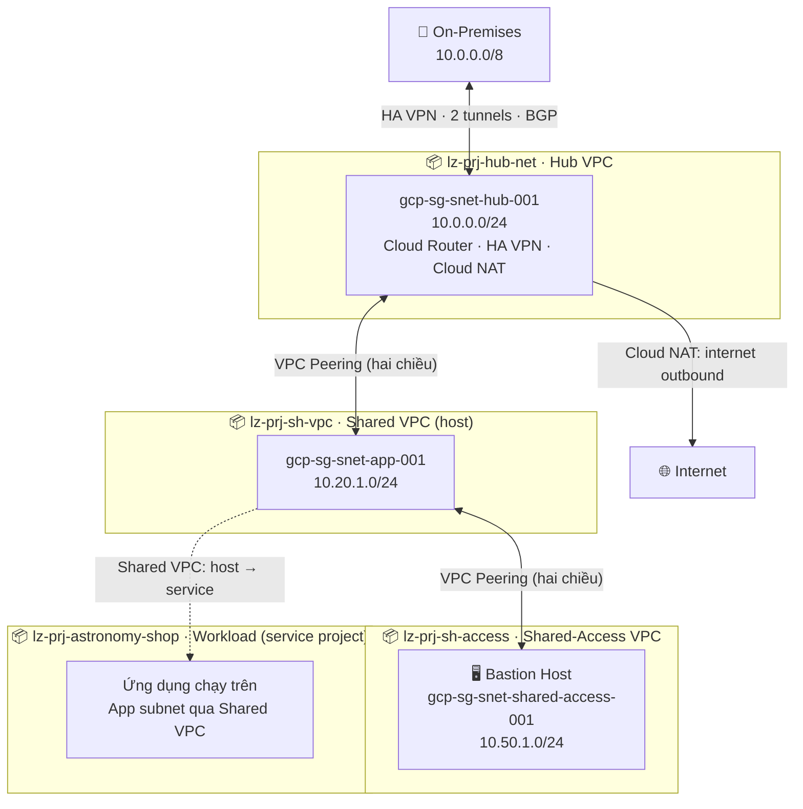
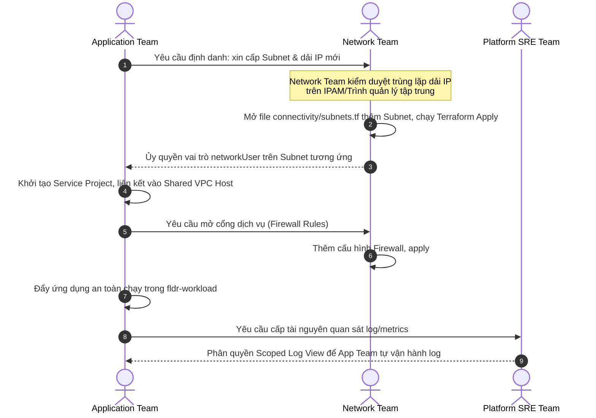
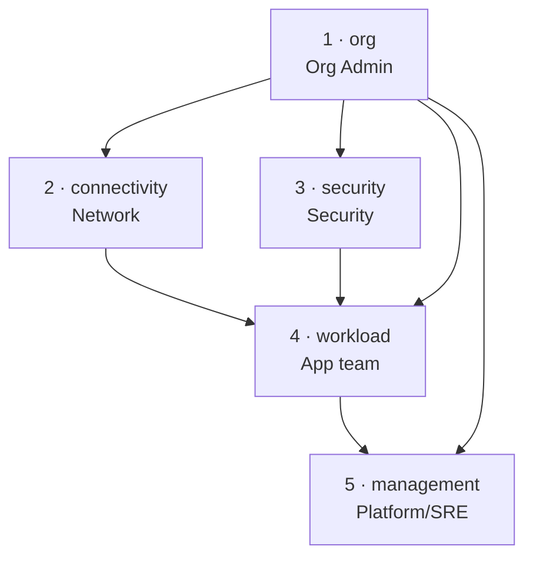

<div align="center">

# 🌌 ENTERPRISE GOOGLE CLOUD LANDING ZONE (IAC)
### 🚀 *Production-Ready Foundation engineered with Terraform & Hub-and-Spoke Grid*

---

[](https://www.terraform.io/)
[](https://cloud.google.com/)
[](https://github.com/)
[](https://cloud.google.com/about/locations)

**Mô hình Hub-and-Spoke** • **Kiến trúc Layered-Stack 5 tệp độc lập** • **Ready for Day-2 Ops & Security Guardrails**

</div>

---

## 📑 Mục lục điều hướng nhanh

| Khám phá mô hình | Vận hành & Phân Quyền | Cấu trúc hạ tầng | Cẩm nang triển khai |
| :--- | :--- | :--- | :--- |
| [💡 Concept & Giá trị](#1-landing-zone-l%C3%A0-g%C3%AC--v%C3%AC-sao-c%E1%BA%A7n) | [👥 Mô hình Phân quyền (IAM)](#3-quy%E1%BB%81n-s%E1%BB%9F-h%E1%BB%AFu-theo-%C4%91%E1%BB%99i-nh%C3%B3m-ownership) | [🏗️ Kiến trúc Stack & Folder](#5-ki%E1%BA%BFn-tr%C3%BAc-source-code) | [🚀 Triển khai & tfvars](#6-h%C6%B0%E1%BB%9Bng-d%E1%BA%ABn-s%E1%BB%AD-d%E1%BB%A5ng) |
| [🌐 Bức tranh kiến trúc](#2-b%E1%BB%A9c-tranh-t%E1%BB%95ng-th%E1%BB%83) | [🟢 Kịch bản phối hợp các Team](#4-c%C3%A1c-k%E1%BB%8Bch-b%E1%BA%A3n-ph%E1%BB%91i-h%E1%BB%A3p-gi%E1%BB%AFa-c%C3%A1c-team) | [🔍 Chi tiết thành phần module](#54-chi-ti%E1%BA%BFt-c%C3%A1c-th%C3%A0nh-ph%E1%BA%A7n--soi-t%E1%BB%B1-n-module) | [🛠️ Runbook & Checklist Day-2](#7-l%C3%B0u-%C3%BD--v%E1%BA%ADn-h%C3%A0nh-v%E1%BB%81-sau-runbook) |

---

## 1. Landing Zone là gì & vì sao cần?

> 💡 **Định nghĩa cốt lõi:** **Landing Zone** là bộ khung móng vững chắc (*enterprise-grade foundation*) được thiết kế đồng bộ, chuẩn hóa, giúp doanh nghiệp vận hành workload trên Google Cloud một cách **Tuyệt đối an toàn — Kiểm soát chặt chẽ — Sẵn sàng mở rộng** ngay từ những giây phút đầu tiên.

Khi lên Cloud mà thiếu đi bản thiết kế Landing Zone chuẩn mực, hậu quả nhãn tiền sẽ là: các đội tự tạo project riêng lẻ, dải IP mạng chồng lấn, quyền truy cập cấp vô tội vạ, Audit log phân mảnh rải rác và chi phí hàng tháng liên tục vượt ngưỡng. 

Giải pháp này giải quyết triệt để bài toán đó bằng cách **thiết lập tự động hóa toàn bộ lớp mạng, danh tính, bảo mật và trung tâm vận hành tập trung** theo sát tiêu chuẩn vàng của Google Cloud Architecture Framework.

### 📊 Giải quyết bài toán thực tế

| 🎯 Hiện trạng khi THIẾU Landing Zone | ✨ Giá trị đột phá sau khi TRẠM HẠ CÁNH hoạt động |
| :--- | :--- |
| **Project lộn xộn:** Không phân cấp, đặt tên tùy hứng, khó quản trị. | **Phân cấp Folder rõ ràng:** Tổ chức theo nhóm phân quyền + Project Factory chuẩn hóa đặt tên tự động. |
| **Mạng chồng lấn IP:** Luồng traffic mạng hỗn loạn, mất kiểm soát. | **Hub-and-Spoke Grid:** Shared VPC cô lập, VPC Peering phân luồng, dải IP được thiết kế chi tiết bằng CIDR khoa học. |
| **Quyền hạn vượt mức:** Ai cũng có quyền Admin, rủi ro bảo mật tột độ. | **Chính sách Least-Privilege:** Service Account định danh độc lập trên từng Project + Org Policies cứng rắn áp từ trên xuống. |
| **Cổng mạng phơi bày:** VM có External IP tràn lan, phơi mình trước mã độc. | **Cổng Bastion IAP cô lập:** Chặn đứng 100% External IP toàn Organization, truy cập an toàn mã hóa qua đường hầm IAP. |
| **Mù thông tin vận hành:** Ghi nhận Log rải rác, không có dấu vết audit. | **Trung tâm Audit Log tập trung:** Lưu trữ 2 tầng (Hot 90 ngày / GCS Cold archive 365 ngày) + phân quyền Scoped Log View. |
| **Chi phí "vỡ trận":** Phát sinh hóa đơn bất ngờ cuối tháng do thiếu kiểm soát. | **Bức tường kiểm soát chi phí:** Budget alert đa tầng + hệ thống Dashboard trực quan phân tích chi tiêu thời gian thực. |

### 👥 Đối tượng sử dụng chính

* 🏢 **Platform / Cloud Engineers:** Sở hữu nền móng hạ tầng chuẩn hóa hàng đầu để bàn giao tức thì cho các dự án thành viên.
* 🚀 **Application Teams:** Tự tin phát triển & đẩy nhanh tốc độ Go-to-market nhờ mượn hoàn toàn hạ tầng mạng/bảo mật đã được xử lý sẵn.
* 🛡️ **Security & Compliance Auditories:** Kiểm soát tự động tuyệt đối bằng hệ thống chính sách (org policies) thực thi liên tục ở cấp cha.

---

## 2. Bức tranh tổng thể

### 2.1 Kiến trúc tổ chức (folder & project)

Kiến trúc cây thư mục tổ chức dự án được phân cấp khoa học như sau:

```
Organization (Gốc tổ chức của doanh nghiệp)
│
├── 📁 fldr-platform                      ← Hạ tầng dùng chung (Platform team sở hữu)
│   │
│   ├── 📁 fldr-management
│   │   ├── 📦 gcp-platform-management    Log buckets · Monitoring · Dashboards · Budget
│   │   └── 📦 gcp-platform-security      KMS · Secret Manager · Security Command Center
│   │
│   └── 📁 fldr-connectivity
│       ├── 📦 lz-prj-hub-net             Hub VPC · Cloud Router · HA VPN · Cloud NAT
│       ├── 📦 lz-prj-sh-vpc              Shared VPC host project
│       └── 📦 lz-prj-sh-access           Shared-Access VPC · Bastion Host
│
├── 📁 fldr-workload                      ← Workload sản xuất (App teams sở hữu)
│   └── 📦 lz-prj-astronomy-shop          Ứng dụng mẫu, dùng Shared VPC
│
└── 📁 fldr-sandbox                       ← Thử nghiệm (hiện để trống — dự phòng)
```

> 💡 **Vì sao [lz-prj-sh-access](org/projects.tf#L88) nằm trong [fldr-connectivity](org/folders.tf)?**
> Dự án [lz-prj-sh-access](org/projects.tf#L88) chứa **Shared-Access VPC + Bastion Host** — đây là thành phần hạ tầng kết nối cốt tử, nên nó được xếp cùng nhóm trong [fldr-connectivity](org/folders.tf) (chi tiết tại tệp [org/projects.tf](org/projects.tf#L88)). 

---

### 2.2 Sơ đồ network topology & dải IP quy hoạch

Mô hình mạng Hub-and-Spoke thiết kế theo tiêu chuẩn mạng không bắc cầu (*non-transitive transit subnet grid*):



#### 📌 Quy hoạch chi tiết bảng địa chỉ IP (Subnet allocation)

| Tên Subnet | Dải CIDR | Loại VPC | Dự án chứa (Project) | Vai trò & Mục đích sử dụng |
| :--- | :--- | :--- | :--- | :--- |
| **`gcp-sg-snet-hub-001`** | `10.0.0.0/24` | Hub VPC | [lz-prj-hub-net](org/projects.tf#L66) | Kết cuối đường truyền VPN, định tuyến Cloud Router, thiết lập Cloud NAT |
| **`gcp-sg-snet-app-001`** | `10.20.1.0/24` | Shared VPC | [lz-prj-sh-vpc](org/projects.tf#L77) | Cung cấp subnet kết nối cho các Workload an toàn (mượn qua cơ chế Host-Service) |
| **`gcp-sg-snet-shared-access-001`** | `10.50.1.0/24` | Shared-Access VPC | [lz-prj-sh-access](org/projects.tf#L88) | Điểm kết nối bảo mật chạy Bastion host trung chuyển và thiết lập IAP Tunneling |

#### 🔁 Chi tiết luồng đi của dữ liệu (Traffic flows)
* 🔗 **On-prem ↔ Hub:** Cặp HA VPN song hành cấu hình BGP là tuyến giao thức kết cuối vật lý duy nhất, ngăn tuyệt mật mọi nguy cơ rò rỉ luồng ngoài.
* 🔁 **Hub ↔ Shared / Shared ↔ Shared-Access:** Liên kết thông suốt qua VPC Peering hai chiều độc lập. Hub đóng vai trò transit điều khiển, mọi Spoke phải trung chuyển qua Hub để tiếp cận on-premises.
* 🏠 **Shared VPC Architecture:** [lz-prj-sh-vpc](org/projects.tf#L77) là Host quản lý lớp mạng vật lý, trong khi dự án ứng dụng [lz-prj-astronomy-shop](org/projects.tf#L110) đăng ký tư cách Service project mượn dải `10.20.1.0/24` chạy workload cô lập mà không cần bận tâm quản trị vĩ mô.
* 🌐 **Cloud NAT Outbound:** Các VMs thuộc vùng chịu đựng an toàn, ra internet cập nhật bản vá qua Cloud NAT đặt tại Hub VPC — tuyệt đối không lộ diện Public IP ra ngoài thế giới.

---

## 3. Quyền sở hữu theo đội nhóm (Ownership)

Landing Zone được thiết kế với triết lý **"Phân rã trách nhiệm — Vận hành độc lập"** để nhiều biệt đội cùng phối hợp mà không bao giờ giẫm chân lên nhau. Mỗi Folder hay Terraform Stack đều có một **Đội chủ quản cốt lõi (Owner)** chịu trách nhiệm toàn quyền thay đổi, các đội khác chỉ có quyền tiếp cận tối giản ở mức an toàn nhất.

### 🗺️ 3.1 Bản đồ phân quyền theo Folder & Vai trò

| Phạm vi quản lý | Đội chủ quản (Owner) | Vai trò vận hành chính | Quyền hạn tiêu biểu (IAM Roles) |
| :--- | :--- | :--- | :--- |
| 🏢 **Organization (Root)** | **Cloud Foundation Team** | Tạo lập cây Folder, Project Factory, áp đặt Org Policy cấp cao, cấp phát tài khoản Billing | `roles/resourcemanager.organizationAdmin`, `roles/resourcemanager.folderAdmin`, `roles/billing.admin`, `roles/compute.xpnAdmin` |
| 📁 **fldr-connectivity** | **Network Operations Team** | Cấu hình VPC, phân dải Subnets, thiết lập Peering, định cấu hình Cloud NAT, HA VPN, Cloud DNS | `roles/compute.networkAdmin`, `roles/dns.admin` |
| 📁 **fldr-management** | **Platform / SRE Team** | Thu thập Logging trung tâm, thiết lập Alerts/Dashboards, giám sát Budget tiêu dùng | `roles/logging.admin`, `roles/monitoring.admin`, `roles/billing.viewer` |
| 🔑 **fldr-management → security** | **Security & Compliance Team** | Quản lý vòng đời KMS keys, lưu trữ Secret Manager, giám sát Security Command Center | `roles/cloudkms.admin`, `roles/secretmanager.admin`, `roles/securitycenter.admin` |
| 📁 **fldr-workload** | **Application Engineering Teams** | Triển khai và vận hành mã nguồn ứng dụng, mượn hạ tầng Shared VPC để chạy dịch vụ | `roles/compute.instanceAdmin`, `roles/compute.networkUser`, `roles/logging.logWriter` |
| 📁 **fldr-sandbox** | **Toàn bộ nhân sự (Self-Service)**| Môi trường thử nghiệm Sandbox cô lập, tự do sáng tạo, không ràng buộc Production | Quyền hạn mở rộng được giới hạn nghiêm ngặt trong ranh giới dự án |

---

### 🛡️ 3.2 Service Account tự động hóa & Giả mạo danh tính (Impersonation)

Mô hình áp dụng triệt để nguyên tắc **"Terraform không tạo SA, không gán role cho SA"** — toàn bộ SA và việc gán quyền cho SA đều được làm thủ công bằng `gcloud CLI` (chi tiết tại mục [6.1](#-trình-tự-gỡ-nút-thắt-con-gà--quả-trứng-bootstrap-thủ-công-toàn-bộ-seed-project--service-account)). Mỗi stack có **TF Runner SA riêng** với quyền tối thiểu chỉ đủ cho phạm vi stack đó — Network engineer không thể chạy được code Security, App developer không thể chạy được code Org. Người dùng / nhóm chỉ cần quyền **Token Creator** (`roles/iam.serviceAccountTokenCreator`) trên đúng SA của team mình để giả mạo danh tính, hoàn toàn không sinh tệp Service Account Key vật lý.

**TF Runner SAs — mỗi stack một SA riêng (tất cả nằm ở Seed Project `gcp-platform-bootstrap-001`):**

| Service Account | Stack chạy | Team chủ quản | Quyền hạn cốt lõi |
| :--- | :--- | :--- | :--- |
| **`sa-tf-org-001`** | [org/](org/) | Cloud Foundation | Org-level: `organizationAdmin`, `projectCreator`, `serviceusage.serviceUsageAdmin`, `orgpolicy.policyAdmin`; Billing-account-level: `billing.user` (cả 2 billing accounts) |
| **`sa-tf-conn-001`** | [connectivity/](connectivity/) | Network Ops | Org-level: `compute.xpnAdmin`; Folder-level (`fldr-platform` + `fldr-workload`): `compute.networkAdmin`, `dns.admin` |
| **`sa-tf-sec-001`** | [security/](security/) | Security & Compliance | Org-level: `organizationAdmin` (bắt buộc để set Org IAM cho admin_principals), `compute.orgFirewallPolicyAdmin`; Project-level (management): `resourcemanager.projectIamAdmin` |
| **`sa-tf-wl-001`** | [workload/](workload/) | Application Eng. | Project-level (sh-access + astronomy-shop): `compute.instanceAdmin.v1`; SA-level: `iam.serviceAccountUser` trên runtime SAs được gắn vào VM |
| **`sa-tf-mgmt-001`** | [management/](management/) | Platform / SRE | Org-level: `logging.admin`; Project-level (management): `monitoring.admin`, `logging.admin`; Billing-account-level: `billing.costsManager` (chỉ trên billing account của budget) |

**Runtime SAs — gắn vào VM/ứng dụng (workload stack chỉ tra cứu qua data source, không tạo):**

| Service Account | Vai trò | Dự án trực thuộc | Quyền hạn cốt lõi |
| :--- | :--- | :--- | :--- |
| **`gcp-sg-sa-sh-access-001`** | 🖥️ Bastion VM runtime (IAP, OS Login, Ops Agent) | `lz-prj-sh-access` | `monitoring.metricWriter`, `logging.logWriter` |
| **`gcp-sg-sa-astronomy-shop-001`** *(tùy chọn)* | Workload astronomy-shop runtime | `lz-prj-astronomy-shop` | `monitoring.metricWriter`, `logging.logWriter` |
| **`gcp-sg-sa-hub-net-001`** *(tùy chọn)* | Tools VM trong hub-net (vd. network-probe) | `lz-prj-hub-net` | Tùy nhu cầu (mặc định `monitoring.metricWriter`, `logging.logWriter`) |
| **`gcp-sg-sa-sh-vpc-001`** *(tùy chọn)* | Tools VM trong sh-vpc | `lz-prj-sh-vpc` | Tùy nhu cầu (mặc định `monitoring.metricWriter`, `logging.logWriter`) |

> 🔒 **Tách bạch rõ ràng:** 5 TF Runner SAs (`sa-tf-*`) chỉ phục vụ Terraform IaC; các runtime SAs (`gcp-sg-sa-*`) chỉ gắn vào VM. Không có SA nào kiêm hai vai trò. Tệp [security/iam.tf](security/iam.tf) chỉ chứa grant Org-IAM cho `admin_principals` và quyền đọc log view — không có bất kỳ resource `google_service_account` hay role binding nào.

> 🛡️ **Cô lập state bucket theo prefix:** Mỗi TF Runner SA chỉ có quyền `objectAdmin` trên prefix `terraform/<stack-của-mình>/` và `objectViewer` trên prefix của các stack upstream (để đọc remote state). Cấu hình IAM Conditions thực hiện tại [§6.1 Phase A bước I](#-phase-a--chuẩn-bị-seed-project-state-bucket-và-5-tf-runner-sa-chạy-một-lần-duy-nhất). Nhờ vậy `sa-tf-conn` vật lý không đọc/ghi được state của `security`.

> ⚠️ **KHUYẾN NGHỊ PRODUCTION READY:** Biến `admin_principals` tại [security/terraform.tfvars](security/terraform.tfvars) chấp nhận cả `user:` và `group:`. Để đảm bảo tính sẵn sàng quản trị lâu dài, hãy **chỉ dùng Google Groups** (ví dụ: `group:grp-gcp-platform-admins@company.com`) — onboard/offboard nhân sự chỉ cần add/remove khỏi group qua Admin Console, không cần `terraform apply`. Tránh tuyệt đối gán quyền cho `user:` cá nhân trên Production.

---

### 📋 3.3 Ma trận trách nhiệm phối hợp RACI

> 💡 **Chú ý viết tắt:** **R**esponsible (Thực thi) · **A**ccountable (Chịu trách nhiệm cuối) · **C**onsulted (Tham vấn ý kiến) · **I**nformed (Được thông báo)

| Kịch bản thay đổi hạ tầng | Org Admin | Network Team | Platform SRE | Security Team | App Team |
| :--- | :---: | :---: | :---: | :---: | :---: |
| **Cấp Folder/Project mới** | 🥇 **A/R** | C | C | C | I |
| **Sửa đổi Policy bảo mật (Org Policy)** | A | C | C | 🥇 **R** | I |
| **Cấu hình VPC / Routing / Peering** | I | 🥇 **A/R** | C | C | I |
| **Mở cổng lửa chặn/cho phép (Firewall)** | I | 🥇 **A/R** | I | C | **C** |
| **Đăng ký dải IP / Subnet cho App mới** | I | 🥇 **A/R** | I | I | C |
| **Triển khai phiên bản ứng dụng mới** | I | I | C | I | 🥇 **A/R** |
| **Thay đổi cấu hình Log Buckets/Alerts** | I | I | 🥇 **A/R** | C | I |
| **Quy trình xoay vòng KMS Keys/Secrets** | I | I | C | 🥇 **A/R** | C |
| **Thay đổi hạn mức ngân sách (Budget alert)**| A | I | 🥇 **R** | I | C |

---

## 4. Các kịch bản phối hợp giữa các team

Để minh chứng cho sức mạnh phối hợp của Landing Zone, dưới đây là **5 kịch bản vận hành thực tế chuẩn hóa Day-2 Ops**:

### 🟢 Kịch bản A: Triển khai dự án & Workload mới lên Cloud
*Khi App Team muốn có một dải mạng an toàn để chạy ứng dụng độc lập.*



**💡 Điểm mấu chốt:** App Team tuyệt đối **không** được tự ý thay đổi hệ thống định tuyến, dải IP mạng hay Firewall. Mọi thay đổi đều được kiểm soát và ghi nhận tập trung qua Network Team nhằm bảo vệ an toàn cao nhất cho toàn khu vực.

---

### 🛡️ Kịch bản B: Truy cập bảo mật tuyệt đối qua Bastion (Zero External IP)
*Chính sách chặn đứng nguy cơ thâm nhập VM từ Internet.*

1. **Khởi tạo kết nối:** Lập trình viên sử dụng kết nối bảo mật **Identity-Aware Proxy (IAP) & OS Login** thông qua Terminal mà không cần lộ địa chỉ IP ra mạng công cộng.
2. **Trung chuyển an toàn:** Điểm kết nối trung gian an toàn là Bastion Host nằm biệt lập ở dự án [org/projects.tf](org/projects.tf#L88).
3. **Tiếp cận dịch vụ:** Từ Bastion Host (dải mạng `10.50.1.0/24`), đi theo đường hầm Peering nội bộ sang dự án [org/projects.tf](org/projects.tf#L77) kết nối trực tiếp đến các máy ảo (VMs) dịch vụ ở dải `10.20.1.0/24`.
4. **Kiểm tra dấu vết:** Mọi vết đăng nhập và lịch sử gõ lệnh đều lưu trữ tập trung tại OS Login, giúp Security Team thực hiện audit nhanh chóng.

---

### 🌐 Kịch bản C: Thiết lập kết nối Hybrid với On-Premises
*Khi dịch vụ trên Cloud cần truy vấn kho dữ liệu gốc đặt tại Datacenter nội bộ.*

1. **Yêu cầu hạ tầng:** Network team tiến hành thiết lập tham số VPN, ASN của On-prem tại tệp [connectivity/vpns.tf](connectivity/vpns.tf) và file cấu hình biến.
2. **Bảo mật bí mật:** Security team kiểm duyệt và cấp phát khóa mã hóa chung (`vpn_shared_secret`) an toàn thông qua Secret Manager, tuyệt mật không lưu trữ văn bản rõ lên kho mã nguồn.
3. **Kích hoạt tức thì:** Triển khai hạ tầng cấu hình song song 2 luồng HA VPN chạy định tuyến động BGP tự phục hồi lỗi.
4. **Thông suốt toàn tuyến:** Dải mạng của On-prem tự động định tuyến thông suốt từ Hub VPC qua các Spoke, giúp các ứng dụng trong Spoke giao tiếp trực tiếp với nội bộ không gặp rào cản.

---

### 🛑 Kịch bản D: Tự động khóa và vá lỗ hổng toàn hệ thống
*Áp đặt chính sách siết chặt bảo mật toàn Organization.*

1. **Yêu cầu an toàn:** Ban quản trị ban hành chính sách mới cấm tạo Service Account Keys bừa bãi tại tệp [org/org-policies.tf](org/org-policies.tf).
2. **Đánh giá ảnh hưởng:** Thực hiện lệnh `terraform plan` trên Stack `org` nhằm rà soát và đánh giá các khóa kế thừa đang hoạt động.
3. **Thực thi cấp tốc:** Org Admin thông qua và kích hoạt lệnh Apply hạ tầng.
4. **Áp dụng diện rộng:** Chính sách bảo mật mới lan tỏa từ Root Organization xuống 100% các Folder con và Project con tức thì, vô hiệu hóa các hành vi vi phạm policy.

---

### 📊 Kịch bản E: Bảo vệ ngân sách & Tối ưu chi phí hàng tháng
*Đảm bảo chi phí hạ tầng luôn nằm trong vùng kiểm soát minh bạch.*

1. **Giám sát trực quan:** Toàn bộ chi tiêu của các dự án được đưa về bảng phân tích Dashboard tạo bởi tệp [management/monitoring.tf](management/monitoring.tf).
2. **Cảnh báo sớm:** Khi chi phí chạm mốc thiết lập, hệ thống cảnh báo tích hợp tại tệp [management/budget.tf](management/budget.tf) tự động gửi email thông báo về Platform SRE.
3. **Tìm kiếm nguyên nhân:** Nhờ hệ thống nhãn dán tự động của Project Factory định danh chính xác chủ sở hữu của từng máy ảo, SRE dễ dàng làm việc với App team để thu hồi máy rác và tối ưu hiệu suất sử dụng.

---

## 5. Kiến trúc source code

Mã nguồn được phân tách khoa học thành **Layered-Stack 5 tệp độc lập tuyệt đối**. Mỗi thư mục sở hữu một **GCS remote state backend riêng lẻ** nhằm tối thiểu hóa phạm vi ảnh hưởng khi xảy ra sự cố hạ tầng (*blast radius*), giúp các đội độc lập triển khai mà không bị ách tắc.

```
📁 GCP-Landing-Zone (Mã nguồn hạ tầng)
│
├── 📁 org/            # Layer 1: Cấu trúc Folder, Project Factory & Org Policies (Owner: Org Admin)
├── 📁 connectivity/   # Layer 2: Thiết lập mạng Hub-Spoke, HA VPN, Cloud NAT, DNS, Firewalls (Owner: Network Team)
├── 📁 security/       # Layer 3: Định quyền IAM, Service Accounts, Hierarchical Firewall Policy (Owner: Security Team)
├── 📁 workload/       # Layer 4: Tài nguyên ứng dụng mẫu, triển khai Bastion VM (Owner: App Team)
└── 📁 management/     # Layer 5: Nhật ký tập trung, Monitoring Dashboards, Ngân sách (Owner: Platform SRE)
```

### 🗂️ 5.1 Phân cấp vai trò chi tiết các Stack

| Thứ tự áp dụng | Tên Stack | Thư mục mã nguồn | Đội ngũ quản lý | Vai trò hạ tầng cốt lõi |
| :---: | :--- | :--- | :--- | :--- |
| **01** | 🔥 **org** | [org/](org/) | Org Admin Team | Đặt móng Folder, Project Factory cấp phát tài khoản tự động, cấu hình Org Policy |
| **02** | 🌐 **connectivity** | [connectivity/](connectivity/) | Network Ops Team | Thiết lập dải mạng VPC, các tuyến Peering, VPN, Cloud NAT định tuyến liên miền |
| **03** | 🔑 **security** | [security/](security/) | Security Team | Tạo lập Service Account vận hành, phân quyền IAM, thi triển Firewall cấp cao |
| **04** | 🚀 **workload** | [workload/](workload/) | Application Team | Triển khai VMs, môi trường ứng dụng và điểm kết nối nội bộ |
| **05** | 📊 **management** | [management/](management/) | Platform/SRE Team | Centralized log export, dựng dashboard giám sát sức khỏe hạ tầng, gán mốc cảnh báo ngân sách |

> 📌 **Mẹo nhỏ:** Stack 2 ([connectivity/](connectivity/)) và Stack 3 ([security/](security/)) có tính chất song song, không phụ thuộc chéo nên có thể triển khai chạy đồng thời để đẩy nhanh tiến độ bàn giao hạ tầng.

---

### 🔗 5.2 Sơ đồ luồng phụ thuộc giữa các Stack (Dependencies)

Mối quan hệ phụ thuộc định tuyến giữa các lớp Stack hạ tầng được biểu diễn như sau:



Các Stack trao đổi dữ liệu an toàn chéo lẫn nhau thông qua Data Source `terraform_remote_state` (được khai báo tại tệp `remote.tf` ở dòng đầu mỗi thư mục).

---

### 📂 5.3 Cấu trúc thư mục cụ thể

Bản đồ mã nguồn của dự án Landing Zone:

```
landing-zone/
├── org/                  # 🏢 Phân cấp Folder, dự án thành viên & Org Policies toàn cục
│   ├── folders.tf            Phân cấp các folder chính
│   ├── projects.tf           Project factory kiến tạo các Landing Zone project
│   ├── org-policies.tf       Hàng rào kiểm soát an toàn tự động
│   ├── providers.tf · backend.tf · outputs.tf · variables.tf · terraform.tfvars
│
├── connectivity/         # 🌐 Quản trị lớp mạng VPC, định tuyến, VPN và DNS
│   ├── vpcs.tf · subnets.tf · shared-vpc.tf
│   ├── peering.tf · routers.tf · nats.tf · vpns.tf
│   ├── firewalls.tf · dns.tf · addresses.tf
│   └── remote.tf · ...
│
├── security/             # 🔐 Trung tâm gán quyền IAM, Service Accounts an toàn
│   ├── iam.tf · org-fw-policies.tf
│   └── remote.tf · ...
│
├── workload/             # 🚀 Tài nguyên mẫu chạy ứng dụng & Bastion VM
│   ├── vms.tf
│   └── remote.tf · ...
│
└── management/           # 📊 Hệ thống Logging lưu trữ, biểu đồ & Ngân sách cảnh báo
    ├── log-export.tf · log-views.tf
    ├── monitoring.tf · dashboards.tf · budget.tf
    └── remote.tf · ...
```

### 5.4 Chi tiết các thành phần — "soi" từng module

> 💡 **La bàn kiến trúc:** Toàn bộ bảng thống kê dưới đây phản ánh **chính xác 100% tài nguyên vật lý đang có trong hệ thống mã nguồn**, được đối chiếu kèm vai trò thực tế và lý do thiết kế, giúp bạn nắm bắt bản chất mà không cần truy vết code thô.

<details>
<summary><b>🏢 Module 1 — org/ · Nền tảng tổ chức, Project Factory & Chính sách tổng (Org Policies)</b></summary>
<br>

**Mục tiêu:** Kiến thiết bộ khung phân cấp dạng cây kết hợp "hàng rào thực thi" (Guardrails) bắt buộc, áp dụng từ trên xuống đảm bảo mọi tài nguyên khởi tạo sau này bắt buộc phải tuyệt đối tuân thủ.

#### 📁 Phân cấp Folder tại [org/folders.tf](org/folders.tf) (Sử dụng Module `terraform-google-modules/folders/google` phiên bản `5.1.0`)

| Phân cấp | Tên Folder | Mục tiêu bảo mật & Vai trò | Đội ngũ quản lý |
| :---: | :--- | :--- | :--- |
| **Cấp 1 (L1)** | `fldr-platform` | Thư mục cha gom toàn bộ hạ tầng dùng chung cơ bản | Cloud Foundation Team |
| **Cấp 1 (L1)** | `fldr-workload` | Nơi tập hợp các dự án ứng dụng phục vụ kinh doanh | App Core Teams |
| **Cấp 1 (L1)** | `fldr-sandbox` | Không gian cách ly hoàn toàn, thử nghiệm khám phá | Toàn bộ kỹ sư |
| **Cấp 2 (L2)** | `fldr-management` | Thư mục con của platform, chứa lõi log/monitoring | Platform SRE Team |
| **Cấp 2 (L2)** | `fldr-connectivity` | Thư mục con platform, chứa hạ tầng mạng cốt lõi | Network Ops Team |

#### 📦 Project Factory tại [org/projects.tf](org/projects.tf) (Sử dụng Module `terraform-google-modules/project-factory/google` phiên bản `17.1.0`)

Mỗi dự án thành phần được khởi tạo với danh mục API kích hoạt tối giản (`activate_apis`), nhãn phân nhóm (`labels`) đồng bộ và chính sách hủy khóa (`deletion_policy`) nghiêm ngặt:

| Tên dự án (Project ID) | Thư mục cha trực thuộc | Các API cốt lõi được bật | Vai trò thực nghiệm |
| :--- | :--- | :--- | :--- |
| **`lz-prj-hub-net`** | `fldr-connectivity` | `compute.googleapis.com`, `orgpolicy.googleapis.com` | Lõi định tuyến, cổng kết nối VPN/NAT |
| **`lz-prj-sh-vpc`** | `fldr-connectivity` | `compute.googleapis.com` | Máy chủ Host Shared VPC |
| **`lz-prj-sh-access`** | `fldr-connectivity` | `compute.googleapis.com`, `oslogin.googleapis.com`, `orgpolicy.googleapis.com` | Máy chủ Bastion Host trung chuyển |
| **`lz-prj-astronomy-shop`**| `fldr-workload` | `compute.googleapis.com` | Dự án dịch vụ ứng dụng mẫu |
| **`gcp-platform-management`**| `fldr-management` | `logging.googleapis.com`, `monitoring.googleapis.com`, `bigquery.googleapis.com`, `pubsub.googleapis.com`, `storage.googleapis.com`, `billingbudgets.googleapis.com` | Trung tâm quan trắc & Ops Hub (Kèm ID ngẫu nhiên) |
| **`gcp-platform-security`**| `fldr-management` | `cloudkms.googleapis.com`, `secretmanager.googleapis.com`, `securitycenter.googleapis.com`, `pubsub.googleapis.com` | Trung tâm mã khóa mật mã (Kèm ID ngẫu nhiên) |

> Project ID dùng hậu tố ngẫu nhiên 4 ký tự (`random_string`) để duy nhất toàn cục.

#### 🛡️ Chính sách đồng bộ Organization Policies tại [org/org-policies.tf](org/org-policies.tf)

Landing Zone triển khai **7 chính sách cưỡng chế cứng** và định nghĩa cấu hình ngoại lệ cấp dự án:

| Ràng buộc (Constraint) | Tác hại khi thiếu | Trạng thái áp dụng | Khu vực ngoại lệ (Exemptions) |
| :--- | :--- | :--- | :--- |
| **`compute.requireOsLogin`** | Quản lý SSH thô sơ bằng SSH-Keys cá nhân có thể rò rỉ | **Áp dụng cứng** toàn tổ chức | Không ngoại lệ |
| **`compute.skipDefaultNetworkCreation`** | Google tự tạo VPC default có External IP rác và dải CIDR trùng lặp | **Chặn đứng** mọi sự tự phát | Không ngoại lệ |
| **`compute.vmExternalIpAccess`** | Tài nguyên Compute bị gán IP công cộng, dễ bị rà quét cổng | **Khóa toàn bộ** (Deny All) | ✅ Chỉ đặc cách duy nhất VM `gcp-sg-vm-bastion-001` tại dự án `sh-access` |
| **`iam.disableServiceAccountKeyCreation`** | Lập trình viên tải file SA Key JSON về máy cá nhân làm lộ lọt quyền | **Cấm tạo mới** SA Keys | ✅ Đặc cách duy nhất dự án `sh-access` phục vụ cơ chế IAP |
| **`compute.requireShieldedVm`** | Máy ảo bị can thiệp vào tầng khởi động, nạp mã độc rootkit | **Luôn áp dụng** (Shielded Only)| Không ngoại lệ |
| **`storage.uniformBucketLevelAccess`**| Phân quyền Bucket ACL lộn xộn dẫn đến rò rỉ dữ liệu ra internet | **Uniform Access** bắt buộc | Không ngoại lệ |
| **`gcp.resourceLocations`** | Dữ liệu/Tài nguyên bị triển khai sang nước ngoài vi phạm luật chủ quyền | **Giới hạn** chỉ chạy tại vùng `asia-southeast1` | Không ngoại lệ |

</details>

<details>
<summary><b>🌐 Module 2 — connectivity/ · Toàn diện mạng Hub-and-Spoke Grid, Shared VPC & VPN bảo mật</b></summary>
<br>

**Mục tiêu:** Quy hoạch và cô lập mạng lưới doanh nghiệp bằng sơ đồ Hub-and-Spoke hoàn thiện, định tuyến thông minh qua Cloud NAT, thiết lập đường truyền nội dung hybrid an toàn qua HA VPN và quản trị hệ thống tên miền nội bộ.

#### 🔹 Kiến tạo VPC vật lý tại [connectivity/vpcs.tf](connectivity/vpcs.tf) (Custom-mode VPC, tắt tự động tạo Subnet, bật định tuyến Global Route)

| Tên VPC vật lý | Dự án quản lý sở hữu | Vai trò phân luồng |
| :--- | :--- | :--- |
| **`gcp-sg-vpc-hub-001`** | `lz-prj-hub-net` | Đóng vai trò Transit Hub, trung chuyển và kết cuối VPN bảo mật |
| **`gcp-sg-vpc-shared-001`** | `lz-prj-sh-vpc` | Máy chủ Host VPC, cung cấp dải mạng con cho toàn bộ Workloads |
| **`gcp-sg-vpc-shared-access-001`** | `lz-prj-sh-access` | Vùng đệm Shared-Access VPC, vận hành Bastion và IAP Gateways |

#### 🔹 Thiết lập dải Subnets tại [connectivity/subnets.tf](connectivity/subnets.tf) (Kích hoạt Flow Logs & Private Google Access trên 100% Subnets)

| Tên Subnet | Dải mạng CIDR | VPC liên kết | Tỷ lệ thu thập Flow Log | Lý do thiết kế |
| :--- | :--- | :--- | :---: | :--- |
| **`gcp-sg-snet-hub-001`** | `10.0.0.0/24` | Hub Network | `0.5` (50%) | Kết nối HA VPN, định vị Cloud Router và Cloud NAT |
| **`gcp-sg-snet-app-001`** | `10.20.1.0/24` | Shared VPC | `0.1` (10%) | Chạy VMs dịch vụ (để sampling thấp giảm chi phí log rác) |
| **`gcp-sg-snet-shared-access-001`**| `10.50.1.0/24` | Shared-Access | `0.5` (50%) | Chứa máy ảo bảo mật Bastion |

#### 🔹 Kết nối Shared VPC tại [connectivity/shared-vpc.tf](connectivity/shared-vpc.tf)
* Dự án `lz-prj-sh-vpc` chuyển trạng thái sang **Host Project** cấp hệ thống.
* Dự án ứng dụng mẫu `lz-prj-astronomy-shop` được liên kết chính thức thành **Service Project**, mượn quyền khai thác Subnet an toàn `10.20.1.0/24` để vận hành mà không cần tự phát mạng riêng.

#### 🔹 Hoạt động kết nối Peering tại [connectivity/peering.tf](connectivity/peering.tf) (VPC Peering hai chiều độc lập, không bắc cầu)
* Cặp Peering 1: Liên kết song thông giữa **Hub VPC** và **Shared VPC** (Bật cờ `allow_custom_route_data` để lan tỏa định tuyến VPN).
* Cặp Peering 2: Liên kết song thông giữa **Shared VPC** và **Shared-Access VPC** (Bật cờ lan tỏa custom routes).
* 🚫 **Rào cản thiết kế:** Do VPC Peering của GCP mang đặc tính không bắc cầu (*non-transitive*), luồng kết nối đi từ Bastion Host muốn về đến On-premise bắt buộc phải đi vòng qua mạng đệm Shared VPC trung chuyển chứ không thể đi xuyên thấu trực tiếp.

#### 🔹 Thiết lập định tuyến Routing & NAT tại [connectivity/routers.tf](connectivity/routers.tf) và [connectivity/nats.tf](connectivity/nats.tf)
* Kích hoạt Cloud Router **`gcp-sg-router-hub-001`** định vị tại ASN **`65003`**, đại diện quảng bá dải CIDR `10.20.0.0/24` và các subnet con cho BGP On-prem.
* Máy chủ NAT Gateway **`gcp-sg-nat-001`** (`gcp-sg-router-nat-001`): Chạy cấu hình tự động phân dải IP (`AUTO_ONLY`), hỗ trợ lưu vết log lỗi, giúp VM nội bộ cập nhật viện từ Internet mà không bao giờ cần cấp phát Public IP.

#### 🔹 Đường truyền Hybrid HA-VPN tại [connectivity/vpns.tf](connectivity/vpns.tf) (Tự động kích hoạt khi có đủ biến vpn)
* Sử dụng cổng HA VPN Gateway kết nối với thiết bị đầu xa On-premise (`External Peer Gateway` chạy dự phòng 2 IP vật lý `TWO_IPS_REDUNDANCY`).
* Vận hành song song **2 Tunnels bảo mật** định tuyến động qua cặp BGP ảo với địa chỉ IP đàm thoại `169.254.0.1/30` và `169.254.1.1/30`, liên kết sang mạng On-premise đại diện bởi ASN **`65002`**.

#### 🔹 Hệ thống Private DNS tại [connectivity/dns.tf](connectivity/dns.tf)
* Khởi tạo Zone phân dải riêng tư mang tên **`internal.lz.local.`**, cấu hình có hiệu lực hiển thị xuyên thông trên **cả 3 VPC**.
* Định dạng sẵn bản ghi A Record phân giải tên miền: **`bastion.internal.lz.local.`** trỏ thẳng về IP cố định `10.50.1.100` (giá trị TTL 300 giây).

#### 🔹 Ma trận quản lý tường lửa tại [connectivity/firewalls.tf](connectivity/firewalls.tf)

Triển khai cấu hình 4 Tường lửa cấp VPC có chọn lọc:

| Tên Firewall Rule | VPC áp dụng | IP Nguồn | Target Tag / Đích đến | Cổng mở | Phân tích lý do thiết kế |
| :--- | :--- | :--- | :--- | :---: | :--- |
| **`allow-ssh-bastion`** | Shared-Access | `0.0.0.0/0` | `allow-ssh-external` | `22` | Mở tạm thời cho Bastion (Sau này khóa thay bằng IAP IP) |
| **`allow-bastion-ssh`** | Shared VPC | `10.50.1.100/32` | `app-vm` | `22` | Chỉ chấp nhận kết nối SSH duy nhất đi ra từ đúng Bastion IP |
| **`allow-vpn-hub`** | Hub VPC | On-prem CIDR dải mạng | Toàn bộ VMs trong Hub | All | *(Bật có điều kiện khi có VPN)* Chấp nhận luồng hybrid |
| **`allow-internal`** | Shared VPC | Dải nội bộ `10.20.0.0/20` | Toàn bộ VMs trong Spoke | All | Thông suốt dữ liệu nội mạng giữa các lớp dịch vụ |

* Định chuẩn địa chỉ tĩnh: [connectivity/addresses.tf](connectivity/addresses.tf) cấp một external IP static **`gcp-sg-bastion-ip-001`** (Premium tier) bổ nhiệm riêng làm IP ngoại lệ cho VM Bastion.

</details>

<details>
<summary><b>🔐 Module 3 — security/ · Công tác đặc quyền (IAM), Service Accounts & Tường lửa phân cấp</b></summary>
<br>

**Mục tiêu:** Thi hành chính sách tối giản đặc quyền (least privilege) cấp tự động và dải lọc tường lửa tiền tuyến cấp Organization chặn bụi bẩn trước khi luồng tải đi vào tường lửa VPC.

#### 👤 Tạo lập và phân quyền cho Service Accounts tại [security/iam.tf](security/iam.tf)

Định hình 4 tài khoản dịch vụ thực thi tác vụ cụ thể:

| Tên Service Account | Scope quyền tại Project | Vai trò thực hiện tác vụ |
| :--- | :--- | :--- |
| **`gcp-sg-sa-hub-net-001`** | `roles/compute.networkAdmin`, `roles/dns.admin` | Quản lý định tuyến và sơ đồ phân dải DNS tại Hub VPC, bổ sung vai trò `roles/compute.xpnAdmin` gán tại cấp Organization để kiểm soát liên kết Shared VPC |
| **`gcp-sg-sa-sh-vpc-001`** | `roles/compute.networkAdmin` | Vận hành toàn bộ cấu hình mạng Host Shared VPC |
| **`gcp-sg-sa-sh-access-001`**| `roles/monitoring.metricWriter`, `roles/logging.logWriter` | Ghi log và đẩy metrics sức khỏe hệ thống máy ảo Bastion Host |
| **`gcp-sg-sa-astronomy-shop`**| `roles/monitoring.metricWriter`, `roles/logging.logWriter`| Ghi log và đẩy metrics kiểm soát sức khỏe ứng dụng Astronomy Shop |

* **Hàng rào bảo mật Log:** Thiết lập IAM thông minh có kèm điều kiện logic CEL (`expression` so khớp) chỉ cho phép nhóm ứng dụng Astronomy Shop sở hữu vai trò `roles/logging.viewAccessor` truy cập đọc nhật ký thuộc đúng phạm vi Log View của họ mà không được dòm ngó logs mạng Hub.

#### 🧱 Tường lửa phân cấp cấp Organization tại [security/org-fw-policies.tf](security/org-fw-policies.tf)

Đây là bức tường chắn vòng ngoài cực kỳ lợi hại, lọc sạch các truy cập nguy hiểm trước khi gói tin chạm đến firewall riêng lẻ của từng VPC:

| Độ ưu tiên (Priority) | Tên quy luật | Hành vi (Action) | Điều kiện so khớp (Match) | Lý do bảo mật cốt lõi |
| :---: | :--- | :---: | :--- | :--- |
| **1000 & 1001** | `delegate-rfc1918-in/out`| `goto_next` | `10.0.0.0/8`, `172.16.0.0/12`, `192.168.0.0/16` | Bỏ qua kiểm tra lớp ngoài, bàn giao các luồng mạng nội bộ nội vùng cho VPC Firewall tự định quyết |
| **1002** | `allow-iap-ssh-rdp` | `allow` | Dải IP IAP của Google `35.235.240.0/20` qua cổng `22`, `3389` | Chấp nhận kết nối hầm kỹ thuật số IAP an toàn đi vào toàn bộ máy ảo |
| **1004** | `allow-google-lb-hc` | `allow` | Các dải IP kiểm thử sức khỏe (Health Check) hệ thống Load Balancer | Duy trì hoạt động tự động sửa lỗi và cân bằng tải của các cụm VM |
| **1005** | `deny-tor-exit-nodes` | **deny** | Tập danh sách IP của mạng nặc danh TOR từ Threat Intelligence | Chặn đứng tức thì âm mưu thâm nhập từ hacker nặc danh |

</details>

<details>
<summary><b>🚀 Module 4 — workload/ · Triển khai hạ tầng ứng dụng mẫu & cấu hình VM Bastion</b></summary>
<br>

**Mục tiêu:** Cung cấp bản vẽ máy ảo vận hành đại diện cho App Team, đồng thời là chốt chặn kỹ thuật bảo mật Bastion vận hành cho toàn khu vực.

#### 🖥️ Chi tiết thiết kế VM Bastion tại [workload/vms.tf](workload/vms.tf)

| Thuộc tính Compute | Giá trị tham chiếu hệ thống | Mục tiêu bảo mật / Kỹ thuật |
| :--- | :--- | :--- |
| **Thế hệ máy ảo** | `e2-micro` (Chạy Debian Linux 12, ổ cứng 20GB tiêu chuẩn) | Tiết kiệm chi phí, tối ưu điện năng vận hành |
| **Mạng kết nối** | Đặt trong Spoke Shared-Access VPC, IP nội bộ cố định `10.50.1.100` | Cô lập khỏi môi trường chứa Database hoặc mã chạy Production |
| **Định danh IP ngoài** | Gán IP ngoại lệ tĩnh `gcp-sg-bastion-ip-001` từ stack connectivity | Chấp nhận cho kết nối quản trị đi qua ranh giới Org Policy |
| **Cấu hình SA gắn kèm**| `sa-sh-access` chạy quyền thu hẹp `cloud-platform` | Bảo mật Least-privilege cấp Token |
| **Bảo mật phần cứng** | **Shielded VM** (Bật Secure Boot + vTPM + Integrity Monitoring) | Chống giả mạo nhân phần cứng ảo hóa |
| **Giao thức định danh** | Bật cờ `enable-oslogin=TRUE` | Chuyển đổi định danh SSH sang tài khoản Google Cloud IAM |
| **Tự động hóa Day-2** | Script tự động nạp và khởi chạy cấu hình **Google Cloud Ops Agent** | Thu thập chỉ số tài nguyên RAM, HDD, Logs cấp ứng dụng đẩy về Ops Hub |

</details>

<details>
<summary><b>📊 Module 5 — management/ · Bộ não trung tâm vận hành tập trung (Logging, Monitoring, Dashboards & Budget)</b></summary>
<br>

**Mục tiêu:** Tập hợp toàn vẹn thông tin vận hành từ tất cả các dự án con đổ về một điểm, thiết lập hệ thống phát hiện sự cố sớm và rào cản tài chính tự động.

#### 🗄️ Kiến trúc Logs 2 tầng lưu trữ tại [management/log-export.tf](management/log-export.tf)
* Toàn bộ Audit Logs từ cấp Organization được thu thập tự động thông qua Sink quy mô lớn đổ về dự án quản lý.
* Log được lưu trữ thành 2 tầng rõ rệt: Tầng nóng (Cloud Logging Bucket lưu nhanh 90 ngày) và Tầng lạnh (Archive GCS Bucket lưu trữ kéo dài 365 ngày phục vụ thanh tra audit chi phí thấp).

#### 🔍 Scoped Log Views cấp tài nguyên tại [management/log-views.tf](management/log-views.tf)
* Tự động lọc ra 2 vùng View chuyên biệt: Chỉ thu hoạch Log của dự án `astronomy-shop` cho App Team xem, và chỉ lọc Log liên quan định tuyến mạng cho Network Team xử lý sự cố.

#### 📈 Trạm quan trắc chỉ số sức khỏe hệ thống tại [management/monitoring.tf](management/monitoring.tf)
* Định cấu hình gom luồng chỉ số Metrics Scope từ 4 dự án liên thông.
* Tích hợp Cảnh báo qua Email chỉ định, Uptime Check kiểm tra trạng thái cổng SSH Bastion mỗi 60 giây và kích hoạt 4 bộ Alert chính sách CPU, RAM, Disk, Uptime chạm ngưỡng.

#### 📊 Biểu đồ trực quan sinh động tại [management/dashboards.tf](management/dashboards.tf)
* Thiết lập 2 Dashboard giám sát hạ tầng thời gian thực biểu thị trực quan hiệu năng tải VM, biểu đồ RAM, ổ cứng trống và biểu đồ tỷ lệ duy trì sẵn sàng của VM đệm.

#### 💰 Thiết lập hạn mức chi tiêu tự động tại [management/budget.tf](management/budget.tf)
* Đặt ngân sách trần `$100 USD/tháng` đi kèm 4 mức cảnh báo động (`50%`, `80%`, `100%` thực tế chi trả và mốc `100%` dự báo thuật toán).

</details>

---

### 🏷️ 5.5 Bộ quy tắc đặt tên tài nguyên (Naming Conventions)

Để đảm bảo toàn bộ hệ thống chuẩn hóa đồng bộ, Landing Zone áp dụng cấu trúc đặt tên bất di bất dịch:

```
[Phạm-vi-quản-lý] - [Loại-tài-nguyên] - [Tên-gợi-nhớ] - [Chỉ-mục-index]
```

* **Phạm-vi-quản-lý (`scope`):** `gcp-sg` (Google Cloud - khu vực Singapore) hoặc `lz` (Landing Zone dùng chung).
* **Loại-tài-nguyên (`type`):** `prj` (Dự án), `vpc` (Mạng ảo), `snet` (Mạng con), `fw` (Tường lửa), `vm` (Máy ảo), `sa` (Tài khoản dịch vụ), `vpn` (Kênh truyền).
* **Tên-gợi-nhớ (`name`):** Nhóm chức năng ví dụ `hub-net`, `sh-vpc`, `bastion`.
* **Chỉ-mục-index (`index`):** Số thứ tự dạng chuỗi ví dụ `001`, `002`.

*📌 Ví dụ cụ thể:* `gcp-sg-snet-hub-001` là Subnet số 1 đặt tại vùng Singapore thuộc lớp định tuyến Transit Hub.

---

### 📊 5.6 Điểm nhấn trung tâm vận hành (Ops/Management)

Thư mục quan trọng [management/](management/) thiết lập trạm chỉ huy vận hành tập trung cho toàn bộ Landing Zone. Sơ đồ gom dòng dữ liệu hoạt động như sau:

```
[ lz-prj-hub-net ] --------┐
[ lz-prj-sh-vpc  ] --------┼───► [ gcp-platform-management ] (Metrics Scope & Central Logs)
[ lz-prj-sh-access] -------┤                   │
[ astronomy-shop] ---------┘                   ├───► Hot Logging Bucket (90 ngày)
                                               ├───► Cold Storage Archive (365 ngày)
                                               └───► Budget & Alert (Email SRE)
```

---

## 🚀 6. Hướng dẫn sử dụng & Triển khai nhanh

🚨 **QUAN TRỌNG:** Bản đồ triển khai này yêu cầu tuân thủ đúng định dạng và sự liên kết chặt chẽ từ gốc tới ngọn.

### 📋 6.1 Yêu cầu chuẩn bị đầu vào

| Công cụ hạ tầng | Phiên bản yêu cầu | Vị trí kiểm tra |
| :--- | :---: | :--- |
| **Terraform CLI** | `>= 1.14.6` | Chạy lệnh `terraform --version` |
| **Google Provider** | `6.50.0` | Khai báo tại tệp [org/providers.tf](org/providers.tf) |
| **Google Beta Provider** | `6.50.0` | Khai báo tại tệp [org/providers.tf](org/providers.tf) |

* **Đặc quyền tài khoản khởi tạo (Apply user):** Bạn cần đăng nhập gcloud bằng tài khoản sở hữu tối thiểu các vai trò hệ thống cấp Organization: `roles/resourcemanager.organizationAdmin`, `roles/billing.admin`, `roles/iam.organizationRoleAdmin`, và `roles/compute.xpnAdmin`.

### 📌 Trình tự gỡ nút thắt "Con gà & Quả trứng" (Bootstrap thủ công toàn bộ Seed Project + Service Account)

Toàn bộ Service Account và việc gán role cho Service Account **không được quản lý bởi Terraform** — bạn phải tự tạo bằng `gcloud CLI` trước. Sau đó, mọi stack Terraform sẽ được chạy thông qua cơ chế **Impersonation** (giả mạo danh tính) của Service Account chuyên dụng. Mô hình này làm sạch tuyệt đối: code Terraform chỉ tiêu thụ SA, không tạo SA và không gán quyền cho SA.

#### 🔨 Phase A — Chuẩn bị Seed Project, State Bucket và 5 TF Runner SA (chạy một lần duy nhất)

```bash
# ----- Biến môi trường tiện dụng (điều chỉnh theo giá trị thực tế của bạn) -----
export ORG_ID="<ORG_ID>"                              # Tìm qua: gcloud organizations list
export BILLING_ACCOUNT_1="<BILLING_ACCOUNT_ID_1>"     # Tìm qua: gcloud billing accounts list (Platform & Security)
export BILLING_ACCOUNT_2="<BILLING_ACCOUNT_ID_2>"     # Networking & Workload
export BILLING_ACCOUNT_BUDGET="<BILLING_ACCOUNT_ID>"  # Billing account mà budget của management stack track (thường = $BILLING_ACCOUNT_1)
export SEED_PROJECT="gcp-platform-bootstrap-001"
export STATE_BUCKET="gcp-sg-tfstate-<UNIQUE_SUFFIX>"  # Bắt buộc duy nhất toàn cầu

# Map team-leader/group nhận quyền Token Creator trên TF Runner SA của team mình
# (mỗi team chỉ có quyền chạy stack của mình — không chạy được stack team khác)
export GRP_FOUNDATION="group:grp-gcp-foundation@company.com"   # impersonate sa-tf-org-001
export GRP_NETWORK="group:grp-gcp-network@company.com"         # impersonate sa-tf-conn-001
export GRP_SECURITY="group:grp-gcp-security@company.com"       # impersonate sa-tf-sec-001
export GRP_APP="group:grp-gcp-app-eng@company.com"             # impersonate sa-tf-wl-001
export GRP_SRE="group:grp-gcp-sre@company.com"                 # impersonate sa-tf-mgmt-001

# ----- A. Đăng nhập với tài khoản cá nhân có quyền Organization Admin -----
gcloud auth login
gcloud auth application-default login

# ----- B. Tạo Seed Project & bật API -----
gcloud projects create $SEED_PROJECT \
    --organization=$ORG_ID --name="GCP Platform Bootstrap"
gcloud billing projects link $SEED_PROJECT --billing-account=$BILLING_ACCOUNT_1
gcloud services enable \
    storage.googleapis.com \
    iam.googleapis.com \
    iamcredentials.googleapis.com \
    cloudresourcemanager.googleapis.com \
    cloudbilling.googleapis.com \
    serviceusage.googleapis.com \
    --project=$SEED_PROJECT

# Set quota project cho ADC để impersonation không bị lỗi quota
gcloud auth application-default set-quota-project $SEED_PROJECT

# ----- C. Tạo GCS State Bucket với Object Versioning -----
gcloud storage buckets create gs://$STATE_BUCKET \
    --project=$SEED_PROJECT \
    --location=asia-southeast1 \
    --uniform-bucket-level-access
gcloud storage buckets update gs://$STATE_BUCKET --versioning

# ----- D. Tạo 5 TF Runner SA (mỗi stack một SA) -----
for STACK in org conn sec wl mgmt ; do
  gcloud iam service-accounts create "sa-tf-${STACK}-001" \
      --project=$SEED_PROJECT \
      --display-name="TF Runner for ${STACK} stack"
done

# Email tiện dụng để gán role bên dưới
export SA_ORG="sa-tf-org-001@${SEED_PROJECT}.iam.gserviceaccount.com"
export SA_CONN="sa-tf-conn-001@${SEED_PROJECT}.iam.gserviceaccount.com"
export SA_SEC="sa-tf-sec-001@${SEED_PROJECT}.iam.gserviceaccount.com"
export SA_WL="sa-tf-wl-001@${SEED_PROJECT}.iam.gserviceaccount.com"
export SA_MGMT="sa-tf-mgmt-001@${SEED_PROJECT}.iam.gserviceaccount.com"

# ----- E. Gán role TỐI THIỂU cho mỗi TF Runner SA (đúng phạm vi stack đó dùng) -----

# E1. sa-tf-org-001 — tạo Folder/Project, Org Policies, link Billing
for ROLE in \
    roles/resourcemanager.organizationAdmin \
    roles/resourcemanager.projectCreator \
    roles/serviceusage.serviceUsageAdmin \
    roles/orgpolicy.policyAdmin ; do
  gcloud organizations add-iam-policy-binding $ORG_ID \
      --member="serviceAccount:$SA_ORG" --role="$ROLE" --condition=None
done
for BA in $BILLING_ACCOUNT_1 $BILLING_ACCOUNT_2 ; do
  gcloud billing accounts add-iam-policy-binding $BA \
      --member="serviceAccount:$SA_ORG" --role="roles/billing.user"
done

# E2. sa-tf-conn-001 — VPC/Subnet/Firewall/Router/NAT/VPN/DNS + Shared VPC
gcloud organizations add-iam-policy-binding $ORG_ID \
    --member="serviceAccount:$SA_CONN" --role="roles/compute.xpnAdmin" --condition=None
# Quyền network/DNS giới hạn ở 2 folder mà stack connectivity động vào
for FLDR_VAR in fldr-platform fldr-workload ; do
  FLDR_ID=$(gcloud resource-manager folders list --organization=$ORG_ID \
              --filter="displayName=$FLDR_VAR" --format="value(name)" | head -1)
  for ROLE in roles/compute.networkAdmin roles/dns.admin ; do
    gcloud resource-manager folders add-iam-policy-binding $FLDR_ID \
        --member="serviceAccount:$SA_CONN" --role="$ROLE"
  done
done

# E3. sa-tf-sec-001 — Org IAM cho admin_principals, Org Firewall Policies, Log View IAM
gcloud organizations add-iam-policy-binding $ORG_ID \
    --member="serviceAccount:$SA_SEC" --role="roles/resourcemanager.organizationAdmin" --condition=None
gcloud organizations add-iam-policy-binding $ORG_ID \
    --member="serviceAccount:$SA_SEC" --role="roles/compute.orgFirewallPolicyAdmin" --condition=None
# Set IAM của log view nằm trong management project — chờ project tồn tại nên gán SAU khi apply stack org
# (xem Phase A.J bên dưới)

# E4. sa-tf-wl-001 — tạo VM trong sh-access (+ astronomy-shop khi mở rộng workload)
# Phạm vi chỉ giới hạn ở 2 project workload thực tế, KHÔNG đụng folder/org
# (chờ project tồn tại nên gán SAU khi apply stack org — xem Phase A.J)

# E5. sa-tf-mgmt-001 — Log Sinks org+folder, Monitoring, Budget
gcloud organizations add-iam-policy-binding $ORG_ID \
    --member="serviceAccount:$SA_MGMT" --role="roles/logging.admin" --condition=None
# Quyền monitoring/logging trên management project và quyền billing budget — gán SAU khi apply stack org (Phase A.J)

# ----- F. Cấp Token Creator cho từng team trên ĐÚNG SA của team mình -----
declare -A SA_TO_GROUP=(
  [$SA_ORG]=$GRP_FOUNDATION
  [$SA_CONN]=$GRP_NETWORK
  [$SA_SEC]=$GRP_SECURITY
  [$SA_WL]=$GRP_APP
  [$SA_MGMT]=$GRP_SRE
)
for SA_EMAIL in "${!SA_TO_GROUP[@]}" ; do
  gcloud iam service-accounts add-iam-policy-binding $SA_EMAIL \
      --project=$SEED_PROJECT \
      --member="${SA_TO_GROUP[$SA_EMAIL]}" \
      --role="roles/iam.serviceAccountTokenCreator"
done

# ----- G. Cô lập GCS state — mỗi SA chỉ truy cập prefix của mình + đọc upstream -----
# G1. Tất cả 5 SA cần "thấy" được bucket để terraform init nhận diện backend
for SA in $SA_ORG $SA_CONN $SA_SEC $SA_WL $SA_MGMT ; do
  gcloud storage buckets add-iam-policy-binding gs://$STATE_BUCKET \
      --member="serviceAccount:$SA" --role="roles/storage.legacyBucketReader"
done

# G2. Mỗi SA: objectAdmin chỉ trên prefix của stack mình (đọc + ghi state)
declare -A SA_TO_PREFIX=(
  [$SA_ORG]="org"
  [$SA_CONN]="connectivity"
  [$SA_SEC]="security"
  [$SA_WL]="workload"
  [$SA_MGMT]="management"
)
for SA in "${!SA_TO_PREFIX[@]}" ; do
  PFX="${SA_TO_PREFIX[$SA]}"
  gcloud storage buckets add-iam-policy-binding gs://$STATE_BUCKET \
      --member="serviceAccount:$SA" \
      --role="roles/storage.objectAdmin" \
      --condition="expression=resource.name.startsWith(\"projects/_/buckets/${STATE_BUCKET}/objects/terraform/${PFX}/\"),title=own-state-${PFX}"
done

# G3. Downstream stacks: objectViewer trên prefix của upstream (chỉ đọc remote state)
#   connectivity → org
#   security     → org
#   workload     → org, connectivity
#   management   → org, connectivity, workload
declare -A SA_TO_UPSTREAM=(
  [$SA_CONN]="org"
  [$SA_SEC]="org"
  [$SA_WL]="org connectivity"
  [$SA_MGMT]="org connectivity workload"
)
for SA in "${!SA_TO_UPSTREAM[@]}" ; do
  for UP in ${SA_TO_UPSTREAM[$SA]} ; do
    gcloud storage buckets add-iam-policy-binding gs://$STATE_BUCKET \
        --member="serviceAccount:$SA" \
        --role="roles/storage.objectViewer" \
        --condition="expression=resource.name.startsWith(\"projects/_/buckets/${STATE_BUCKET}/objects/terraform/${UP}/\"),title=read-upstream-${UP}"
  done
done

# ----- H. Cập nhật 5 tệp backend.tf với tên Bucket vừa tạo -----
# Mở từng tệp: org/backend.tf, connectivity/backend.tf, security/backend.tf,
# workload/backend.tf, management/backend.tf và thay giá trị bucket:
#   terraform {
#     backend "gcs" {
#       bucket = "gcp-sg-tfstate-<UNIQUE_SUFFIX>"   # Thay bằng $STATE_BUCKET
#       prefix = "terraform/<tên-stack>"
#     }
#   }

# ----- I. Cập nhật tf_runner_sa trong 5 tệp terraform.tfvars -----
# Mặc định đã trỏ đúng tên SA: sa-tf-{org,conn,sec,wl,mgmt}-001@gcp-platform-bootstrap-001.iam.gserviceaccount.com
# Nếu bạn đổi SEED_PROJECT khác, sửa lại field tf_runner_sa trong 5 tfvars cho khớp.

# ----- J. (CHẠY SAU `terraform apply org`) Hoàn tất role project-level cho sec/wl/mgmt -----
# Phải chạy sau apply stack org vì các project mới có project_id thật từ random_string suffix
cd org && export PRJ_MGMT="$(terraform output -raw project_id_management)"
export PRJ_SH_ACCESS="$(terraform output -raw project_id_sh_access)"
export PRJ_ASTRO="$(terraform output -raw project_id_astronomy_shop)"
cd ..

# J1. sa-tf-sec-001 — set IAM log view trên management project
gcloud projects add-iam-policy-binding $PRJ_MGMT \
    --member="serviceAccount:$SA_SEC" --role="roles/resourcemanager.projectIamAdmin" --condition=None

# J2. sa-tf-wl-001 — tạo/quản lý VM trong sh-access và astronomy-shop
for PRJ in $PRJ_SH_ACCESS $PRJ_ASTRO ; do
  gcloud projects add-iam-policy-binding $PRJ \
      --member="serviceAccount:$SA_WL" --role="roles/compute.instanceAdmin.v1" --condition=None
done

# J3. sa-tf-mgmt-001 — Log Sinks/Buckets/Views + Monitoring + Budget
for ROLE in roles/logging.admin roles/monitoring.admin roles/storage.admin ; do
  gcloud projects add-iam-policy-binding $PRJ_MGMT \
      --member="serviceAccount:$SA_MGMT" --role="$ROLE" --condition=None
done
gcloud billing accounts add-iam-policy-binding $BILLING_ACCOUNT_BUDGET \
    --member="serviceAccount:$SA_MGMT" --role="roles/billing.costsManager"
```

> 💡 **Vì sao chia làm Phase A và Phase A.J?** Một số role phải gán ở scope project, nhưng các project (`PRJ_MGMT`, `PRJ_SH_ACCESS`, ...) chỉ tồn tại SAU khi stack `org` chạy xong (do `random_string` sinh suffix). Vì vậy: chạy E1→I trước → `terraform apply org` → quay lại chạy J1→J3 → tiếp tục các stack còn lại.

#### 🔨 Phase B — Tạo Runtime Service Account cho VM/Workload (sau khi apply stack `org`)

Các SA dưới đây không dùng để chạy Terraform mà dùng cho **runtime** của VM/workload (ví dụ: bastion host gắn `sa-sh-access`). Sau khi stack [org/](org/) apply thành công (các project app đã tồn tại), tiếp tục chạy:

```bash
# Project ID của các project workload đã export sẵn ở Phase A.J
# (PRJ_SH_ACCESS, PRJ_ASTRO — chạy lại nếu mở shell mới)

# ===== B1. BẮT BUỘC: Bastion runtime SA (workload stack tra cứu qua data source) =====
export BASTION_SA="gcp-sg-sa-sh-access-001"
export BASTION_SA_EMAIL="${BASTION_SA}@${PRJ_SH_ACCESS}.iam.gserviceaccount.com"

gcloud iam service-accounts create $BASTION_SA \
    --project=$PRJ_SH_ACCESS \
    --display-name="Bastion host runtime SA"

# Role TỐI THIỂU cho VM ghi logs/metrics qua Ops Agent
for ROLE in roles/monitoring.metricWriter roles/logging.logWriter ; do
  gcloud projects add-iam-policy-binding $PRJ_SH_ACCESS \
      --member="serviceAccount:$BASTION_SA_EMAIL" --role="$ROLE"
done

# BẮT BUỘC: cho sa-tf-wl-001 "actAs" bastion SA (iam.serviceAccountUser) — thiếu sẽ fail apply workload
gcloud iam service-accounts add-iam-policy-binding $BASTION_SA_EMAIL \
    --project=$PRJ_SH_ACCESS \
    --member="serviceAccount:$SA_WL" \
    --role="roles/iam.serviceAccountUser"

# ===== B2. (TÙY CHỌN) astronomy-shop workload SA — chỉ tạo khi triển khai workload thật =====
# Nếu chưa deploy app astronomy-shop, có thể bỏ qua khối này.
export ASTRO_SA="gcp-sg-sa-astronomy-shop-001"
export ASTRO_SA_EMAIL="${ASTRO_SA}@${PRJ_ASTRO}.iam.gserviceaccount.com"

gcloud iam service-accounts create $ASTRO_SA \
    --project=$PRJ_ASTRO \
    --display-name="Astronomy-shop workload runtime SA"
for ROLE in roles/monitoring.metricWriter roles/logging.logWriter ; do
  gcloud projects add-iam-policy-binding $PRJ_ASTRO \
      --member="serviceAccount:$ASTRO_SA_EMAIL" --role="$ROLE"
done
# Cấp actAs cho sa-tf-wl-001 nếu Terraform sẽ gắn SA này vào VM/GKE node
gcloud iam service-accounts add-iam-policy-binding $ASTRO_SA_EMAIL \
    --project=$PRJ_ASTRO \
    --member="serviceAccount:$SA_WL" \
    --role="roles/iam.serviceAccountUser"

# ===== B3. (TÙY CHỌN) Tools SA cho hub-net / sh-vpc — chỉ tạo khi cần VM/tooling =====
# Mặc định 2 project này thuần network không có VM. Bỏ qua trừ khi bạn deploy network-probe / IDS / tooling.
export PRJ_HUB_NET="$(cd org && terraform output -raw project_id_hub_net)"
export PRJ_SH_VPC="$(cd org && terraform output -raw project_id_sh_vpc)"

for PAIR in "gcp-sg-sa-hub-net-001:$PRJ_HUB_NET" "gcp-sg-sa-sh-vpc-001:$PRJ_SH_VPC" ; do
  SA_NAME="${PAIR%%:*}"; PRJ="${PAIR##*:}"
  SA_EMAIL="${SA_NAME}@${PRJ}.iam.gserviceaccount.com"
  gcloud iam service-accounts create $SA_NAME \
      --project=$PRJ --display-name="$SA_NAME runtime SA"
  for ROLE in roles/monitoring.metricWriter roles/logging.logWriter ; do
    gcloud projects add-iam-policy-binding $PRJ \
        --member="serviceAccount:$SA_EMAIL" --role="$ROLE"
  done
done
```

> ⚠️ **Lưu ý:** Chỉ B1 là **bắt buộc** (do `workload/vms.tf` đã hard-coded data source trỏ tới `gcp-sg-sa-sh-access-001`). B2 và B3 là **tùy chọn** — chỉ tạo khi bạn thực sự triển khai workload tương ứng. Nguyên tắc YAGNI: SA nào không có VM/app dùng thì đừng tạo trước.

> 💡 **Lưu ý vận hành quan trọng:** Seed Project là nơi tập trung lưu trữ duy nhất cho `tfstate` và Terraform Runner SA cấp quyền cao nhất hệ thống. Hãy bảo vệ bằng `essential_contacts`, Owner Group chuyên biệt, và audit log bắt buộc. Hoàn toàn không có bất kỳ tệp Service Account Key vật lý nào được sinh ra trong quy trình này — toàn bộ truy cập đi qua Impersonation.

---

### ⚙️ 6.2 Bước 1: Khai báo cấu hình biến môi trường (`terraform.tfvars`)

Tiến hành cập nhật thông tin thực tế của doanh nghiệp vào các tệp tin biến môi trường tương ứng:

#### 📝 Tệp [org/terraform.tfvars](org/terraform.tfvars)

> 💡 **Mô hình Tách biệt Tài chính & Hạn mức Dự án (Cost Isolation & Quota Management):**
> Nhằm nâng cao tính minh bạch tài chính và quản lý hạn mức (quota) dự án tối ưu trong doanh nghiệp, hạ tầng Landing Zone hỗ trợ tách biệt nguồn chi trả thành hai **Billing Accounts** độc lập:
> *   **`billing_account_id_1`**: Chuyên biệt thanh toán cho nhóm dự án Quản lý vận hành hệ thống tầng Platform (`gcp-platform-management`, `gcp-platform-security`). Cách tách biệt này giúp bộ phận Tài chính/IT Operations dễ dàng bóc tách chi phí phục vụ hạ tầng chung.
> *   **`billing_account_id_2`**: Chuyên biệt chi trả cho nhóm dự án mạng Hub và các môi trường chạy ứng dụng thực tế (`lz-prj-hub-net`, `lz-prj-sh-vpc`, `lz-prj-sh-access`, `lz-prj-astronomy-shop`). Giúp doanh nghiệp định lượng chính xác chi phí sinh ra từ các phân hệ kết nối và phát triển sản phẩm của App team.

```hcl
org_id               = "123456789012"             # Số định danh Organization ID của bạn
billing_account_id_1 = ""     # Billing Account 1 (IT Operations & Security)
billing_account_id_2 = ""     # Billing Account 2 (Networking & Application Workloads)
tf_runner_sa         = "sa-tf-org-001@gcp-platform-bootstrap-001.iam.gserviceaccount.com"
```

#### 📝 Tệp [connectivity/terraform.tfvars](connectivity/terraform.tfvars) *(Chỉ nhập khi muốn thông kết nối Hybrid)*
```hcl
tf_runner_sa           = "sa-tf-conn-001@gcp-platform-bootstrap-001.iam.gserviceaccount.com"
onprem_vpn_public_ip_0 = "1.2.3.4"               # IP Public của tổng đài On-premise Gateway 1
onprem_vpn_public_ip_1 = "5.6.7.8"               # IP Public của tổng đài On-premise Gateway 2
vpn_shared_secret_1    = "KmsSuperSecretKey01"   # Khóa mã hóa bảo mật kênh truyền 1
vpn_shared_secret_2    = "KmsSuperSecretKey02"   # Khóa mã hóa bảo mật kênh truyền 2
onprem_network_cidrs   = ["10.0.0.0/8"]          # Dải mạng On-premise nội bộ
```

#### 📝 Tệp [security/terraform.tfvars](security/terraform.tfvars)
```hcl
org_id = "123456789012"
tf_runner_sa = "sa-tf-sec-001@gcp-platform-bootstrap-001.iam.gserviceaccount.com"

admin_principals = [
  "group:grp-gcp-platform-admins@company.com",
  "group:grp-gcp-security-audit@company.com",
]
```

#### 📝 Tệp [workload/terraform.tfvars](workload/terraform.tfvars)
```hcl
tf_runner_sa = "sa-tf-wl-001@gcp-platform-bootstrap-001.iam.gserviceaccount.com"
```

#### 📝 Tệp [management/terraform.tfvars](management/terraform.tfvars)
```hcl
org_id                    = "123456789012"
tf_runner_sa              = "sa-tf-mgmt-001@gcp-platform-bootstrap-001.iam.gserviceaccount.com"
budget_billing_account_id = "012345-6789AB-CDEF01"   # Billing account cần track chi tiêu (để trống → bỏ qua budget)
alert_notification_email  = "sre-oncall@company.com" # Email nhận alert Monitoring và ngưỡng budget
```
---

### 🛠️ 6.3 Bước 2: Thi công chạy lệnh triển khai tuần tự

**Mỗi stack có TF Runner SA riêng được khai báo trong `terraform.tfvars` (`tf_runner_sa`)** — provider tự động impersonate đúng SA, không cần `export GOOGLE_IMPERSONATE_SERVICE_ACCOUNT` thủ công. Người chạy chỉ cần có quyền `Token Creator` trên SA của stack mình; không có quyền thì `terraform plan` sẽ fail ngay từ bước xác thực, không thể chạy nhầm sang stack team khác.

**Bảng phân công vận hành:**

| Bước | Stack | Team chạy | SA được impersonate | Phụ thuộc trước đó |
| :---: | :--- | :--- | :--- | :--- |
| 1 | `org/` | Cloud Foundation | `sa-tf-org-001` | — |
| 1.5 | *(thủ công)* | Cloud Foundation | gcloud | Phase A.J + Phase B của §6.1 (sau khi org xong) |
| 2a | `connectivity/` | Network Ops | `sa-tf-conn-001` | org |
| 2b | `security/` | Security & Compliance | `sa-tf-sec-001` | org |
| 3 | `workload/` | Application Eng. | `sa-tf-wl-001` | org + connectivity |
| 4 | `management/` | Platform / SRE | `sa-tf-mgmt-001` | org + connectivity + workload |

> Bước 2a và 2b có thể chạy song song trên 2 terminal khác nhau (do 2 team khác nhau, 2 SA khác nhau, prefix state khác nhau — vật lý không xung đột).

```bash
# ==========================================
# PHẦN 1 — Cloud Foundation team
# ==========================================
cd org && terraform init && terraform apply

# ⚠️ TẠM DỪNG: chạy Phase A.J và Phase B của §6.1 ngay sau khi org apply xong
#   - Phase A.J: hoàn tất role project-level cho sa-tf-sec / sa-tf-wl / sa-tf-mgmt
#   - Phase B  : tạo runtime SA gcp-sg-sa-sh-access-001 (bắt buộc) + tùy chọn
# Thiếu hai phase này → các bước 2a..4 dưới đây sẽ fail Permission Denied.

# ==========================================
# PHẦN 2a — Network Ops team (song song với 2b)
# ==========================================
cd ../connectivity && terraform init && terraform apply

# ==========================================
# PHẦN 2b — Security team (song song với 2a, terminal khác)
# ==========================================
cd ../security && terraform init && terraform apply

# ==========================================
# PHẦN 3 — Application Engineering team
# ==========================================
cd ../workload && terraform init && terraform apply

# ==========================================
# PHẦN 4 — Platform / SRE team
# ==========================================
cd ../management && terraform init && terraform apply
```

> 🔒 **Lợi ích then chốt của mô hình per-stack SA:**
> - **Separation of duty**: Network không chạy được Security; App không chạy được Org. Vật lý đảm bảo bởi (1) Token Creator chỉ cấp cho đúng group, (2) IAM Conditions trên prefix GCS state.
> - **Zero Key**: Không có tệp `.json` service account key nào được sinh ra.
> - **Audit minh bạch**: Mỗi thay đổi quy về SA của đúng stack + `principalSubject` là user thực hiện impersonation → đọc audit log biết ngay ai-làm-gì-trên-stack-nào.
> - **Thu hồi nhanh**: Nhân sự rời team → gỡ khỏi group → mất Token Creator → mất toàn bộ khả năng chạy stack đó, không cần đụng vào SA.

---

### 💾 6.4 Bản đồ GCS Cloud Storage State Backends

Landing Zone kiến tạo 5 tệp lưu trữ trạng thái hạ tầng độc lập tuyệt đối tại Cloud Storage (cấu hình chi tiết tại tệp `backend.tf` lẻ ở mỗi đầu thư mục để tách biệt phân quyền):

| Stack thư mục | Đường dẫn backend cấu hình | Đường lưu trữ đối tượng thực tế trên GCS Bucket |
| :---: | :--- | :--- |
| **01** | [org/backend.tf](org/backend.tf) | `gs://<lz-tfstate-bucket-name>/org/terraform.tfstate` |
| **02** | [connectivity/backend.tf](connectivity/backend.tf) | `gs://<lz-tfstate-bucket-name>/connectivity/terraform.tfstate` |
| **03** | [security/backend.tf](security/backend.tf) | `gs://<lz-tfstate-bucket-name>/security/terraform.tfstate` |
| **04** | [workload/backend.tf](workload/backend.tf) | `gs://<lz-tfstate-bucket-name>/workload/terraform.tfstate` |
| **05** | [management/backend.tf](management/backend.tf) | `gs://<lz-tfstate-bucket-name>/management/terraform.tfstate` |

---

## 🛠️ 7. Lưu ý & Vận hành về sau (Day-2 Runbook)

> 🧑‍💻 **HƯỚNG DẪN THỰC ĐỊA SRE:** Cẩm nang này được xem là tài liệu gối đầu giường dùng để vận hành, mở rộng hệ thống Landing Zone một cách an toàn nhất, giảm thiểu tối đa các rủi ro làm sập mạng diện rộng.

### 🛑 7.1 Thứ tự thi công lắp dựng & Thu hồi hạ tầng (Apply / Destroy)

Do đặc thù các Stack trao đổi dữ liệu đầu ra qua bộ đệm `terraform_remote_state`, việc thi hành sai trình tự sẽ dẫn đến lỗi logic hệ thống nghiêm trọng và khóa cứng hạ tầng.

#### 📈 Quy luật Triển khai xuôi (Apply order)
```
[ 1. org ] ──► [ 2. connectivity ] ══ [ 3. security ] ──► [ 4. workload ] ──► [ 5. management ]
```

#### 📉 Quy luật Thu hồi ngược (Destroy order)
```
[ 5. management ] ──► [ 4. workload ] ──► [ 3. security ] ══ [ 2. connectivity ] ──► [ 1. org ]
```

* **Lưu ý đặc biệt cho VM Bastion:** Máy ảo đệm được bảo vệ bằng tham số cứng `deletion_protection = true` tại tệp [workload/vms.tf](workload/vms.tf). Trước khi thực hiện thu hồi ngược (`terraform destroy`) stack `workload`, bạn phải chủ động đổi tham số này thành `false` và tiến hành Apply cập nhật trước, sau đó mới bấm lệnh hủy hạ tầng.

---

### 🔑 7.2 Danh sách hành vi rủi ro tột độ — Phải phê duyệt đa tầng

Tuyệt đối cấm kỵ áp cấu hình hoặc chạy lệnh sửa đổi trực tiếp các tệp tin sau lên Production mà chưa qua kịch bản kiểm thử (Dry-Run):

* 📜 **Chính sách cấp cao [org/org-policies.tf](org/org-policies.tf):** Việc đưa thêm một ràng buộc (constraint) mới hoặc thu hẹp chính sách có nguy cơ làm rụng kết nối tức thì của hàng loạt máy ảo VM hiện tại đang phát triển trong toàn tổ chức.
* 🧱 **Thông số định tuyến [connectivity/vpcs.tf](connectivity/vpcs.tf):** Sửa đổi dải IPAM hoặc Peering có thể làm đứt kết nối VPN kết nối thông về dữ liệu On-premise của doanh nghiệp.
* 👥 **Phần quyền trung tâm [security/iam.tf](security/iam.tf):** Thay đổi Service Account Token có thể làm sập dây chuyền hoạt động ghi nhận nhật ký của ứng dụng Astronomy Shop.

---

### 🧬 7.3 Cẩm nang mở rộng hệ thống (Day-2 Operations)

#### ➕ A. Cách cấp dải mạng & Thêm dự án Workload mới cho team lập trình
1. Network Team truy cập tệp [connectivity/subnets.tf](connectivity/subnets.tf), khai báo một Subnet con mới ví dụ `gcp-sg-snet-payments-001` với dải CIDR trống không trùng lặp (ví dụ: `10.20.2.0/24`). Cho chạy lệnh Terraform Apply.
2. Org Admin mở tệp [org/projects.tf](org/projects.tf), sử dụng Project Factory nhân bản cấu hình tạo thêm dự án con `lz-prj-payments` đặt trong Folder `fldr-workload`. Bấm Apply.
3. Network Team gán vai trò `roles/compute.networkUser` của Subnet mới tạo tại bước 1 cho Service Account đại diện của dự án thanh toán mới. App Team nay đã có thể tự khởi chạy tài nguyên của mình.

#### 📈 B. Tích hợp máy ảo ứng dụng mới vào Trạm quan trắc trung tâm
1. Khi triển khai Compute hoặc tài nguyên mới cho App team, hãy đảm bảo nạp tập lệnh Script tự động tải và kích hoạt **Google Cloud Ops Agent** vào Startup Script cấu hình VM (như biểu diễn tại tệp [workload/vms.tf](workload/vms.tf)).
2. SRE team bổ sung Project ID mới của App team vào danh bạ `monitored_projects` tại tệp [management/monitoring.tf](management/monitoring.tf) để hệ thống tự động quét chỉ số RAM, HDD và đẩy log về trung tâm.

---

### 📋 7.4 Checklist Vàng trước khi bàn giao hệ thống lên Production

* [ ] **Chuyển đổi IAM sang Google Groups:** Đảm bảo toàn bộ email gán thô tại tệp [security/iam.tf](security/iam.tf) đã được chuyển hóa sang cấu hình Google Groups phân quyền tự động theo đội.
* [ ] **Bảo mật bí mật VPN:** Xác lập 100% mã khóa VPN không lưu trữ công khai tại Git, sử dụng cơ chế bảo mật Secret Manager để truyền biến tự động.
* [ ] **Bảo vệ hủy tệp tin trạng thái (TFState Protection):** Đã kích hoạt cơ chế lưu vết lịch sử Object Versioning trên GCS Bucket dùng để cất giữ tệp tin tfstate.
* [ ] **Chốt chặn Deletion Protection:** Chuyển đổi trạng thái `deletion_protection` trên máy ảo Bastion và các cơ sở dữ liệu quan trọng sang `true`.
* [ ] **Thành lập đường hầm IAP:** Bịt hoàn toàn lỗ hổng IP Public ngoài, gỡ bỏ rule mở SSH diện rộng và cấu hình hầm kết nối riêng tư IAP.

---

## 🛠️ 8. Hệ sinh thái Công nghệ (Tech Stack)

* 🧱 **Công cụ IaC:** Terraform CLI `1.14.6`
* ☁️ **Nhà cung ứng Cloud:** Google Cloud Platform (Google Provider `v6.50.0` / Google Beta `v6.50.0`)
* 📦 **Thư viện Modules chính thức:**
  * [`terraform-google-modules/project-factory`](https://registry.terraform.io/modules/terraform-google-modules/project-factory/google) - Kiến tạo Project chuẩn hóa `v17.1.0`
  * [`terraform-google-modules/folders`](https://registry.terraform.io/modules/terraform-google-modules/folders/google) - Phân dải cây Folder `v5.1.0`
* 📍 **Khu vực đặt hạ tầng chủ chốt (Primary Region):** `asia-southeast1` (Singapore)

---

<div align="center">

**🌌 Engineered with enterprise-grade modular designs & built with dedication**

*Tài liệu này được biên soạn độc quyền và tối ưu nhằm nâng tầm trải nghiệm quản trị hạ tầng của bạn.*

</div>
