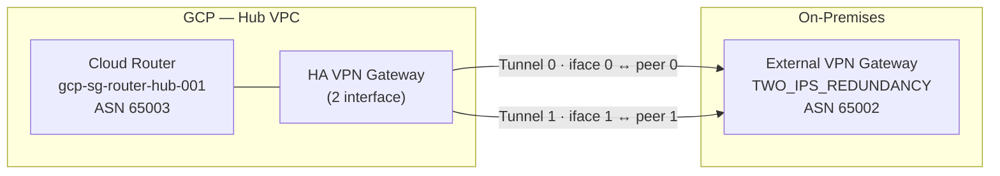
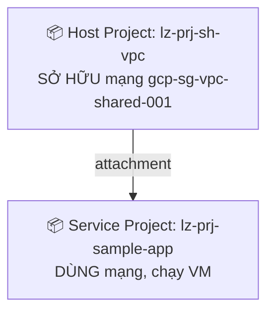
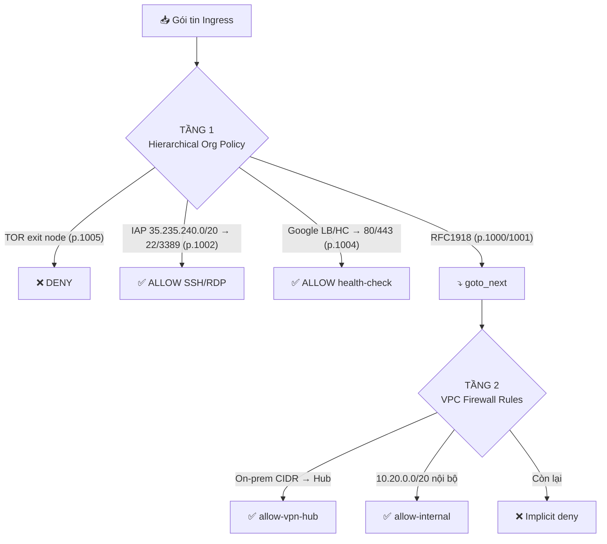

# 🏛️ Thiết Kế Kiến Trúc — GCP Landing Zone

> Tài liệu này đi sâu vào **lý do thiết kế** (the *why*) đằng sau từng quyết định kiến trúc, không chỉ liệt kê tài nguyên. Mục tiêu là giúp người vận hành hiểu được *tại sao* hạ tầng được dựng theo cách này, từ đó tự tin mở rộng, sửa đổi và khắc phục sự cố.

Nếu bạn cần cái nhìn tổng quan nhanh (sơ đồ tổng thể, danh sách tính năng), hãy đọc [README](../README.md). Tài liệu này tập trung vào **chiều sâu kỹ thuật**: nguyên lý phân cấp, kế hoạch địa chỉ IP, cơ chế định tuyến động BGP, thứ tự đánh giá firewall, và các đánh đổi (trade-off) thiết kế.

---

## 📑 Mục lục

1. [Triết lý & Nguyên tắc thiết kế](#1)
2. [Phân cấp tài nguyên — Resource Hierarchy](#2)
3. [Mô hình mạng Hub-and-Spoke](#3)
4. [Kế hoạch địa chỉ IP (IPAM)](#4)
5. [Định tuyến động: HA VPN + BGP](#5)
6. [Egress ra Internet: Cloud NAT](#6)
7. [Mô hình Shared VPC & VPC Peering](#7)
8. [Phân giải tên nội bộ: Cloud DNS](#8)
9. [Kiến trúc Firewall hai tầng](#9)
10. [Guardrails: Organization Policies](#10)
11. [Mô phỏng đường đi gói tin (Packet Walkthrough)](#11)
12. [Bảng tổng hợp quyết định thiết kế](#12)

---

<a id="1"></a>

## 1. 🧭 Triết Lý & Nguyên Tắc Thiết Kế

Landing Zone này không phải là một tập hợp tài nguyên ngẫu nhiên — nó được dựng trên năm nguyên tắc nền tảng. Mỗi quyết định trong các phần sau đều quay về phục vụ ít nhất một trong số chúng.

| Nguyên tắc | Ý nghĩa thực tế | Hiện thực hóa trong dự án |
| :--- | :--- | :--- |
| **Least Privilege** | Mỗi danh tính chỉ có đúng quyền cần thiết, không hơn. | 5 Service Account runner riêng cho từng stack; IAM Conditions giới hạn quyền theo prefix state. |
| **Separation of Duties** | Tách bạch trách nhiệm mạng, bảo mật, vận hành và ứng dụng. | Phân cấp folder theo chức năng; tách billing account giữa nền tảng và workload. |
| **Defense in Depth** | Không tin tưởng một lớp phòng thủ duy nhất. | Firewall hai tầng (hierarchical + VPC); Org Policies; Shielded VM; OS Login. |
| **Zero External IP** | Không VM nào lộ ra Internet trực tiếp. | Org Policy `vmExternalIpAccess = deny_all`; quản trị qua Cloud IAP; egress qua NAT. |
| **Everything as Code** | Mọi tài nguyên đều khai báo, tái lập được, có thể review. | 100% Terraform, state phân tách theo stack, không thao tác thủ công trên Console. |

> [!IMPORTANT]
> Nguyên tắc **Zero External IP** chi phối toàn bộ thiết kế mạng. Vì không VM nào có IP công khai, ta buộc phải xây dựng đường egress riêng (Cloud NAT) và đường quản trị riêng (Cloud IAP). Đây là lý do tồn tại của Hub VPC.

---

<a id="2"></a>

## 2. 🗂️ Phân Cấp Tài Nguyên — Resource Hierarchy

### 2.1 Sơ đồ cây tổ chức

Tài nguyên được tổ chức phân cấp dưới Organization để **cô lập ranh giới** và **ủy quyền quản trị** theo từng nhóm chức năng:

```
🏢 Organization Root
│
├── 📁 fldr-platform                       ← Hạ tầng dùng chung (đội Network & SRE)
│   │
│   ├── 📁 fldr-management                 ← Quan sát & Bảo mật tập trung
│   │   ├── 📦 gcp-platform-management      ← Log buckets, dashboards, alerting, budget
│   │   └── 📦 gcp-platform-security        ← KMS, Secret Manager, Org Firewall Policy
│   │
│   └── 📁 fldr-connectivity               ← Lớp mạng lõi
│       ├── 📦 lz-prj-hub-net-<suffix>      ← Hub VPC, HA VPN, Cloud Router, NAT
│       └── 📦 lz-prj-sh-vpc-<suffix>       ← Shared VPC Host Project
│
├── 📁 fldr-workload                       ← Môi trường ứng dụng (đội App)
│   └── 📦 lz-prj-sample-app-<suffix>   ← Service Project dùng Shared VPC
│
└── 📁 fldr-sandbox                        ← Khu thử nghiệm cô lập (chưa có project)
```

### 2.2 Vì sao phân cấp như vậy?

**Tách `fldr-platform` khỏi `fldr-workload`** — Hạ tầng nền tảng (mạng, bảo mật, log) có vòng đời và đối tượng vận hành hoàn toàn khác với ứng dụng. Đội App không nên (và không cần) chạm vào VPC hay Org Policy. Ranh giới folder cho phép gán IAM ở cấp folder, khiến quyền được kế thừa xuống tự nhiên mà không rò rỉ chéo.

**Tách `fldr-management` và `fldr-connectivity`** dưới `platform` — Quan sát (logging/monitoring) và Kết nối (networking) là hai miền trách nhiệm riêng. Một sự cố cấu hình mạng không được phép vô tình ảnh hưởng tới kho log kiểm toán, và ngược lại.

**`fldr-sandbox` tồn tại sẵn nhưng rỗng** — Đây là chủ đích: cung cấp sẵn một vùng cô lập để thử nghiệm trong tương lai mà không phải sửa lại cây folder (thao tác nhạy cảm ở cấp Organization).

### 2.3 Chiến lược tách Billing Account

Đây là một chi tiết dễ bị bỏ qua nhưng rất quan trọng về mặt tài chính và bảo mật:

| Nhóm project | Billing Account | Lý do |
| :--- | :--- | :--- |
| `lz-prj-hub-net`, `lz-prj-sh-vpc`, `lz-prj-sample-app` | **Billing #2** (workload) | Chi phí vận hành ứng dụng & mạng phục vụ ứng dụng — quy về ngân sách sản phẩm. |
| `gcp-platform-management`, `gcp-platform-security` | **Billing #1** (nền tảng) | Chi phí nền tảng dùng chung (log, bảo mật) — quy về ngân sách hạ tầng trung tâm. |

Việc tách billing giúp **phân bổ chi phí (cost allocation)** rõ ràng và cho phép áp ngân sách/cảnh báo độc lập cho từng miền.

### 2.4 Quy ước đặt tên project

Các project workload dùng tiền tố `lz-prj-*` cộng với **hậu tố ngẫu nhiên 4 ký tự** sinh bởi `random_string.name_suffix`:

```hcl
project_id_hub_net = "lz-prj-hub-net-${local.name_suffix}"   # ví dụ: lz-prj-hub-net-a3f9
```

Project ID trong GCP phải **duy nhất toàn cầu**. Hậu tố ngẫu nhiên đảm bảo có thể triển khai lại landing zone (ví dụ môi trường demo/test song song) mà không đụng tên. Hai project nền tảng (`gcp-platform-management`, `gcp-platform-security`) dùng `random_project_id = true` để provider tự gắn hậu tố.

---

<a id="3"></a>

## 3. 🌐 Mô Hình Mạng Hub-and-Spoke

### 3.1 Vì sao chọn Hub-and-Spoke?

Kiến trúc mạng dựa trên mô hình **Hub-and-Spoke không bắc cầu (non-transitive)**. Có ba phương án phổ biến để kết nối nhiều VPC; ta chọn Hub-and-Spoke vì:

| Phương án | Ưu | Nhược | Quyết định |
| :--- | :--- | :--- | :--- |
| **VPC phẳng đơn lẻ** | Đơn giản | Không cô lập được lỗi/bảo mật; khó mở rộng đa nhóm | ❌ |
| **Full-mesh Peering** | Độ trễ thấp giữa mọi VPC | Số kết nối bùng nổ O(n²); khó quản lý route | ❌ |
| **Hub-and-Spoke** | Tập trung điểm vào/ra (VPN, NAT); dễ kiểm soát; mở rộng tuyến tính | Hub là điểm hội tụ cần thiết kế HA | ✅ |

Trong mô hình này, **Hub VPC** là điểm hội tụ duy nhất cho mọi luồng đặc quyền: chấm dứt VPN tới on-prem, và (gián tiếp) đường ra Internet. Các **Spoke** (hiện tại là Shared VPC chứa workload) kết nối về Hub qua Peering.

### 3.2 Sơ đồ tổng thể

```mermaid
flowchart TD
    classDef project fill:#2d3748,stroke:#4a5568,stroke-width:2px,color:#fff;
    classDef network fill:#1a202c,stroke:#3182ce,stroke-width:2px,color:#fff;
    classDef external fill:#2c5282,stroke:#2b6cb0,stroke-width:2px,color:#fff;

    OnPrem["🏢 Mạng On-Premises<br/>(RFC1918)"]:::external
    Internet["🌐 Public Internet"]:::external
    IAP["🔒 Cloud IAP<br/>(35.235.240.0/20)"]:::external

    subgraph HubProject["📦 lz-prj-hub-net"]
        subgraph HubVPC["🌐 gcp-sg-vpc-hub-001 (GLOBAL)"]
            HubSubnet["gcp-sg-snet-hub-001 — 10.0.0.0/24<br/>• HA VPN Gateway<br/>• Cloud Router (ASN 65003)"]:::network
        end
    end
    style HubProject fill:#1a202c,stroke:#e2e8f0,stroke-width:1px

    subgraph SharedVPCProject["📦 lz-prj-sh-vpc"]
        subgraph SharedVPC["🌐 gcp-sg-vpc-shared-001 (GLOBAL, Host)"]
            AppSubnet["gcp-sg-snet-app-001 — 10.20.1.0/24<br/>• Subnet workload<br/>• Cloud NAT (gcp-sg-nat-001)"]:::network
        end
    end
    style SharedVPCProject fill:#1a202c,stroke:#e2e8f0,stroke-width:1px

    subgraph WorkloadProject["📦 lz-prj-sample-app (Service Project)"]
        VM["🖥️ Workload VM<br/>(IP nội bộ, KHÔNG IP ngoài)"]:::project
    end
    style WorkloadProject fill:#1a202c,stroke:#e2e8f0,stroke-width:1px

    OnPrem <-->|"HA VPN · 2 tunnel · BGP"| HubSubnet
    HubVPC <-->|"VPC Peering (custom routes)"| SharedVPC
    SharedVPC -.->|"Shared VPC attachment"| VM
    AppSubnet -->|"Cloud NAT"| Internet
    IAP -.->|"SSH/RDP qua IAP"| VM
```



> [!NOTE]
> **Điểm tinh tế:** Cloud NAT *không* đặt ở Hub mà đặt ngay trong Shared VPC (`gcp-sg-router-nat-001`). Hub chủ yếu đảm nhiệm chấm dứt VPN và là điểm BGP trung tâm. Điều này giảm một chặng peering cho luồng egress thuần Internet của workload.

---

<a id="4"></a>

## 4. 🔢 Kế Hoạch Địa Chỉ IP (IPAM)

Quy hoạch IP được thiết kế để **không chồng lấn** và **chừa chỗ mở rộng**. Mọi subnet đều bật **Private Google Access** (cho phép gọi API Google qua IP nội bộ) và **VPC Flow Logs**.

| Subnet | CIDR | VPC | Project | Flow Sampling | Vai trò |
| :--- | :--- | :--- | :--- | :---: | :--- |
| `gcp-sg-snet-hub-001` | `10.0.0.0/24` | Hub | `lz-prj-hub-net` | `0.5` | Chấm dứt HA VPN, BGP peering. **Không** đặt compute. |
| `gcp-sg-snet-app-001` | `10.20.1.0/24` | Shared | `lz-prj-sh-vpc` | `0.1` | Chứa workload & private VM. |

### 4.1 Giải thích các dải địa chỉ

- **`10.0.0.0/24` (Hub)** — Dải nhỏ, chuyên dụng cho hạ tầng kết nối. Hub không chạy ứng dụng nên một `/24` (254 địa chỉ) là quá đủ cho gateway, router và các thành phần điều khiển.
- **`10.20.1.0/24` (App)** — Subnet workload thực tế. Đáng chú ý: Cloud Router của Hub **quảng bá cả dải `10.20.0.0/20`** (xem §5.3) chứ không chỉ `/24`. Đây là chủ đích — dành sẵn không gian `10.20.0.0/20` (4096 địa chỉ, 16 subnet `/24`) để thêm subnet workload mới sau này mà **không phải tái cấu hình BGP**.

### 4.2 Vì sao Flow Sampling khác nhau?

`flow_sampling` quyết định tỷ lệ gói được ghi vào Flow Logs:

- **Hub = `0.5` (50%)** — Lưu lượng qua Hub ít nhưng mang tính nhạy cảm (VPN, liên kết on-prem). Lấy mẫu dày để phục vụ kiểm toán & điều tra sự cố.
- **App = `0.1` (10%)** — Subnet workload có lưu lượng lớn hơn nhiều. Lấy mẫu thưa để cân bằng giữa khả năng quan sát và **chi phí lưu trữ log**.

### 4.3 Dải địa chỉ liên kết BGP (link-local)

Phiên BGP qua VPN dùng dải `169.254.0.0/16` (RFC 3927, link-local) — tách biệt hoàn toàn khỏi không gian địa chỉ workload:

| Tunnel | GCP side (interface) | On-prem peer | ASN peer |
| :--- | :--- | :--- | :---: |
| Tunnel 0 | `169.254.0.1/30` | `169.254.0.2` | `65002` |
| Tunnel 1 | `169.254.1.1/30` | `169.254.1.2` | `65002` |

Mỗi tunnel có một `/30` riêng → hai phiên BGP độc lập, không chồng lấn, đảm bảo dự phòng thật sự.

---

<a id="5"></a>

## 5. 🔐 Định Tuyến Động: HA VPN + BGP

### 5.1 Vì sao HA VPN + BGP thay vì VPN tĩnh?

VPN với **static route** đòi hỏi khai báo thủ công từng dải đích và không tự chuyển hướng khi một tunnel chết. Ta chọn **HA VPN với BGP** vì:

- **Tự động hội tụ (auto-convergence):** Khi một tunnel mất kết nối, BGP rút route và dồn lưu lượng sang tunnel còn lại — không cần can thiệp.
- **Quảng bá route động:** Thêm/bớt subnet ở on-prem hay GCP được trao đổi tự động qua BGP.
- **SLA 99.99%:** HA VPN đạt SLA này khi cấu hình đủ hai interface dự phòng — đúng như thiết kế hai tunnel ở đây.

### 5.2 Cấu trúc dự phòng kép



Cụ thể trong code:

- **HA VPN Gateway** (`gcp-sg-vpn-hub-001`) có 2 interface.
- **External VPN Gateway** (`gcp-sg-vpn-external-peer-001`) khai báo `redundancy_type = "TWO_IPS_REDUNDANCY"` với hai IP công khai của on-prem.
- **Hai tunnel** (`gcp-sg-vpn-tunnel-001`, `-002`) nối chéo iface ↔ peer tương ứng, mỗi tunnel một shared secret riêng.
- Mỗi tunnel gắn một **router interface** + **router peer** để chạy phiên BGP độc lập.

### 5.3 Lựa chọn ASN & quảng bá route

| Thành phần | Giá trị | Ghi chú |
| :--- | :--- | :--- |
| GCP Cloud Router ASN | `65003` | Private ASN (RFC 6996, dải 64512–65534). |
| On-prem peer ASN | `65002` | ASN riêng cho phía on-prem → eBGP giữa hai phía. |
| Chế độ quảng bá | `CUSTOM` | Tự kiểm soát những gì quảng bá ra on-prem. |
| Quảng bá | `ALL_SUBNETS` + dải `10.20.0.0/20` | Bao gồm cả không gian workload dự phòng. |

Việc quảng bá nguyên `10.20.0.0/20` (thay vì chỉ subnet `/24` hiện có) chính là điểm khớp với kế hoạch IPAM ở §4.1: on-prem học sẵn tuyến tới toàn bộ vùng workload tương lai.

### 5.4 ⚙️ VPN là tùy chọn (conditional)

Đây là một đặc điểm vận hành quan trọng. Toàn bộ tài nguyên VPN được bao bởi một biến `local.vpn_enabled`:

```hcl
locals {
  vpn_enabled = (
    var.onprem_vpn_public_ip_0 != "" &&
    var.onprem_vpn_public_ip_1 != "" &&
    var.vpn_shared_secret_1   != "" &&
    var.vpn_shared_secret_2   != ""
  ) ? 1 : 0
}
```

> [!WARNING]
> **Mặc định VPN KHÔNG được tạo.** Vì `terraform.tfvars` để trống các IP on-prem và shared secret, `vpn_enabled = 0` và toàn bộ gateway/tunnel/BGP bị bỏ qua (`count = 0`). Điều này cho phép triển khai landing zone trong môi trường lab/demo **không cần thiết bị on-prem thật**. Khi cần kết nối hybrid thực sự, chỉ việc điền 4 giá trị này rồi `apply` lại.

---

<a id="6"></a>

## 6. 🚪 Egress Ra Internet: Cloud NAT

VM trong Shared VPC **không có IP ngoài** (do Org Policy `vmExternalIpAccess = deny_all`). Để chúng vẫn tải được gói OS, cập nhật, gọi API bên thứ ba… ta dùng **Cloud NAT**.

### 6.1 Cấu hình & lý do

```hcl
resource "google_compute_router_nat" "gcp-sg-nat-001" {
  nat_ip_allocate_option             = "AUTO_ONLY"
  source_subnetwork_ip_ranges_to_nat = "LIST_OF_SUBNETWORKS"
  subnetwork {
    name                    = google_compute_subnetwork.gcp-sg-snet-app-001.self_link
    source_ip_ranges_to_nat = ["ALL_IP_RANGES"]
  }
  log_config { enable = true; filter = "ERRORS_ONLY" }
}
```

| Tham số | Giá trị | Vì sao |
| :--- | :--- | :--- |
| `nat_ip_allocate_option` | `AUTO_ONLY` | GCP tự cấp & co giãn IP NAT theo tải — không cần quản lý IP tĩnh thủ công. |
| `source_subnetwork_ip_ranges_to_nat` | `LIST_OF_SUBNETWORKS` | **Chỉ** subnet được liệt kê tường minh mới được NAT — tránh vô tình mở egress cho subnet mới. |
| Phạm vi | Chỉ `gcp-sg-snet-app-001` | Egress được giới hạn đúng subnet workload. |
| `log_config.filter` | `ERRORS_ONLY` | Chỉ ghi log khi NAT cạn cổng/lỗi → tiết kiệm chi phí mà vẫn cảnh báo được sự cố. |

> [!NOTE]
> Cloud NAT là **một chiều (egress-only)**. Nó cho phép VM khởi tạo kết nối ra ngoài, nhưng **không** mở bất kỳ đường nào để Internet chủ động kết nối vào. Đây là nền tảng của tư thế Zero External IP.

---

<a id="7"></a>

## 7. 🔗 Mô Hình Shared VPC & VPC Peering

### 7.1 Shared VPC: tách quyền mạng khỏi quyền ứng dụng

**Shared VPC** cho phép một **Host Project** sở hữu mạng, trong khi nhiều **Service Project** gắn vào và dùng chung mạng đó:



Lợi ích cốt lõi: **đội mạng kiểm soát subnet/firewall/route ở Host Project, đội ứng dụng chỉ triển khai workload ở Service Project**. Đội App không thể tự ý sửa cấu trúc mạng — đúng nguyên tắc Separation of Duties (§1).

Trong code, việc này gồm hai tài nguyên:
- `google_compute_shared_vpc_host_project` — bật chế độ Host cho `lz-prj-sh-vpc`.
- `google_compute_shared_vpc_service_project` — gắn `lz-prj-sample-app` làm service project.

### 7.2 VPC Peering: Hub ↔ Shared

Hub VPC và Shared VPC là hai mạng tách biệt, nối nhau bằng **một cặp peering hai chiều**:

```hcl
# Hub → App
export_custom_routes = true
import_custom_routes = true
# App → Hub (đối xứng)
export_custom_routes = true
import_custom_routes = true
```

Peering trong GCP **phải khai báo cả hai chiều** mới hoạt động. Quan trọng hơn, cả hai bật `export/import_custom_routes = true`. Vì sao? Để **route động học từ BGP/VPN ở Hub được lan truyền sang Shared VPC**. Nếu không bật custom routes, Shared VPC sẽ không biết đường về on-prem dù peering đã thông.

> [!IMPORTANT]
> Peering trong GCP **không bắc cầu (non-transitive)**. Nếu sau này thêm Spoke C peering với Hub, thì C **không** tự động thấy Shared VPC. Đây là tính năng bảo mật, không phải hạn chế — nó buộc mọi liên kết phải tường minh.

### 7.3 Dấu vết lịch sử: vì sao không có Bastion?

Trong code có chú thích: *"sh-access VPC removed along with bastion host. Access is via Cloud IAP."* Thiết kế ban đầu từng có một VPC riêng cho bastion host; nó đã bị loại bỏ hoàn toàn để chuyển sang **Cloud IAP** (§9.1) — giảm một VPC, một VM phải vá lỗi, và một bề mặt tấn công.

---

<a id="8"></a>

## 8. 🏷️ Phân Giải Tên Nội Bộ: Cloud DNS

Một **private DNS zone** (`gcp-sg-dns-internal-001`, domain `internal.lz.local.`) phục vụ phân giải tên nội bộ:

```hcl
visibility = "private"
private_visibility_config {
  networks { network_url = <Hub VPC> }
  networks { network_url = <Shared VPC> }
}
```

- **`visibility = private`** — Zone chỉ phân giải được từ trong các VPC được liệt kê, không lộ ra Internet công cộng.
- **Gắn cả Hub lẫn Shared VPC** — Cả hai mạng cùng dùng chung một không gian tên, nên một VM ở Shared VPC có thể phân giải bản ghi đặt tại Hub và ngược lại.
- Hiện zone **chưa có bản ghi A nào** — đây là khung sẵn, thêm record khi workload thực tế được triển khai (có chú thích `# Add internal DNS records here...`).

Dùng tên `internal.lz.local.` thay vì IP cứng giúp workload **không phụ thuộc địa chỉ IP** — có thể đổi IP backend mà không sửa cấu hình ứng dụng.

---

<a id="9"></a>

## 9. 🧱 Kiến Trúc Firewall Hai Tầng

Bảo mật mạng được áp dụng ở **hai tầng độc lập**, đánh giá theo thứ tự. Đây chính là hiện thân của nguyên tắc Defense in Depth.



### 9.1 Tầng 1 — Hierarchical Firewall Policy (cấp Organization)

Định nghĩa tại `security/org-fw-policies.tf`, gắn trực tiếp vào Organization → áp cho **mọi** project con, đánh giá **trước** firewall của từng VPC. Đây là tầng guardrail không thể bị project con vô hiệu hóa.

| Priority | Rule | Hành động | Nguồn / Đích | Mục đích |
| :---: | :--- | :--- | :--- | :--- |
| 1000 | delegate RFC1918 ingress | `goto_next` | `10/8, 172.16/12, 192.168/16` | Ủy quyền lưu lượng nội bộ xuống VPC. |
| 1001 | delegate RFC1918 egress | `goto_next` | RFC1918 | Tương tự, chiều ra. |
| 1002 | **allow IAP SSH/RDP** | `allow` | `35.235.240.0/20` → `22, 3389` | Đường quản trị duy nhất vào VM. |
| 1004 | allow Google LB/HC | `allow` | dải health-check Google → `80, 443` | Cho phép load balancer kiểm tra sức khỏe. |
| 1005 | **deny TOR** | `deny` | `iplist-tor-exit-nodes` (Threat Intel) | Chặn nguồn ẩn danh độc hại. |

> [!IMPORTANT]
> **Cloud IAP là cửa quản trị duy nhất.** Rule 1002 cho phép SSH/RDP *chỉ* từ dải `35.235.240.0/20` — dải IP cố định của hạ tầng Identity-Aware Proxy của Google. Người quản trị không kết nối trực tiếp tới VM mà qua proxy mã hóa của IAP, nơi danh tính được xác thực bằng IAM + OS Login *trước khi* gói tin chạm tới VM. Không có IP công khai, không có bastion — chỉ có IAP.

**Về thứ tự priority:** Số nhỏ hơn = ưu tiên cao hơn. Lưu ý rule deny TOR (1005) có priority *thấp hơn* các rule allow — nghĩa là một gói khớp đồng thời IAP-allow và TOR sẽ được xử lý theo rule priority cao hơn. Trong thực tế các tập IP này không giao nhau, nên thứ tự ở đây chủ yếu mang tính tổ chức logic: delegate nội bộ → cho phép quản trị/LB → chặn mối đe dọa.

### 9.2 Tầng 2 — VPC Firewall Rules

Sau khi Tầng 1 `goto_next`, lưu lượng nội bộ rơi xuống firewall riêng của từng VPC:

| VPC | Rule | Nguồn | Giao thức | Ghi chú |
| :--- | :--- | :--- | :--- | :--- |
| Hub | `gcp-sg-fw-allow-vpn-hub-001` | `var.onprem_network_cidrs` | TCP/UDP/ICMP | **Conditional** — chỉ tạo nếu có khai báo dải on-prem (`count > 0`). |
| Shared | `gcp-sg-fw-allow-internal-001` | `10.20.0.0/20` | TCP/UDP/ICMP/IPIP | Cho phép giao tiếp nội bộ trong toàn vùng workload. |

Lưu ý `allow-vpn-hub` cũng **conditional** giống VPN — nếu không cấu hình on-prem, rule này không tồn tại, nhất quán với việc VPN bị tắt mặc định (§5.4).

---

<a id="10"></a>

## 10. 🛡️ Guardrails: Organization Policies

7 Org Policy được áp ở cấp Organization (`org/org-policies.tf`) tạo thành các **lan can (guardrail) không thể vượt qua** — kể cả người có quyền Owner project con cũng không thể vi phạm:

| Org Policy | Constraint | Tác động & Lý do |
| :--- | :--- | :--- |
| Require OS Login | `compute.requireOsLogin` | Quản lý truy cập SSH bằng IAM thay vì khóa thủ công → kiểm toán tập trung. |
| Skip Default Network | `compute.skipDefaultNetworkCreation` | Không sinh VPC mặc định kém an toàn khi tạo project mới. |
| Deny External IP | `compute.vmExternalIpAccess` (`deny_all`) | **Trụ cột Zero External IP** — không VM nào có IP công khai. |
| Disable SA Key Creation | `iam.disableServiceAccountKeyCreation` | Cấm tạo khóa SA tĩnh (dễ rò rỉ) → buộc dùng Workload Identity / impersonation. |
| Require Shielded VM | `compute.requireShieldedVm` | Bắt buộc Secure Boot/vTPM → chống rootkit, đảm bảo tính toàn vẹn boot. |
| Uniform Bucket Access | `storage.uniformBucketLevelAccess` | Tắt ACL theo từng object (dễ cấu hình sai) → chỉ dùng IAM nhất quán. |
| Restrict Locations | `gcp.resourceLocations` (`in:asia-southeast1-locations`) | Ràng buộc dữ liệu/tài nguyên trong `asia-southeast1` → tuân thủ chủ quyền dữ liệu. |

> [!NOTE]
> Các Org Policy này khai báo `depends_on = [module.lz-prj-hub-net]`. Đây là chủ đích để Terraform tạo project **trước khi** siết policy — tránh tình huống policy chặn ngay cả thao tác provisioning hợp lệ ban đầu.

---

<a id="11"></a>

## 11. 🧪 Mô Phỏng Đường Đi Gói Tin (Packet Walkthrough)

Để củng cố hiểu biết, dưới đây là ba kịch bản gói tin điển hình đi qua kiến trúc.

### Kịch bản A — Quản trị viên SSH vào VM workload

```
1. Admin chạy: gcloud compute ssh <vm> --tunnel-through-iap
2. Kết nối tới IAP endpoint (35.235.240.0/20), KHÔNG tới IP VM.
3. IAP xác thực danh tính qua IAM + kiểm tra quyền OS Login.
4. Hierarchical FW rule 1002 cho phép 35.235.240.0/20 → port 22.
5. IAP mở tunnel mã hóa tới IP NỘI BỘ của VM. Phiên SSH thiết lập.
   → Không một byte nào đi qua Internet công cộng tới VM.
```

### Kịch bản B — VM workload tải gói cập nhật OS từ Internet

```
1. VM (10.20.1.x, không IP ngoài) khởi tạo kết nối ra apt/yum repo.
2. Gói rời subnet app, tới Cloud Router NAT trong Shared VPC.
3. Cloud NAT (gcp-sg-nat-001) dịch nguồn sang IP NAT động (AUTO_ONLY).
4. Gói ra Internet; phản hồi quay về đúng VM qua bảng NAT.
   → Egress được, nhưng Internet KHÔNG thể chủ động kết nối vào.
```

### Kịch bản C — VM workload gọi dịch vụ ở on-prem (khi VPN bật)

```
1. VM (10.20.1.x) gửi gói tới đích on-prem (vd 192.168.x.x).
2. Bảng route Shared VPC (học qua peering custom routes) trỏ về Hub.
3. Gói qua VPC Peering sang Hub VPC.
4. Cloud Router (ASN 65003) đã học tuyến on-prem qua BGP, đẩy vào tunnel.
5. HA VPN mã hóa, truyền qua một trong hai tunnel tới on-prem gateway.
   → Nếu một tunnel chết, BGP tự dồn lưu lượng sang tunnel còn lại.
```

---

<a id="12"></a>

## 12. 📋 Bảng Tổng Hợp Quyết Định Thiết Kế

| # | Quyết định | Lựa chọn thay thế bị loại | Lý do chọn |
| :---: | :--- | :--- | :--- |
| 1 | Hub-and-Spoke không bắc cầu | Full-mesh / VPC phẳng | Tập trung điểm vào-ra, kiểm soát rõ, mở rộng tuyến tính. |
| 2 | Shared VPC (Host/Service) | Mỗi project một VPC độc lập | Tách quyền mạng khỏi quyền ứng dụng (SoD). |
| 3 | HA VPN + BGP | VPN tĩnh / single tunnel | Tự hội tụ khi lỗi, SLA 99.99%, route động. |
| 4 | Zero External IP + Cloud IAP | Bastion host công khai | Bớt bề mặt tấn công, xác thực theo danh tính. |
| 5 | Cloud NAT trong Shared VPC | NAT tại Hub | Bớt một chặng peering cho egress workload. |
| 6 | VPN & FW on-prem dạng conditional | Luôn tạo VPN | Triển khai được trong lab không cần on-prem thật. |
| 7 | Routing mode `GLOBAL` | `REGIONAL` | Sẵn sàng mở rộng đa region trong tương lai. |
| 8 | Firewall 2 tầng (Org + VPC) | Chỉ VPC firewall | Guardrail cấp Org không thể bị project con vô hiệu hóa. |
| 9 | Quảng bá `/20` thay vì `/24` | Chỉ quảng bá subnet hiện có | Thêm subnet workload mới không cần đụng BGP. |
| 10 | Tách 2 billing account | Một billing chung | Phân bổ chi phí & ngân sách độc lập theo miền. |

---

### 🔗 Tài liệu liên quan

| Tài liệu | Nội dung |
| :--- | :--- |
| [README.md](../README.md) | Tổng quan dự án & hướng dẫn triển khai. |
| [iam-roles.md](./iam-roles.md) | Mô hình IAM, Service Account & phân quyền chi tiết. |
| [deployment.md](./deployment.md) | Quy trình triển khai từng stack theo thứ tự. |
| [day2-ops.md](./day2-ops.md) | Vận hành & bảo trì sau triển khai. |
