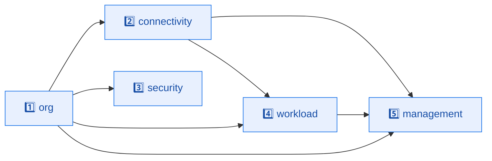
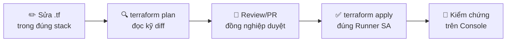
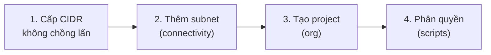
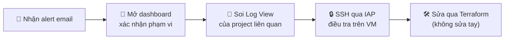

# 🛠️ Cẩm Nang Vận Hành — GCP Landing Zone Day-2 Operations

> Tài liệu này là **sổ tay vận hành (runbook)** dành cho SRE và Cloud Platform Administrator chịu trách nhiệm duy trì landing zone *sau khi* đã triển khai xong. Nếu [architecture.md](./architecture.md) trả lời câu hỏi *"tại sao hạ tầng được dựng như thế này?"*, thì tài liệu này trả lời câu hỏi *"hằng ngày tôi thao tác với nó ra sao cho an toàn?"*.

Để nắm tổng quan dự án và sơ đồ kiến trúc, hãy đọc [README](../README.md). Để hiểu chiều sâu thiết kế mạng/bảo mật, đọc [architecture.md](./architecture.md). Để triển khai từ đầu, xem [deployment.md](./deployment.md). Tài liệu này tập trung vào **các tác vụ lặp lại sau triển khai**: thay đổi có kiểm soát, mở rộng hạ tầng, phản ứng cảnh báo, quản lý state và khắc phục sự cố.

---

## 📑 Mục lục

1. [Triết lý vận hành Day-2](#1)
2. [Mô hình thực thi: Impersonation không key tĩnh](#2)
3. [Thứ tự vòng đời: Apply & Destroy](#3)
4. [Quy trình thay đổi chuẩn (Change Workflow)](#4)
5. [Quản lý Terraform State](#5)
6. [Các kịch bản vận hành thường gặp](#6)
7. [Quan trắc & phản ứng cảnh báo](#7)
8. [Lan can vận hành (Operational Guardrails)](#8)
9. [Khắc phục sự cố thường gặp](#9)
10. [Checklist trước khi lên Production](#10)
11. [Bảng tra cứu lệnh nhanh](#11)

---

<a id="1"></a>

## 1. 🧭 Triết Lý Vận Hành Day-2

Mọi thao tác vận hành trong landing zone này đều xoay quanh ba nguyên tắc kế thừa trực tiếp từ thiết kế kiến trúc:

| Nguyên tắc vận hành | Ý nghĩa thực tế | Hệ quả khi thao tác |
| :--- | :--- | :--- |
| **Everything as Code** | Không sửa tay trên Console. Mọi thay đổi đi qua Terraform + Git review. | Console chỉ dùng để *đọc/kiểm chứng*, không dùng để *sửa*. Sửa tay sẽ bị drift và bị `apply` sau ghi đè. |
| **Blast Radius Isolation** | 5 stack độc lập, mỗi stack một state riêng. | Một thay đổi chỉ chạy `apply` trong đúng thư mục stack liên quan, không bao giờ chạy toàn bộ cùng lúc. |
| **Least Privilege at Runtime** | Mỗi stack chạy bằng đúng Runner SA của nó qua impersonation. | Bạn không cần (và không nên) dùng quyền Owner cá nhân để `apply`; quyền đến từ SA. |

> [!IMPORTANT]
> **Quy tắc vàng:** Trước mọi `terraform apply`, luôn chạy `terraform plan` và đọc kỹ diff. Trong landing zone, một thay đổi nhỏ ở stack nền (org/connectivity) có thể lan tới các stack hạ nguồn qua `terraform_remote_state`. Không bao giờ `apply` mù.

---

<a id="2"></a>

## 2. 🔐 Mô Hình Thực Thi: Impersonation Không Key Tĩnh

Khác với cách làm phổ biến (tải file key JSON về máy), landing zone này **cấm tuyệt đối key SA tĩnh** (Org Policy `iam.disableServiceAccountKeyCreation`). Mỗi stack chạy bằng cách **mạo danh (impersonate)** đúng Runner SA của nó.

### 2.1 Ánh xạ Stack ↔ Runner SA ↔ Nhóm người dùng

| Stack | Runner SA | Nhóm được impersonate | Quyền ghi state prefix |
| :--- | :--- | :--- | :--- |
| `org` | `sa-tf-org-001` | `grp-gcp-foundation` | `terraform/org` |
| `connectivity` | `sa-tf-conn-001` | `grp-gcp-network` | `terraform/connectivity` |
| `security` | `sa-tf-sec-001` | `grp-gcp-security` | `terraform/security` |
| `workload` | `sa-tf-wl-001` | `grp-gcp-app-eng` | `terraform/workload` |
| `management` | `sa-tf-mgmt-001` | `grp-gcp-sre` | `terraform/management` |

Việc bạn `apply` được stack nào phụ thuộc vào nhóm bạn thuộc về. Cơ chế cấp quyền `roles/iam.serviceAccountTokenCreator` được thiết lập trong [scripts/roles.sh](../scripts/roles.sh) (bảng `TOKEN_CREATOR_BINDINGS`).

### 2.2 Điều kiện tiên quyết mỗi phiên làm việc

```bash
# 1. Đăng nhập danh tính cá nhân của bạn (thành viên một trong các nhóm trên)
gcloud auth login
gcloud auth application-default login

# 2. Provider tự impersonate Runner SA nhờ cấu hình trong terraform.tfvars
#    của từng stack (impersonate_service_account = "sa-tf-...@...").
#    Bạn KHÔNG cần tải key — token được cấp động và tự hết hạn.
```

> [!NOTE]
> Nếu `terraform plan` báo lỗi `Permission denied` hoặc `unable to impersonate`, gần như chắc chắn danh tính của bạn **không thuộc nhóm** được phép impersonate Runner SA của stack đó, hoặc binding Token Creator chưa được chạy. Đây là tính năng bảo mật, không phải lỗi cấu hình.

---

<a id="3"></a>

## 3. 🔄 Thứ Tự Vòng Đời: Apply & Destroy

Vì các stack tham chiếu output của nhau qua data source `terraform_remote_state` (ví dụ [management/remote.tf](../management/remote.tf) đọc prefix `terraform/org`), bạn **bắt buộc** tôn trọng cây phụ thuộc khi cập nhật hay thu hồi.

### 3.1 Cây phụ thuộc



### 3.2 Thứ tự TRIỂN KHAI (Apply — xuôi chiều phụ thuộc)

```
[ 1. org ] ──► [ 2. connectivity ] & [ 3. security ] ──► [ 4. workload ] ──► [ 5. management ]
```

- `org` luôn đi trước: nó tạo Folder, Project và xuất `project_id_*`, `folder_id_*` mà mọi stack khác đọc.
- `connectivity` và `security` **độc lập với nhau** → có thể `apply` song song ở hai terminal sau khi `org` xong.
- `workload` cần cả `org` (project) lẫn `connectivity` (mạng Shared VPC).
- `management` đi cuối vì nó quan trắc *tất cả* các project đã tồn tại.

### 3.3 Thứ tự THU HỒI (Destroy — ngược chiều phụ thuộc)

```
[ 5. management ] ──► [ 4. workload ] ──► [ 3. security ] & [ 2. connectivity ] ──► [ 1. org ]
```

> [!CAUTION]
> Sai thứ tự sẽ gây **state lock**, lỗi resolve `terraform_remote_state` (output không còn tồn tại), và để lại tài nguyên mồ côi không xóa được. Luôn thu hồi từ stack hạ nguồn (management) trước, kết thúc ở org.

> [!WARNING]
> Trước khi `terraform destroy` stack `workload`, nếu VM có bật `deletion_protection = true`, bạn phải đặt thuộc tính này về `false` và `apply` một lần trước, rồi mới `destroy` được. Tương tự, GCS log bucket có `versioning` và log bucket nóng có retention — kiểm tra kỹ trước khi xóa stack `management` để tránh mất nhật ký kiểm toán.

---

<a id="4"></a>

## 4. 📝 Quy Trình Thay Đổi Chuẩn (Change Workflow)

Mọi thay đổi — dù nhỏ — đều nên đi theo vòng lặp bốn bước này:



1. **Sửa code** trong đúng thư mục stack. Không bao giờ sửa nhiều stack trong một thay đổi logic nếu không cần thiết.
2. **`terraform plan`** và đọc từng dòng `+ / ~ / -`. Đặc biệt cảnh giác với các thay đổi `-/+` (replace) trên tài nguyên mạng hoặc project — chúng có thể gây gián đoạn.
3. **Review** qua Pull Request. Vì "Everything as Code", diff Git chính là bản ghi kiểm toán thay đổi hạ tầng.
4. **`terraform apply`** rồi **kiểm chứng** lại trên Console hoặc bằng `gcloud` (chỉ đọc).

> [!TIP]
> Khi thay đổi một stack nền (org/connectivity), hãy kiểm tra xem nó có đổi **output** nào không (xem `outputs.tf`). Nếu output đổi, các stack hạ nguồn đọc output đó cần được `plan` lại để xác nhận không bị ảnh hưởng ngoài ý muốn.

---

<a id="5"></a>

## 5. 💾 Quản Lý Terraform State

State được lưu tập trung trên **GCS bucket** (backend `gcs`), mỗi stack một `prefix` riêng, có bật **Object Versioning**. Quyền ghi vào từng prefix bị khóa theo Runner SA (bảng `STATE_OWN_BINDINGS` / `STATE_UPSTREAM_BINDINGS` trong [scripts/roles.sh](../scripts/roles.sh)).

### 5.1 Cô lập quyền truy cập state

| Runner SA | Ghi được prefix | Chỉ đọc prefix upstream |
| :--- | :--- | :--- |
| `sa-tf-conn-001` | `connectivity` | `org` |
| `sa-tf-sec-001` | `security` | `org` |
| `sa-tf-wl-001` | `workload` | `org`, `connectivity` |
| `sa-tf-mgmt-001` | `management` | `org`, `connectivity`, `workload` |

Nhờ vậy, runner của một stack **không thể** ghi đè state của stack khác — một sai sót ở `management` không thể làm hỏng state của `org`.

### 5.2 Xử lý State Lock

Nếu một `apply` bị ngắt giữa chừng, state có thể bị khóa. Đọc kỹ thông báo lỗi để lấy `Lock ID`, xác nhận **không có tiến trình nào đang chạy thật**, rồi:

```bash
terraform force-unlock <LOCK_ID>
```

> [!CAUTION]
> Chỉ `force-unlock` khi chắc chắn không còn ai/CI đang `apply`. Mở khóa nhầm khi một tiến trình khác đang ghi sẽ làm **hỏng state**.

### 5.3 Khôi phục state hỏng

Vì bucket bật **Object Versioning**, mỗi lần ghi tạo một phiên bản mới của file `default.tfstate`. Nếu state hỏng, có thể khôi phục phiên bản trước:

```bash
# Liệt kê các phiên bản của state
gsutil ls -a gs://<STATE_BUCKET>/terraform/<stack>/default.tfstate
# Khôi phục một generation cụ thể
gsutil cp gs://<STATE_BUCKET>/terraform/<stack>/default.tfstate#<GENERATION> \
          gs://<STATE_BUCKET>/terraform/<stack>/default.tfstate
```

---

<a id="6"></a>

## 6. 📈 Các Kịch Bản Vận Hành Thường Gặp

### 6.1 — Đăng ký Subnet & Project workload mới

Khi một đội ứng dụng yêu cầu môi trường cô lập mới:



1. **Cấp phát CIDR**: Chọn một dải `/24` chưa dùng *nằm trong* không gian dự phòng `10.20.0.0/20` (ví dụ `10.20.2.0/24`). Vì Cloud Router đã quảng bá sẵn nguyên `/20` qua BGP (xem [architecture.md §5.3](./architecture.md#5)), bạn **không cần** cấu hình lại VPN/BGP.
2. **Cập nhật mạng**: Mở [connectivity/subnets.tf](../connectivity/subnets.tf), thêm khối `google_compute_subnetwork` mới trên network `gcp-sg-vpc-shared-001`, bật `private_ip_google_access` và `log_config`. Chạy `terraform apply` trong thư mục `connectivity`.
3. **Tạo project**: Mở [org/projects.tf](../org/projects.tf), khai báo project mới qua Project Factory và gán vào folder `fldr-workload`. Chạy `terraform apply` trong thư mục `org`.
4. **Phân quyền**: Cập nhật bảng dữ liệu trong [scripts/roles.sh](../scripts/roles.sh) rồi chạy `./scripts/02-post-org-roles.sh`. Cấp cho Runner SA workload (`sa-tf-wl-001`) quyền `roles/compute.networkUser` trên subnet mới để được tạo VM trong đó.

> [!IMPORTANT]
> Luôn cấp CIDR từ **IPAM tập trung** và đảm bảo không chồng lấn với on-prem (`192.168.x.x`, `172.16.x.x`...) lẫn các subnet GCP hiện có. Chồng lấn IP là loại sự cố mạng tốn kém và khó sửa nhất.

---

### 6.2 — Thêm một VM workload mới

VM được khai báo trong [workload/vms.tf](../workload/vms.tf) (hiện file có sẵn khung mẫu ở dạng chú thích).

1. **Sao chép khung mẫu** trong [workload/vms.tf](../workload/vms.tf) và điền tên, `machine_type`, `zone` (vd `asia-southeast1-b`), project (`local.org.project_id_sample_app`).
2. **Gắn mạng** qua `local.conn.snet_shared_access_id` (Shared VPC) và **tuyệt đối không** thêm khối `access_config` → đảm bảo VM không có IP ngoài (tuân thủ Org Policy `vmExternalIpAccess = deny_all`).
3. **Bật Shielded VM** (`enable_secure_boot`, `enable_vtpm`, `enable_integrity_monitoring`) — bắt buộc bởi Org Policy `compute.requireShieldedVm`.
4. **Bật OS Login** qua `metadata = { enable-oslogin = "TRUE" }` — bắt buộc bởi `compute.requireOsLogin`.
5. Chạy `terraform apply` trong thư mục `workload`.

> [!NOTE]
> VM cần một **Runtime SA** (khác với Runner SA chạy Terraform) để ghi log/metric. Các Runtime SA này được tạo bằng `./scripts/03-runtime-sa.sh --app` (xem bảng `RUNTIME_SA_BINDINGS` trong [scripts/roles.sh](../scripts/roles.sh)), gắn sẵn `roles/monitoring.metricWriter` và `roles/logging.logWriter`.

---

### 6.3 — Truy cập VM qua Cloud IAP (không có Bastion, không IP Public)

Đây là **đường quản trị duy nhất** vào VM. Không có IP công khai, không có bastion host.

```bash
gcloud compute ssh <INSTANCE_NAME> \
  --project=<PROJECT_ID> \
  --zone=asia-southeast1-b \
  --tunnel-through-iap
```

Điều kiện cần (đã được thiết lập sẵn bởi landing zone):
- Người dùng có `roles/iap.tunnelResourceAccessor` trên project (cấp trong [security/iam.tf](../security/iam.tf)).
- OS Login bật toàn org (Org Policy).
- Hierarchical firewall rule (priority 1002) đã cho phép dải IAP `35.235.240.0/20` vào port `22` (xem [architecture.md §9.1](./architecture.md#9)).

---

### 6.4 — Bật kết nối Hybrid VPN tới On-Premises

Mặc định **VPN không được tạo** (`vpn_enabled = 0`) vì các giá trị on-prem để trống. Khi cần kết nối datacenter thật:

1. Mở [connectivity/terraform.tfvars](../connectivity/terraform.tfvars) và điền **đủ 4 giá trị**:
   - `onprem_vpn_public_ip_0`, `onprem_vpn_public_ip_1` — hai IP công khai của VPN gateway on-prem.
   - `vpn_shared_secret_1`, `vpn_shared_secret_2` — shared secret cho hai tunnel.
2. Khai báo `onprem_network_cidrs` (dải IP on-prem) để firewall rule `gcp-sg-fw-allow-vpn-hub-001` được tạo (rule này cũng *conditional*).
3. Chạy `terraform apply` trong `connectivity`. Khi đủ 4 giá trị, Terraform tự tạo HA VPN Gateway, 2 tunnel, External VPN Gateway và 2 phiên BGP.

> [!WARNING]
> **Shared secret là bí mật.** Không commit giá trị thật vào Git. Hãy truyền qua biến môi trường `TF_VAR_vpn_shared_secret_1`/`_2` hoặc Secret Manager, để `terraform.tfvars` trong repo luôn trống.

---

### 6.5 — Kết nối VM vào hệ thống quan trắc tập trung

Để VM gửi log & metric về dashboard SRE:

> [!NOTE]
> **VM mẫu (`sample-app`) đã tự cài Ops Agent** qua `startup-script` trong [workload/vms.tf](../workload/vms.tf) — không cần làm thủ công. Các bước dưới đây áp dụng cho **VM bạn tự thêm về sau**.

1. **Cài Ops Agent** trên VM (qua startup script hoặc image):
   ```bash
   curl -sSO https://dl.google.com/cloudagents/add-google-cloud-ops-agent.sh
   sudo bash add-google-cloud-ops-agent.sh --also-install
   ```
   > Các alert **memory** (`agent.googleapis.com/memory/percent_used`) và **disk** (`agent.googleapis.com/disk/percent_used`) trong [management/monitoring.tf](../management/monitoring.tf) **chỉ hoạt động khi có Ops Agent**. Không cài agent → hai alert này không bao giờ có dữ liệu.
2. **Đăng ký project vào Metrics Scope**: Mở [management/monitoring.tf](../management/monitoring.tf), thêm một khối `google_monitoring_monitored_project` trỏ tới project mới (`metrics_scope = local.org.project_id_management`). Chạy `terraform apply` trong `management`.

---

### 6.6 — Thêm Log View phân quyền cho một project

Log toàn org được gom về **log bucket nóng** (retention 90 ngày) trong project management; ngoài ra có bản sao lưu trữ lạnh trên **GCS (ARCHIVE, 365 ngày)** — xem [management/log-export.tf](../management/log-export.tf).

Để cho một đội chỉ đọc được log *của riêng project họ*:
1. Mở [management/log-views.tf](../management/log-views.tf), thêm khối `google_logging_log_view` với `filter = "SOURCE(\"projects/<PROJECT_ID>\")"`.
2. Chạy `terraform apply` trong `management`.
3. Cấp quyền đọc Log View đó cho nhóm tương ứng (qua IAM ở [security/iam.tf](../security/iam.tf)).

Cơ chế này cho phép **đọc log theo từng nguồn** mà không lộ toàn bộ log tập trung — đúng nguyên tắc Least Privilege.

---

### 6.7 — Điều chỉnh ngân sách (Budget) & cảnh báo chi tiêu

Budget được định nghĩa trong [management/budget.tf](../management/budget.tf): mặc định **100 USD/tháng**, cảnh báo ở các ngưỡng **50% · 80% · 100% chi tiêu thực tế** và **100% chi tiêu dự báo (forecasted)**, gửi qua kênh email.

- Đổi hạn mức: sửa `amount.specified_amount.units`.
- Đổi ngưỡng: sửa danh sách `for_each = toset([0.5, 0.8, 1.0])`.
- Budget chỉ được tạo khi `budget_billing_account_id` khác rỗng (`count` conditional). Để rỗng nếu môi trường lab không muốn theo dõi chi phí.

---

### 6.8 — Thêm bản ghi DNS nội bộ

Private zone `internal.lz.local.` (xem [connectivity/dns.tf](../connectivity/dns.tf)) hiện là khung trống, gắn cả Hub lẫn Shared VPC. Để thêm phân giải tên nội bộ:
1. Thêm `google_dns_record_set` (loại A) trỏ tên → IP nội bộ của VM trong [connectivity/dns.tf](../connectivity/dns.tf).
2. Chạy `terraform apply` trong `connectivity`.

Dùng tên thay vì IP cứng giúp workload không phụ thuộc địa chỉ IP backend.

---

<a id="7"></a>

## 7. 🚨 Quan Trắc & Phản Ứng Cảnh Báo

Project `management` là **Metrics Scope trung tâm** thu thập metric của mọi project (sample-app, hub-net, sh-vpc). Ba Alert Policy được cấu hình sẵn trong [management/monitoring.tf](../management/monitoring.tf):

| Alert | Điều kiện | Yêu cầu | Tự đóng |
| :--- | :--- | :--- | :--- |
| `gcp-sg-alert-cpu-001` | CPU > **80%** trong **5 phút** | Metric GCE mặc định | 7 ngày |
| `gcp-sg-alert-memory-001` | RAM (`used`) > **80%** trong 5 phút | **Cần Ops Agent** | 7 ngày |
| `gcp-sg-alert-disk-001` | Disk (`used`) > **85%** trong 5 phút | **Cần Ops Agent** | 7 ngày |

Tất cả gửi tới kênh email `gcp-sg-monitoring-email-001` (địa chỉ lấy từ biến `alert_notification_email`).

### 7.1 Quy trình phản ứng cảnh báo (gợi ý)



> [!IMPORTANT]
> Khi xử lý sự cố, được phép **đọc** trực tiếp trên Console/VM, nhưng mọi **thay đổi cấu hình** (scale, mở port, đổi machine type...) phải quay về sửa qua Terraform để tránh drift. Sửa tay là nợ kỹ thuật sẽ bị `apply` sau ghi đè.

---

<a id="8"></a>

## 8. ⚡ Lan Can Vận Hành (Operational Guardrails)

> [!WARNING]
> Không bao giờ `apply` các khối tài nguyên nhạy cảm dưới đây mà chưa thử nghiệm trước trên một project thuộc folder **`fldr-sandbox`**.

| Khu vực nhạy cảm | File | Rủi ro nếu sai |
| :--- | :--- | :--- |
| **Organization Policies** | [org/org-policies.tf](../org/org-policies.tf) | Đổi `compute.vmExternalIpAccess` hay `iam.disableServiceAccountKeyCreation` ở cấp org có hiệu lực tức thì với **mọi** project con — có thể chặn cả thao tác provisioning hợp lệ. |
| **Hierarchical Firewall** | [security/org-fw-policies.tf](../security/org-fw-policies.tf) | Sửa rule cấp Org có thể **chặn toàn bộ** kết nối IAP (mất đường SSH vào VM) hoặc luồng Hub↔Spoke. |
| **VPC Peering / Routes** | [connectivity/peering.tf](../connectivity/peering.tf) | Tắt `export/import_custom_routes` làm Shared VPC mất tuyến học từ BGP → đứt kết nối on-prem. |
| **Deletion Protection** | [workload/vms.tf](../workload/vms.tf) | Phải tắt `deletion_protection` trước khi `destroy`; nhưng đừng để tắt vĩnh viễn trên VM Production. |
| **Log Buckets / GCS Archive** | [management/log-export.tf](../management/log-export.tf) | Xóa nhầm log bucket/GCS archive làm **mất nhật ký kiểm toán** không khôi phục được. |

> [!CAUTION]
> Đặc biệt thận trọng với rule IAP (priority 1002) trong hierarchical firewall: nó là **cửa quản trị duy nhất**. Vô tình xóa/sửa rule này có thể khiến bạn **mất hoàn toàn quyền SSH** vào mọi VM trong org.

---

<a id="9"></a>

## 9. 🔧 Khắc Phục Sự Cố Thường Gặp

| Triệu chứng | Nguyên nhân thường gặp | Hướng xử lý |
| :--- | :--- | :--- |
| `Error: unable to impersonate` khi `plan` | Danh tính không thuộc nhóm được phép impersonate Runner SA của stack | Kiểm tra `gcloud auth list`; xác nhận nhóm của bạn trong `TOKEN_CREATOR_BINDINGS` ([roles.sh](../scripts/roles.sh)) |
| `Error acquiring the state lock` | Một `apply` trước bị ngắt | Xác nhận không còn tiến trình chạy → `terraform force-unlock <ID>` |
| `terraform_remote_state` trả về rỗng/lỗi | Stack upstream chưa `apply`, hoặc output bị đổi tên | `apply` lại stack upstream; kiểm tra `outputs.tf` |
| VM tạo được nhưng không SSH được | Thiếu `roles/iap.tunnelResourceAccessor`, hoặc OS Login chưa bật | Cấp quyền IAP trong [security/iam.tf](../security/iam.tf); kiểm tra metadata `enable-oslogin` |
| VM không ra được Internet | Subnet chưa nằm trong danh sách NAT, hoặc dùng sai subnet | Kiểm tra `gcp-sg-nat-001` ([connectivity/nats.tf](../connectivity/nats.tf)) liệt kê đúng subnet |
| Alert memory/disk không có dữ liệu | VM chưa cài Ops Agent | Cài Ops Agent (xem §6.5) |
| `apply` báo vi phạm Org Policy | Tài nguyên vi phạm guardrail (IP ngoài, thiếu Shielded VM...) | Sửa cấu hình tài nguyên cho đúng chuẩn, **không** nới lỏng Org Policy |
| Project ID trùng khi tạo lại | Thiếu hậu tố ngẫu nhiên | Dùng `random_string`/`random_project_id` như mẫu trong [org/projects.tf](../org/projects.tf) |

---

<a id="10"></a>

## 10. ✅ Checklist Trước Khi Lên Production

Trước khi bàn giao landing zone cho workload Production thật, rà soát toàn bộ danh mục sau:

- [ ] **State**: Bucket state bật Versioning; quyền prefix đã khóa đúng theo Runner SA.
- [ ] **Impersonation**: Mọi `terraform.tfvars` trỏ đúng Runner SA; không có key JSON tĩnh nào tồn tại.
- [ ] **VPN**: Đã điền IP/secret on-prem qua biến môi trường (không hardcode); hai tunnel BGP `UP`.
- [ ] **Firewall**: Rule IAP (1002) còn nguyên; đã kiểm thử SSH qua IAP thành công.
- [ ] **Org Policies**: 7 policy đang `enforced`; đã thử tạo VM IP-public để xác nhận bị chặn.
- [ ] **Quan trắc**: 3 alert (CPU/RAM/Disk) gắn đúng kênh email; Ops Agent đã cài trên mọi VM cần đo RAM/disk.
- [ ] **Log**: 3 sink (org/folder/GCS) đang chảy; log bucket nóng 90 ngày + GCS archive 365 ngày hoạt động; Log View phân quyền đúng.
- [ ] **Budget**: Hạn mức & ngưỡng cảnh báo đặt đúng; kênh email nhận được test alert.
- [ ] **Deletion Protection**: Bật trên mọi VM Production.
- [ ] **Sandbox**: Mọi thay đổi rủi ro cao đã được thử trên `fldr-sandbox` trước.
- [ ] **Tài liệu**: README, architecture, deployment, day2-ops phản ánh đúng trạng thái hiện tại.

---

<a id="11"></a>

## 11. 🗂️ Bảng Tra Cứu Lệnh Nhanh

| Mục đích | Lệnh |
| :--- | :--- |
| Đăng nhập & ADC | `gcloud auth login && gcloud auth application-default login` |
| Khởi tạo backend stack | `cd <stack> && terraform init` |
| Xem trước thay đổi | `terraform plan` |
| Áp dụng thay đổi | `terraform apply` |
| Xem output stack | `terraform output` / `terraform output -raw <name>` |
| Mở khóa state | `terraform force-unlock <LOCK_ID>` |
| SSH vào VM qua IAP | `gcloud compute ssh <vm> --zone=asia-southeast1-b --tunnel-through-iap` |
| Tạo Runtime SA cho VM | `./scripts/03-runtime-sa.sh --app --tools` |
| Phân quyền sau apply org | `./scripts/02-post-org-roles.sh` |
| Liệt kê phiên bản state | `gsutil ls -a gs://<STATE_BUCKET>/terraform/<stack>/default.tfstate` |

---

### 🔗 Tài liệu liên quan

| Tài liệu | Nội dung |
| :--- | :--- |
| [README.md](../README.md) | Tổng quan dự án & sơ đồ kiến trúc tổng thể. |
| [architecture.md](./architecture.md) | Chiều sâu thiết kế: mạng, IPAM, BGP, firewall, guardrails. |
| [iam-roles.md](./iam-roles.md) | Mô hình IAM, 5 Runner SA & cơ chế khóa prefix state. |
| [deployment.md](./deployment.md) | Quy trình triển khai từ đầu theo thứ tự stack. |
