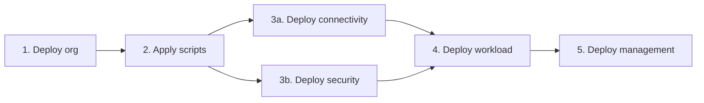

# 🚀 Enterprise GCP Landing Zone — Step-by-Step Deployment Guide

Follow this guide to deploy the Landing Zone infrastructure from scratch. Ensure all prerequisites are met and execute the phases sequentially.

---

## 📋 1. Prerequisites & Setup

### 1.1 Command-Line Tools
The deploying administrator must have the following tools installed locally:
- **Terraform CLI** version `>= 1.14.6`.
- **Google Cloud SDK (gcloud CLI)**: Install and update with `gcloud components update`.
- **Bash Shell**: For executing setup scripts.

### 1.2 Administrative Credentials
You must log in to gcloud using an identity with the following organization-level permissions:
- `roles/resourcemanager.organizationAdmin`
- `roles/billing.admin`
- `roles/iam.organizationRoleAdmin`
- `roles/compute.xpnAdmin`

Verify your active credentials:
```bash
gcloud auth login
gcloud auth application-default login
```

---

## ⚙️ 2. Configuration Phase

### Step 2.1: Configure Global Settings
Open the file [scripts/config.sh](file:///d:/GCP/landing-zone/scripts/config.sh) and update the parameters to match your GCP deployment targets:

```bash
# Targets
export ORG_ID="123456789012"                              # GCP Organization ID
export BILLING_ACCOUNT_1="012345-6789AB-CDEF01"           # Billing Account for Platform/Security
export BILLING_ACCOUNT_2="012345-6789AB-CDEF01"           # Billing Account for Network/Workloads
export BILLING_ACCOUNT_BUDGET="012345-6789AB-CDEF01"      # Billing Account to track budgets
export STATE_BUCKET="gcp-sg-tfstate-yourcompany"          # Globally unique bucket name for state files

# Group Mappings (Ensure these groups exist in your Cloud Identity/Workspace)
export GRP_FOUNDATION="group:grp-gcp-foundation@company.com"
export GRP_NETWORK="group:grp-gcp-network@company.com"
export GRP_SECURITY="group:grp-gcp-security@company.com"
export GRP_APP="group:grp-gcp-app-eng@company.com"
export GRP_SRE="group:grp-gcp-sre@company.com"
```

---

## 🔨 3. Phase A — Bootstrapping the Infrastructure Foundation

We utilize a bootstrap script to set up our Terraform state bucket and runner Service Accounts.

> [!IMPORTANT]  
> All Service Accounts and GCS prefix permission rules are created manually via `gcloud CLI` (automated in scripts). Terraform does not create SAs or self-bind role scopes, maintaining clean management separation.

### Step 3.1: Execute the Bootstrap Script
Run the script from the root directory:
```bash
./scripts/01-bootstrap.sh
```

### Step 3.2: Verify Bootstrap Outputs
Ensure the script successfully completes the following steps:
1. Provisions the **Seed Project** (`gcp-platform-bootstrap-001`).
2. Generates the **State Bucket** (`gs://<STATE_BUCKET>`) with Versioning enabled.
3. Provisions **5 TF Runner SAs** (org, conn, sec, wl, mgmt).
4. Limits state bucket read/write scopes to specific folder prefixes using GCS IAM Conditions.

### Step 3.3: Configure Backends
Update the `backend.tf` files inside `org/`, `connectivity/`, `security/`, `workload/`, and `management/` to target your new `$STATE_BUCKET` name:

```hcl
terraform {
  backend "gcs" {
    bucket = "gcp-sg-tfstate-yourcompany"   # Set to your exact $STATE_BUCKET
    prefix = "terraform/org"                # Set to match stack folder name
  }
}
```

---

## 🏗️ 4. Phase B — Sequential Stack Deployment

Apply the stacks in the exact sequence specified. Each folder runs with dynamic credential impersonation via its `terraform.tfvars` configuration.



### Step 4.1: Deploy Layer 1 — Org Stack
This builds folders, launches projects, and sets Organization Policies:
```bash
cd org
terraform init
terraform apply
```

### Step 4.2: Apply Post-Org Setup Scripts
Run these scripts from the repository root to authorize SAs on the newly created projects:
```bash
cd ..
./scripts/02-post-org-roles.sh
./scripts/03-runtime-sa.sh --astro --tools
```

### Step 4.3: Deploy Layer 2 — Connectivity & Security (Parallel)
Deploy the core network and security policy layers:

```bash
# Terminal A (Connectivity)
cd connectivity
terraform init
terraform apply

# Terminal B (Security)
cd security
terraform init
terraform apply
```

### Step 4.4: Deploy Layer 3 — Workload Stack
This deploys the private compute instances within the astronomy workload project:
```bash
cd ../workload
terraform init
terraform apply
```

### Step 4.5: Deploy Layer 4 — Management Stack
Apply the central monitoring configurations, dashboards, log exports, and budget controls:
```bash
cd ../management
terraform init
terraform apply
```

> [!TIP]  
> All stacks are now successfully deployed. Verify resource links, budgets, and central log buckets inside the Google Cloud Console to confirm operations are running correctly.
