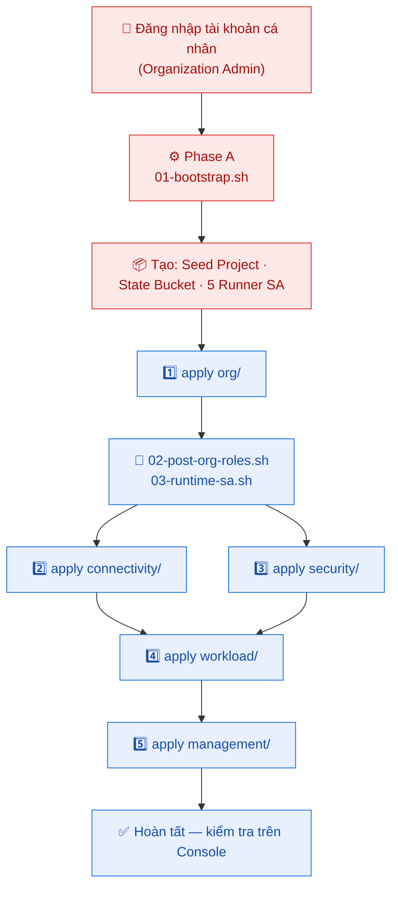
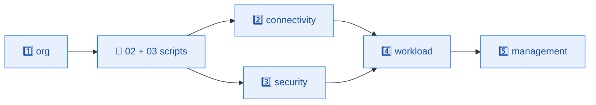
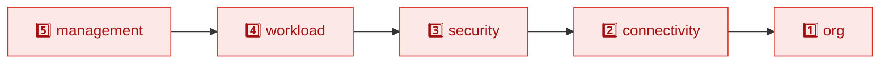

<div align="center">

# 🚀 Hướng Dẫn Triển Khai — GCP Landing Zone

### *Hướng dẫn từng bước để dựng toàn bộ hạ tầng Landing Zone từ con số 0*

<br>

🔐 **Zero-Key Bootstrap** &nbsp;•&nbsp; 🧱 **5 Stack tuần tự** &nbsp;•&nbsp; ✅ **Kiểm tra sau mỗi bước**

</div>

---

> [!NOTE]
> Tài liệu này hướng dẫn **thao tác triển khai**. Nếu bạn muốn hiểu *tại sao* hạ tầng được thiết kế như vậy, đọc thêm [architecture.md](./architecture.md) và [iam-roles.md](./iam-roles.md).

---

## 📑 Mục lục

1. [Bức tranh tổng thể — luồng triển khai](#1)
2. [Chuẩn bị trước khi bắt đầu](#2)
3. [Bước 1 — Cấu hình tham số](#3)
4. [Bước 2 — Phase A: Bootstrap nền móng](#4)
5. [Bước 3 — Cấu hình Backend & tfvars](#5)
6. [Bước 4 — Phase B: Triển khai 5 stack tuần tự](#6)
7. [Bước 5 — Kiểm tra sau triển khai](#7)
8. [Bước 6 — Thu hồi hạ tầng (Destroy)](#8)
9. [Phụ lục — Xử lý sự cố thường gặp](#9)

---

<a id="1"></a>

## 1. 🗺️ Bức Tranh Tổng Thể — Luồng Triển Khai

Toàn bộ quá trình gồm **hai pha (phase)**:

- **Phase A — Bootstrap (chạy MỘT LẦN):** Dùng tài khoản cá nhân có quyền Organization Admin để tạo "hạt giống": Seed Project, State Bucket, và 5 Terraform Runner Service Account. Đây là pha duy nhất bạn dùng quyền cá nhân trực tiếp.
- **Phase B — Triển khai stack (lặp lại khi cần):** Từ đây trở đi, Terraform **không** chạy bằng quyền cá nhân của bạn nữa, mà *mượn quyền* (impersonate) các Runner SA đã tạo ở Phase A.



> [!IMPORTANT]
> **Thứ tự là bắt buộc.** Stack `org` phải xong trước (vì nó sinh ra các project mà các stack sau cần). `connectivity` và `security` có thể chạy song song. `workload` cần cả hai stack trước nó. `management` chạy cuối cùng.

---

<a id="2"></a>

## 2. 📋 Chuẩn Bị Trước Khi Bắt Đầu

### 2.1 Cài đặt công cụ dòng lệnh

Máy của người triển khai cần có sẵn 3 công cụ sau:

| Công cụ | Phiên bản | Ghi chú |
|:--------|:----------|:--------|
| **Terraform CLI** | `1.14.6` (đúng phiên bản) | Khớp với `required_version` trong code. |
| **Google Cloud SDK** (`gcloud`) | Mới nhất | Cập nhật bằng lệnh bên dưới. |
| **Bash Shell** | — | Để chạy các script `.sh` trong thư mục `scripts/`. |

Kiểm tra Terraform đã cài đúng phiên bản:

```bash
terraform version
```

Cập nhật gcloud lên bản mới nhất:

```bash
gcloud components update
```

### 2.2 Quyền của tài khoản triển khai (Phase A)

Tài khoản cá nhân bạn dùng để chạy Phase A **phải** có các quyền cấp Organization sau:

- `roles/resourcemanager.organizationAdmin`
- `roles/billing.admin`
- `roles/iam.organizationRoleAdmin`
- `roles/compute.xpnAdmin`

### 2.3 Đăng nhập gcloud

Đăng nhập tài khoản người dùng (mở trình duyệt):

```bash
gcloud auth login
```

Đăng nhập **Application Default Credentials** (Terraform & các script dùng cái này để xác thực):

```bash
gcloud auth application-default login
```

Kiểm tra tài khoản đang hoạt động đúng là tài khoản admin của bạn:

```bash
gcloud auth list
```

> [!TIP]
> Lấy nhanh **Organization ID** nếu bạn chưa biết:
> ```bash
> gcloud organizations list
> ```
> Lấy danh sách **Billing Account ID**:
> ```bash
> gcloud billing accounts list
> ```

---

<a id="3"></a>

## 3. ⚙️ Bước 1 — Cấu Hình Tham Số

Mọi tham số dùng chung được tập trung trong một file duy nhất: [scripts/config.sh](../scripts/config.sh). Mở file này và điền các giá trị thực tế của bạn.

### 3.1 Các giá trị BẮT BUỘC điền

```bash
export ORG_ID="<ORG_ID>"                              # ID tổ chức GCP (gcloud organizations list)
export BILLING_ACCOUNT_1="<BILLING_ACCOUNT_ID_1>"     # Billing cho Platform & Security
export BILLING_ACCOUNT_2="<BILLING_ACCOUNT_ID_2>"     # Billing cho Network & Workload
export BILLING_ACCOUNT_BUDGET="<BILLING_ACCOUNT_ID>"  # Billing để theo dõi ngân sách (thường = BILLING_ACCOUNT_1)
export STATE_BUCKET="gcp-sg-tfstate-<UNIQUE_SUFFIX>"  # Tên bucket lưu state — PHẢI duy nhất toàn cầu
```

### 3.2 Ánh xạ nhóm (Group) → Runner SA

Các group này quyết định **ai được phép apply stack nào** (qua cơ chế impersonation). Đảm bảo chúng đã tồn tại trong Cloud Identity / Google Workspace của bạn.

```bash
export GRP_FOUNDATION="group:grp-gcp-foundation@company.com"   # → impersonate sa-tf-org-001
export GRP_NETWORK="group:grp-gcp-network@company.com"         # → impersonate sa-tf-conn-001
export GRP_SECURITY="group:grp-gcp-security@company.com"       # → impersonate sa-tf-sec-001
export GRP_APP="group:grp-gcp-app-eng@company.com"             # → impersonate sa-tf-wl-001
export GRP_SRE="group:grp-gcp-sre@company.com"                 # → impersonate sa-tf-mgmt-001
```

> [!WARNING]
> `STATE_BUCKET` phải **duy nhất trên toàn cầu** (giống mọi GCS bucket). Nếu tên đã có người dùng, lệnh tạo bucket ở Phase A sẽ thất bại — hãy đổi sang tên khác.

> [!NOTE]
> Bạn **không cần** sửa email của 5 Runner SA — chúng được tự suy ra từ `SEED_PROJECT` ngay trong [scripts/config.sh](../scripts/config.sh). Chi tiết bảng phân quyền nằm ở [iam-roles.md](./iam-roles.md).

### 3.3 Nạp biến vào shell hiện tại

Sau khi điền xong [scripts/config.sh](../scripts/config.sh), **vào thư mục gốc repo rồi nạp nó vào shell** để mọi lệnh `$ORG_ID`, `$STATE_BUCKET`, `$SEED_PROJECT`… trong tài liệu này copy-paste được ngay (không phải thay tay):

```bash
cd /duong/dan/toi/landing-zone   # ← thay bằng đường dẫn repo của bạn (nơi bạn clone)
source scripts/config.sh
```

> [!TIP]
> Mỗi khi mở terminal mới, hãy `cd` về gốc repo và `source scripts/config.sh` lại trước khi chạy các lệnh ở những bước sau. Sau khi source, biến **`$LZ_ROOT`** (thư mục gốc repo) được đặt sẵn — mọi lệnh `cd "$LZ_ROOT/<stack>"` sau đây luôn nhảy đúng thư mục dù bạn đang đứng ở đâu.

---

<a id="4"></a>

## 4. 🔨 Bước 2 — Phase A: Bootstrap Nền Móng

Phase A dùng một script tự động để dựng toàn bộ "hạt giống". Chạy script này từ **thư mục gốc** của repo.

> [!IMPORTANT]
> Mọi Service Account và quy tắc cô lập state (GCS IAM Conditions) đều được tạo **thủ công qua gcloud** (đóng gói sẵn trong script). Terraform **không** tự tạo SA hay tự gán quyền cho chính nó — giữ ranh giới quản trị sạch sẽ.

### 4.1 Chạy script bootstrap

> [!WARNING]
> **Trước khi chạy, đảm bảo `gcloud` đang trỏ vào một project đang sống.** Nếu `core/project` của gcloud đang trỏ vào một project đã bị xóa (ví dụ seed project của lần triển khai trước), các lệnh cấp **organization** (`gcloud organizations add-iam-policy-binding`) sẽ không tính được quota vào project đó, mà rớt về **quota pool chung của gcloud** (`project_number:32555940559`) — rất dễ dính lỗi **`429 RESOURCE_EXHAUSTED` / `Write requests per minute`** giữa chừng Bước E. Đặt lại đúng project (lần đầu có thể chưa có seed project — dùng bất kỳ project nào bạn đang sở hữu, hoặc bỏ qua nếu gcloud đang trỏ project hợp lệ):
>
> ```bash
> gcloud config set core/project <PROJECT_DANG_SONG>
> gcloud config set billing/quota_project <PROJECT_DANG_SONG>
> ```
>
> Sau khi bootstrap tạo xong Seed Project, nên trỏ gcloud về chính nó: `gcloud config set core/project $SEED_PROJECT && gcloud config set billing/quota_project $SEED_PROJECT`.

Đảm bảo bạn đang đứng ở thư mục gốc `landing-zone/`:

```bash
cd "$LZ_ROOT"
```

Chạy script:

```bash
./scripts/01-bootstrap.sh
```

### 4.2 Script này làm những gì?

| Bước | Hành động |
|:----:|:----------|
| **B** | Tạo **Seed Project** (ví dụ: `gcp-platform-bootstrap-001` được cấu hình qua biến `$SEED_PROJECT`) + bật các API cần thiết. |
| **C** | Tạo **State Bucket** (`gs://$STATE_BUCKET`) + bật **Object Versioning**. |
| **D** | Tạo **5 TF Runner SA**: org, conn, sec, wl, mgmt. |
| **E** | Gán role **tối thiểu** cấp Org + Billing cho từng SA. |
| **F** | Cấp **Token Creator** cho từng nhóm trên SA của nhóm mình (cơ chế impersonation). |
| **G** | **Cô lập state** theo prefix: mỗi SA chỉ ghi được đúng thư mục state của mình. |

> [!TIP]
> Script được thiết kế **idempotent** — chạy lại nhiều lần vẫn an toàn. Nếu một vài lệnh báo "đã tồn tại" thì đó là bình thường, không phải lỗi.

### 4.3 Kiểm tra kết quả Phase A

Xác nhận Seed Project đã được tạo:

```bash
gcloud projects describe $SEED_PROJECT
```

Xác nhận State Bucket tồn tại và đã bật versioning:

```bash
gcloud storage buckets describe gs://$STATE_BUCKET --format="value(versioning_enabled)"
```

Xác nhận đủ 5 Runner SA:

```bash
gcloud iam service-accounts list --project $SEED_PROJECT
```

Kết quả mong đợi: thấy `sa-tf-org-001`, `sa-tf-conn-001`, `sa-tf-sec-001`, `sa-tf-wl-001`, `sa-tf-mgmt-001`.

---

<a id="5"></a>

## 5. 🔧 Bước 3 — Cấu Hình Backend & tfvars

Trước khi apply, mỗi stack cần biết **lưu state ở đâu** (backend) và **mượn quyền SA nào** (tf_runner_sa).

### 5.1 Trỏ Backend về State Bucket của bạn

Trong source, giá trị `bucket` được để **placeholder `<STATE_BUCKET>`** — bạn **bắt buộc** thay bằng đúng tên `$STATE_BUCKET` của mình, nếu không `terraform init` sẽ lỗi.

Mở file `backend.tf` trong **mỗi** thư mục stack: `org/`, `connectivity/`, `security/`, `workload/`, `management/`. Sửa `bucket` thành `$STATE_BUCKET`. Giữ nguyên `prefix` (đã khớp tên thư mục stack).

Ví dụ với [org/backend.tf](../org/backend.tf):

```hcl
terraform {
  backend "gcs" {
    bucket = "<STATE_BUCKET>"   # ← đổi thành $STATE_BUCKET của bạn (vd: gcp-sg-tfstate-yourcompany)
    prefix = "terraform/org"    # ← giữ nguyên (khớp tên stack)
  }
}
```

Lần lượt các `prefix` tương ứng cho từng stack:

| Stack | `prefix` trong backend.tf |
|:------|:--------------------------|
| `org/` | `terraform/org` |
| `connectivity/` | `terraform/connectivity` |
| `security/` | `terraform/security` |
| `workload/` | `terraform/workload` |
| `management/` | `terraform/management` |

> [!WARNING]
> **Đừng quên `remote.tf`.** Bốn stack `connectivity/`, `security/`, `workload/`, `management/` còn có file `remote.tf` đọc state của stack `org` — trong đó cũng có `bucket = "<STATE_BUCKET>"`. Phải sửa **cả `remote.tf`** sang `$STATE_BUCKET` của bạn. Nếu chỉ sửa `backend.tf` mà bỏ sót `remote.tf`, stack sẽ đọc state từ bucket sai (hoặc bucket của người khác).
>
> | File phải sửa `bucket` | Số lượng |
> |:--|:--|
> | `*/backend.tf` | 5 (cả 5 stack) |
> | `connectivity,security,workload,management /remote.tf` | 4 |

**Cách nhanh (copy-paste, không cần sửa tay):** sau khi đã `source scripts/config.sh` (có sẵn `$STATE_BUCKET`), chạy 1 lệnh thay toàn bộ placeholder trong cả 9 file:

```bash
grep -rl '<STATE_BUCKET>' */backend.tf */remote.tf \
  | xargs sed -i "s|<STATE_BUCKET>|$STATE_BUCKET|g"
```

Kiểm tra không còn placeholder sót:

```bash
grep -rn '<STATE_BUCKET>' */backend.tf */remote.tf || echo "OK — đã thay hết"
```

### 5.2 Tạo `terraform.tfvars` từ mẫu & điền biến bắt buộc

File `terraform.tfvars` bị `.gitignore` (không commit giá trị thật), nên khi clone source bạn sẽ **không có sẵn** nó. Mỗi stack đi kèm một file mẫu `terraform.tfvars.example`. Copy mẫu → `terraform.tfvars` cho từng stack rồi điền giá trị:

```bash
for d in org connectivity security workload management; do
  cp "$d/terraform.tfvars.example" "$d/terraform.tfvars"
done
```

Sau đó mở từng `terraform.tfvars` và điền các **biến BẮT BUỘC** (placeholder dạng `<...>` phải được thay hết):

| Stack | Biến bắt buộc | Ghi chú |
|:------|:--------------|:--------|
| `org/` | `org_id`, `billing_account_id_1`, `billing_account_id_2` | billing lấy từ `gcloud billing accounts list` |
| `connectivity/` | — | chỉ VPN là tùy chọn (xem §5.3) |
| `security/` | `org_id`, `admin_principals` | `admin_principals` rỗng = **không ai có quyền admin** |
| `workload/` | — | `enable_sample_vm` (mặc định `true`) tạo VM mẫu cho dashboard |
| `management/` | `org_id`, `alert_notification_email`, `budget_billing_account_id` | để trống `budget_billing_account_id` sẽ bỏ qua budget |

> [!IMPORTANT]
> Đặc biệt nhớ điền `org_id` ở **3 stack** `org/`, `security/`, `management/`. Bỏ trống sẽ khiến `terraform apply` lỗi ngay từ stack đầu tiên.

Mặc định đã trỏ đúng tên SA: `sa-tf-{org,conn,sec,wl,mgmt}-001@<SEED_PROJECT>.iam.gserviceaccount.com`. Điền giá trị tương ứng với `$SEED_PROJECT` của bạn.

| Stack | `tf_runner_sa` mong đợi |
|:------|:------------------------|
| `org/` | `sa-tf-org-001@$SEED_PROJECT.iam.gserviceaccount.com` |
| `connectivity/` | `sa-tf-conn-001@$SEED_PROJECT.iam.gserviceaccount.com` |
| `security/` | `sa-tf-sec-001@$SEED_PROJECT.iam.gserviceaccount.com` |
| `workload/` | `sa-tf-wl-001@$SEED_PROJECT.iam.gserviceaccount.com` |
| `management/` | `sa-tf-mgmt-001@$SEED_PROJECT.iam.gserviceaccount.com` |

> [!NOTE]
> Cơ chế impersonation nằm ở `providers.tf` của mỗi stack: provider Google nhận `impersonate_service_account = var.tf_runner_sa`. Nhờ vậy Terraform tự mượn quyền SA mà **không cần file key tĩnh**.

### 5.3 (Tùy chọn) Cấu hình VPN cho stack connectivity

Mặc định **VPN bị tắt** — landing zone vẫn triển khai được trong môi trường lab không có thiết bị on-prem. Nếu cần kết nối hybrid thật, điền 4 giá trị trong [connectivity/terraform.tfvars](../connectivity/terraform.tfvars):

```hcl
onprem_vpn_public_ip_0 = ""   # IP công khai gateway on-prem #1
onprem_vpn_public_ip_1 = ""   # IP công khai gateway on-prem #2
vpn_shared_secret_1    = ""   # shared secret tunnel #1
vpn_shared_secret_2    = ""   # shared secret tunnel #2
onprem_network_cidrs   = []   # ví dụ ["192.168.0.0/16"]
```

> [!WARNING]
> **Không commit secret thật** vào git. Để trống cả 4 giá trị nếu bạn chưa cần VPN — toàn bộ tài nguyên VPN sẽ tự động bị bỏ qua.

---

<a id="6"></a>

## 6. 🏗️ Bước 4 — Phase B: Triển Khai 5 Stack Tuần Tự

Apply các stack **đúng theo thứ tự** dưới đây. Từ đây Terraform chạy bằng quyền impersonate (không phải quyền cá nhân của bạn).

> [!IMPORTANT]
> **Mọi lệnh `cd` bên dưới đều đi từ thư mục gốc repo** thông qua biến `$LZ_ROOT` (được đặt sẵn khi `source scripts/config.sh` ở §3.3). Cách này **tránh lỗi `cd ..`** — dù bạn đang đứng ở đâu, lệnh vẫn nhảy đúng stack. Nếu mở terminal mới, nhớ `source scripts/config.sh` lại.



### 6.1 Lớp 1 — Stack `org`

Stack này tạo **cây Folder**, **5 project** (qua Project Factory) và **Organization Policies** (guardrails).

Vào thư mục `org`:

```bash
cd "$LZ_ROOT/org"
```

Khởi tạo backend & provider:

```bash
terraform init
```

Xem trước thay đổi (khuyến nghị luôn chạy trước khi apply):

```bash
terraform plan
```

Áp dụng:

```bash
terraform apply
```

> [!NOTE]
> Khi `apply` hỏi xác nhận, gõ `yes`. Nếu muốn tự động (CI), thêm cờ `-auto-approve`.

### 6.2 Chạy script hậu-org (Post-Org)

Sau khi `org` apply xong, các project mới có **ID thật** (sinh từ random suffix). Hai script sau gán nốt quyền cấp project và tạo Runtime SA cho VM.

Quay về thư mục gốc:

```bash
cd "$LZ_ROOT"
```

Gán role cấp project cho `sa-tf-sec` / `sa-tf-wl` / `sa-tf-mgmt`:

```bash
./scripts/02-post-org-roles.sh
```

Tạo Runtime SA cho workload (sample-app) và các tool (hub-net, sh-vpc):

```bash
./scripts/03-runtime-sa.sh --app --tools
```

> [!TIP]
> Cờ của `03-runtime-sa.sh` là tùy chọn:
> - `--app` → chỉ tạo Runtime SA cho `sample-app`.
> - `--tools` → chỉ tạo Runtime SA cho `hub-net` & `sh-vpc`.
> - Dùng cả hai nếu muốn tạo tất cả.

### 6.3 Lớp 2 — `connectivity` và `security` (chạy song song được)

Hai stack này độc lập với nhau nên có thể chạy ở hai terminal khác nhau.

**Terminal A — Connectivity** (VPC, Shared VPC, Peering, NAT, DNS, VPN):

```bash
cd "$LZ_ROOT/connectivity"
```

```bash
terraform init
```

```bash
terraform apply
```

**Terminal B — Security** (Org Firewall Policies, IAM cho admin, IAP, Log View):

```bash
cd "$LZ_ROOT/security"
```

```bash
terraform init
```

```bash
terraform apply
```

### 6.4 Lớp 3 — Stack `workload`

Triển khai VM mẫu private trong project `sample-app` (gắn vào Shared VPC, không IP public). VM này dùng máy nhỏ `e2-small` và tự cài **Google Cloud Ops Agent** để dashboard monitoring (CPU/memory/disk) ở stack `management` có dữ liệu hiển thị.

> [!NOTE]
> Bật/tắt VM mẫu qua biến `enable_sample_vm` trong [workload/terraform.tfvars](../workload/terraform.tfvars) (mặc định `true`). Đặt `false` nếu chưa cần VM.

```bash
cd "$LZ_ROOT/workload"
```

```bash
terraform init
```

```bash
terraform apply
```

### 6.5 Lớp 4 — Stack `management`

Triển khai giám sát tập trung: Log Sinks, Log Views, Dashboards, Alert Policies và Budget.

```bash
cd "$LZ_ROOT/management"
```

```bash
terraform init
```

```bash
terraform apply
```

> [!TIP]
> Đến đây cả 5 stack đã triển khai xong. 🎉

---

<a id="7"></a>

## 7. ✅ Bước 5 — Kiểm Tra Sau Triển Khai

Xác nhận cây Folder & project đã được tạo:

```bash
gcloud resource-manager folders list --organization=$ORG_ID
```

Xem các project đã tạo (lọc theo tiền tố của dự án):

```bash
gcloud projects list --filter="projectId:(lz-prj-* OR gcp-platform-*)"
```

Lấy nhanh project ID thật từ output của stack `org`:

```bash
(cd "$LZ_ROOT/org" && terraform output)
```

Sau đó, vào **Google Cloud Console** để kiểm tra trực quan:

- 🌐 **VPC Network** → xác nhận 2 VPC, Peering ở trạng thái `ACTIVE`, Cloud NAT, subnet.
- 🛡️ **Firewall / Org Policies** → xác nhận các guardrail đã áp.
- 📊 **Monitoring & Logging** → xác nhận Dashboards, Log Buckets, Alert Policies.
- 💰 **Billing → Budgets** → xác nhận ngân sách & cảnh báo đã bật.

> [!TIP]
> Để SSH vào VM workload (không cần IP public, không cần bastion), dùng Cloud IAP:
> ```bash
> gcloud compute ssh <TÊN_VM> --project <PROJECT_ID> --zone asia-southeast1-b --tunnel-through-iap
> ```
> Chi tiết quyền truy cập xem [iam-roles.md](./iam-roles.md).

---

<a id="8"></a>

## 8. 🧨 Bước 6 — Thu Hồi Hạ Tầng (Destroy)

Khi cần **gỡ bỏ toàn bộ** landing zone (hoặc dọn môi trường lab), phải `terraform destroy` **ngược chiều phụ thuộc** — bắt đầu từ stack hạ nguồn (`management`) và kết thúc ở `org`. Làm sai thứ tự sẽ gây lỗi resolve `terraform_remote_state` (output không còn) và để lại tài nguyên mồ côi.



> [!CAUTION]
> `terraform destroy` **xóa thật** tài nguyên trên GCP, không khôi phục được. Luôn chạy `terraform plan -destroy` để xem trước, và đảm bảo bạn đang đứng đúng stack/đúng project trước khi gõ `yes`. Các project được tạo với `deletion_policy = "DELETE"` nên khi destroy `org`, **toàn bộ 5 project sẽ bị xóa**.

### 8.0 Chuẩn bị trước khi destroy

Nạp lại biến môi trường (nếu mở terminal mới) và đảm bảo vẫn đăng nhập tài khoản admin Phase A:

```bash
cd /duong/dan/toi/landing-zone   # ← thư mục gốc repo của bạn
source scripts/config.sh
gcloud auth list
```

> [!WARNING]
> **Cân nhắc nhật ký kiểm toán.** Stack `management` chứa Log Bucket nóng (retention 90 ngày) và GCS Archive (365 ngày). Khi destroy, **toàn bộ log tập trung sẽ mất vĩnh viễn**. Nếu cần lưu giữ, hãy export ra nơi khác (ví dụ tải GCS archive về) **trước khi** destroy stack này.

### 8.1 Lớp 5 — Destroy `management`

```bash
cd "$LZ_ROOT/management"
```

Xem trước những gì sẽ bị xóa:

```bash
terraform plan -destroy
```

Thu hồi:

```bash
terraform destroy
```

> [!WARNING]
> **Lỗi thường gặp:** `Error trying to delete bucket <tên> without force_destroy set to true`. GCS bucket lưu trữ log audit (ARCHIVE) **còn object** nên Terraform từ chối xóa để tránh mất nhật ký. Đây là cơ chế bảo vệ, không phải hỏng. Mọi tài nguyên khác của `management` vẫn destroy bình thường, chỉ còn bucket này vướng lại.

**Cách xử lý — xóa object trong bucket trước, rồi destroy lại.**

Bucket nằm trong project `management`, và do toàn bộ stack chạy qua **impersonation**, tài khoản cá nhân của bạn **không có quyền** trên bucket (sẽ gặp `storage.objects.list access denied`). Phải xóa bằng chính Runner SA của stack (`sa-tf-mgmt-001`):

```bash
gcloud storage rm --recursive gs://<TÊN_BUCKET_ARCHIVE> \
  --impersonate-service-account=sa-tf-mgmt-001@$SEED_PROJECT.iam.gserviceaccount.com
```

Sau đó chạy lại:

```bash
terraform destroy
```

> [!TIP]
> Tên bucket archive có dạng `<prefix>-logbkt-gcs-<suffix>` (ví dụ `lz-logbkt-gcs-0nei`). Email SA đầy đủ là `sa-tf-mgmt-001@<SEED_PROJECT>.iam.gserviceaccount.com` — nếu chưa `source scripts/config.sh` thì thay `$SEED_PROJECT` bằng giá trị thật.

> [!NOTE]
> **Nếu lỡ nhấn `Ctrl+C` giữa chừng** và lần destroy sau báo `Error acquiring the state lock` (Error 412 `conditionNotMet`): đó là lock cũ chưa kịp nhả. Gỡ bằng Lock ID hiện trong thông báo (chỉ làm khi `Who:` đúng là máy bạn, không có ai chạy song song):
> ```bash
> terraform force-unlock <LOCK_ID>
> ```
> rồi `terraform destroy` lại.

### 8.2 Lớp 4 — Destroy `workload`

Stack này chứa VM mẫu `sample-app`. VM hiện **không bật** `deletion_protection` nên destroy được ngay.

```bash
cd "$LZ_ROOT/workload"
terraform destroy
```

> [!NOTE]
> Nếu về sau bạn tự thêm VM có `deletion_protection = true`, phải đặt về `false` và `terraform apply` một lần **trước khi** destroy, nếu không GCP sẽ chặn việc xóa.

### 8.3 Lớp 3 & 2 — Destroy `security` và `connectivity`

Hai stack này độc lập nhau, nhưng **cả hai phải destroy trước `org`**. Destroy `security` trước, sau đó `connectivity` (vì `connectivity` gỡ Shared VPC mà `workload` vừa rời khỏi).

**Security:**

```bash
cd "$LZ_ROOT/security"
terraform destroy
```

**Connectivity:**

```bash
cd "$LZ_ROOT/connectivity"
terraform destroy
```

> [!WARNING]
> Stack `connectivity` sẽ gỡ liên kết Shared VPC (`google_compute_shared_vpc_service_project`) và tắt host project. Việc này **chỉ thành công khi `workload` đã destroy xong** — nếu service project `sample-app` vẫn còn VM dùng subnet, GCP sẽ chặn gỡ Shared VPC. Hãy chắc chắn §8.2 đã hoàn tất.

### 8.4 Lớp 1 — Destroy `org`

Đây là bước cuối, xóa **5 project**, cây Folder và Organization Policies.

```bash
cd "$LZ_ROOT/org"
terraform plan -destroy
terraform destroy
```

> [!CAUTION]
> Khi destroy `org`, Organization Policies (guardrails) cũng bị gỡ — tổ chức trở lại trạng thái **không có lan can bảo vệ**. Chỉ làm điều này khi bạn thực sự muốn tháo dỡ toàn bộ landing zone.

> [!NOTE]
> Project ở trạng thái `DELETE_REQUESTED` sẽ được GCP xóa hoàn toàn sau ~30 ngày (có thể khôi phục trong thời gian này bằng `gcloud projects undelete <PROJECT_ID>`).

### 8.5 (Tùy chọn) Dọn nốt tài nguyên Bootstrap (Phase A)

Terraform **không** quản lý các tài nguyên Phase A (Seed Project, State Bucket, 5 Runner SA) — chúng được tạo thủ công bằng [scripts/01-bootstrap.sh](../scripts/01-bootstrap.sh). Nếu muốn xóa nốt, làm **thủ công** và **sau cùng** (vì State Bucket chứa state của mọi stack — chỉ xóa khi đã destroy hết):

> [!IMPORTANT]
> Sau khi destroy `org`, các project (vd `gcp-platform-management-*`) đã bị xóa — nhưng `gcloud` có thể vẫn đặt **quota project** là một trong số đó, khiến lệnh tiếp theo lỗi `HTTPError 404: The requested project was not found`. Hãy **trỏ `gcloud` về Seed Project** (project vẫn còn sống, đang chứa State Bucket) trước khi xóa bucket:
> ```bash
> gcloud config set project $SEED_PROJECT
> ```

Xóa State Bucket (kèm toàn bộ state — **không thể hoàn tác**):

```bash
gcloud storage rm --recursive gs://$STATE_BUCKET
```

Xóa Seed Project (việc này cũng xóa luôn 5 Runner SA bên trong):

```bash
gcloud projects delete $SEED_PROJECT
```

> [!CAUTION]
> Chỉ xóa State Bucket khi **tất cả** stack đã destroy xong. Nếu xóa bucket khi state vẫn còn tài nguyên sống, bạn sẽ mất khả năng quản lý/destroy chúng bằng Terraform và phải dọn thủ công trên Console.

### 8.6 Kiểm tra sau khi destroy

Xác nhận các project đã chuyển sang trạng thái xóa:

```bash
gcloud projects list --filter="projectId:(lz-prj-* OR gcp-platform-*)"
```

Xác nhận Organization Policies đã được gỡ (danh sách rỗng là đúng):

```bash
gcloud org-policies list --organization=$ORG_ID
```

---

<a id="9"></a>

## 9. 🛟 Phụ Lục — Xử Lý Sự Cố Thường Gặp

| Triệu chứng | Nguyên nhân thường gặp | Cách xử lý |
|:------------|:-----------------------|:-----------|
| `Error: unable to impersonate` khi `plan`/`apply` | Tài khoản của bạn không thuộc nhóm được phép impersonate Runner SA của stack đó | Kiểm tra `gcloud auth list`; xác nhận nhóm của bạn có trong `TOKEN_CREATOR_BINDINGS` ([scripts/roles.sh](../scripts/roles.sh)) |
| `[ERROR] Bien ... con placeholder` khi chạy script | Còn giá trị `<...>` chưa thay trong [scripts/config.sh](../scripts/config.sh) | Điền hết các biến bắt buộc rồi chạy lại |
| Tạo bucket thất bại (`already exists`/`conflict`) | Tên `STATE_BUCKET` đã có người dùng toàn cầu | Đổi sang tên bucket khác, độc nhất hơn |
| `01-bootstrap.sh` lỗi `429 RESOURCE_EXHAUSTED` / `Write requests per minute` ở Bước E (gán role org), consumer `project_number:32555940559` | `core/project` của gcloud đang trỏ vào project **đã bị xóa** (vd seed project lần trước) → lệnh cấp-org rớt về **quota pool chung** của gcloud thay vì quota riêng. `32555940559` KHÔNG phải project của bạn | `gcloud config set core/project <PROJECT_DANG_SONG>` + `gcloud config set billing/quota_project <PROJECT_DANG_SONG>` (sau bootstrap thì dùng `$SEED_PROJECT`), đợi ~60s cho quota/phút reset, rồi chạy lại `01-bootstrap.sh` (idempotent). Xem §4.1 |
| `terraform init` không thấy backend | `backend.tf` chưa trỏ đúng `$STATE_BUCKET` | Sửa `bucket` trong `backend.tf` của stack (xem §5.1) |
| Stack đọc nhầm/không thấy output của `org` (`remote_state`) | Quên sửa `bucket` trong `remote.tf` (vẫn còn `<STATE_BUCKET>`) | Sửa `bucket` trong `remote.tf` của 4 stack hạ nguồn (xem §5.1) |
| `terraform apply` lỗi `org_id` rỗng / billing | Chưa điền biến bắt buộc trong `terraform.tfvars` | Copy từ `.example` và điền `org_id`, `billing_account_id_*` (xem §5.2) |
| Script `02`/`03` báo không lấy được `terraform output` | Chưa `apply` stack `org` trước đó | Apply `org` thành công rồi mới chạy script hậu-org |
| Script `02-post-org-roles.sh` lỗi `... admin@... does not have permission to access projects instance [<project>:setIamPolicy]` (vẫn lỗi sau khi chờ 60s) | Các project hạ nguồn được **tạo qua impersonation** nên `sa-tf-org-001` mới là **owner**, còn tài khoản người (Phase A) KHÔNG có `resourcemanager.projects.setIamPolicy` trên chúng → không tự gán role project-level được | Đã xử lý: `grant_project` ([scripts/lib.sh](../scripts/lib.sh)) chạy qua `--impersonate-service-account=$SA_ORG` (owner mọi project). Chạy lại `./scripts/02-post-org-roles.sh` (idempotent) |
| Script `03` lỗi `Service account ... does not exist` ngay sau khi `Created service account` | SA vừa tạo chưa lan truyền (eventual consistency) khi gán role. Với `03`, role được gán **qua impersonation `$SA_ORG`** nên identity gán role (SA_ORG) cũng cần thời gian "thấy" SA mới | Đã xử lý: `create_sa` poll chờ SA sẵn sàng (~60s); thêm `grant_project` ([scripts/lib.sh](../scripts/lib.sh)) **retry tối đa ~60s** khi gặp `does not exist`/`NOT_FOUND`. Chỉ cần chạy lại script (idempotent) |
| Script `03` lỗi `PERMISSION_DENIED: Permission 'iam.serviceAccounts.getIamPolicy' denied ...` khi cấp `roles/iam.serviceAccountUser` (actAs) cho runtime SA | Runtime SA nằm trong project **owned by `sa-tf-org-001`**; tài khoản người không có `iam.serviceAccounts.getIamPolicy` trên SA đó nên không set được policy của chính SA | Đã xử lý: `grant_on_sa` ([scripts/lib.sh](../scripts/lib.sh)) nhận tham số `$5` để impersonate; `03-runtime-sa.sh` truyền `$SA_ORG`. Chạy lại `./scripts/03-runtime-sa.sh --app --tools` (idempotent) |
| `terraform apply` lỗi `Error 403: Organization Policy API has not been used in project ...` (`SERVICE_DISABLED`) | Seed Project chưa bật `orgpolicy.googleapis.com` (project này là quota project cho mọi API call qua impersonation) | Đã xử lý: Bước B của [01-bootstrap.sh](../scripts/01-bootstrap.sh) bật sẵn `orgpolicy.googleapis.com`. Chạy lại `01-bootstrap.sh` rồi `apply` lại |
| `terraform apply` lỗi `Error 409: Requested entity already exists` (org policy) | Lần apply trước tạo policy thành công trên Org nhưng batch lỗi nên state chưa lưu | `terraform import 'google_org_policy_policy.<tên>' 'organizations/<ORG_ID>/policies/<constraint>'` cho từng policy bị báo, rồi `apply` lại (xem §9.1) |
| `terraform apply` lỗi `403 USER_PROJECT_DENIED` / `serviceUsageConsumer` ở stack hạ nguồn (connectivity/security/workload/management) | Provider đặt `user_project_override=true` + `billing_project=<project>`; Runner SA thiếu `serviceusage.services.use` trên billing_project đó | Đã xử lý: bảng [6] ([scripts/roles.sh](../scripts/roles.sh)) gán `roles/serviceusage.serviceUsageConsumer` cho từng SA. Chạy lại `./scripts/02-post-org-roles.sh` rồi `apply` lại stack |
| `connectivity` lỗi `403 ... 'compute.firewalls.create' permission` | `roles/compute.networkAdmin` KHÔNG quản lý firewall (chỉ đọc); quyền tạo firewall nằm ở `roles/compute.securityAdmin` | Đã xử lý: bảng [1] ([scripts/roles.sh](../scripts/roles.sh)) gán thêm `roles/compute.securityAdmin` cho `sa-tf-conn-001`. Chạy lại `./scripts/01-bootstrap.sh` rồi `apply` lại |
| `security` lỗi `403 ... 'compute.organizations.setFirewallPolicy'` khi tạo `firewall_policy_association` | `orgFirewallPolicyAdmin` chỉ tạo/sửa policy & rules, KHÔNG associate vào org; permission `compute.organizations.setFirewallPolicy` nằm trong `roles/compute.orgSecurityResourceAdmin` | Đã xử lý: bảng [1] ([scripts/roles.sh](../scripts/roles.sh)) gán thêm `roles/compute.orgSecurityResourceAdmin` cho `sa-tf-sec-001`. Chạy lại `./scripts/01-bootstrap.sh` rồi `apply` lại |
| `security` lỗi `403` khi set IAM (`google_project_iam_member`) trên app/hub-net/sh-vpc | SA_SEC chỉ có `projectIamAdmin` trên MGMT, chưa có trên 3 project IAP | Đã xử lý: bảng [6] ([scripts/roles.sh](../scripts/roles.sh)) gán `roles/resourcemanager.projectIamAdmin` cho `sa-tf-sec-001` trên APP/HUB_NET/SH_VPC. Chạy lại `./scripts/02-post-org-roles.sh` rồi `apply` lại |
| `management` lỗi `403 Service Usage API ... SERVICE_DISABLED` trên project `gcp-platform-management-*` (khi tạo log bucket `enable_destination_api`) | Provider stack đặt `billing_project=management` + `user_project_override=true` nên mọi call cần Service Usage API **bật trên project management**, nhưng `activate_apis` thiếu `serviceusage.googleapis.com` | Đã xử lý: thêm `serviceusage.googleapis.com` vào `activate_apis` của module management ([org/projects.tf](../org/projects.tf)). Chạy lại `(cd "$LZ_ROOT/org" && terraform apply)` rồi `apply` lại management |
| `management` lỗi `403 ... MonitoredProject ... caller does not have permission` (tạo `google_monitoring_monitored_project`) | Để gom project vào metric scope cần `monitoring.metricsScopes.link` (trong `roles/monitoring.admin`) trên **CẢ** scoping project (MGMT) **LẪN** project bị gom (app/hub-net/sh-vpc); SA_MGMT chỉ có trên MGMT | Đã xử lý: bảng [6] ([scripts/roles.sh](../scripts/roles.sh)) gán `roles/monitoring.admin` cho `sa-tf-mgmt-001` trên APP/HUB_NET/SH_VPC. Chạy lại `./scripts/02-post-org-roles.sh` rồi `apply` lại |
| `management` lỗi `400 Error creating Budget: Request contains an invalid argument` | `currency_code` của budget hardcode `USD` nhưng billing account dùng **VND** — phải khớp loại tiền của billing account | Đã xử lý: đổi `currency_code = "VND"` + `units` tương đương trong [management/budget.tf](../management/budget.tf). Kiểm tra currency: `gcloud billing accounts describe billingAccounts/<ID> --format='value(currencyCode)'` |
| `management` lỗi `400 ... AlertPolicy ... project ... is not monitored by the account` | Race/propagation: alert policy validate ngay khi metric scope vừa link xong, backend monitoring **chưa propagate** project vào scope (dù đã có `depends_on`). Propagate có thể mất **vài phút** | **`apply` lại** — `google_monitoring_monitored_project` đã nằm trong state ngay từ lần đầu nên các lần sau chỉ retry alert policy. Thực tế có thể cần **2–3 lần apply** (đợi ~2–5 phút giữa các lần) cho tới khi backend propagate xong, sau đó `Apply complete!` |
| `terraform init` lỗi `Failed to query available provider packages ... context deadline exceeded` / `could not connect to registry.terraform.io` | Mạng tới `registry.terraform.io` chập chờn/timeout tạm thời (không phải lỗi cấu hình) | Kiểm tra mạng: `curl -s -o /dev/null -w "%{http_code}\n" https://registry.terraform.io/.well-known/terraform.json` (mong đợi `200`), rồi **chạy lại `terraform init`**. Provider đã tải về cache ở các stack khác nên init lại thường nhanh |
| `Permission denied` khi tạo tài nguyên cấp Org | Tài khoản Phase A thiếu quyền Org Admin / billing | Cấp đủ quyền ở §2.2 rồi đăng nhập lại |

> [!NOTE]
> Tài liệu vận hành thường ngày (cập nhật, mở rộng subnet, thêm quyền, gỡ bỏ tài nguyên) nằm ở [day2-ops.md](./day2-ops.md).

---

<a id="9.1"></a>

### 9.1. Import Org Policy đã tồn tại (lỗi `409 already exists`)

Khi `terraform apply` stack `org` bị gián đoạn (ví dụ vừa bật Org Policy API),
một số `google_org_policy_policy` có thể đã được **tạo thật trên Organization**
nhưng **chưa kịp ghi vào Terraform state**. Lần apply sau, Terraform tưởng chúng
chưa tồn tại nên tạo lại → GCP trả `Error 409: Requested entity already exists`.

Cách xử lý: **import** từng policy bị báo lỗi vào state (không tạo mới), rồi apply lại.

Cú pháp ID import: `organizations/<ORG_ID>/policies/<constraint>`. Tra `<constraint>`
trong trường `name` của resource tại [org/org-policies.tf](../org/org-policies.tf).

```bash
cd "$LZ_ROOT/org"
# Ví dụ với 4 policy thường gặp (thay <ORG_ID> bằng ORG_ID của bạn):
terraform import 'google_org_policy_policy.gcp-sg-org-policy-require-oslogin-001'        'organizations/<ORG_ID>/policies/compute.requireOsLogin'
terraform import 'google_org_policy_policy.gcp-sg-org-policy-skip-default-network-001'   'organizations/<ORG_ID>/policies/compute.skipDefaultNetworkCreation'
terraform import 'google_org_policy_policy.gcp-sg-org-policy-deny-vm-external-ip-001'    'organizations/<ORG_ID>/policies/compute.vmExternalIpAccess'
terraform import 'google_org_policy_policy.gcp-sg-org-policy-disable-sa-key-001'         'organizations/<ORG_ID>/policies/iam.disableServiceAccountKeyCreation'

terraform apply   # apply lại, các policy đã import sẽ không bị tạo lại
```

> [!TIP]
> Chỉ import đúng những policy mà Terraform báo `409`. Các policy còn lại đã nằm
> trong state nên không cần import.

---

### 🔗 Tài liệu liên quan

| Tài liệu | Nội dung |
|:---------|:---------|
| [README.md](../README.md) | Tổng quan dự án & tính năng. |
| [architecture.md](./architecture.md) | Chiều sâu thiết kế: mạng, routing, firewall, guardrails. |
| [iam-roles.md](./iam-roles.md) | Mô hình IAM, Service Account & phân quyền chi tiết. |
| [day2-ops.md](./day2-ops.md) | Vận hành & bảo trì sau triển khai. |
