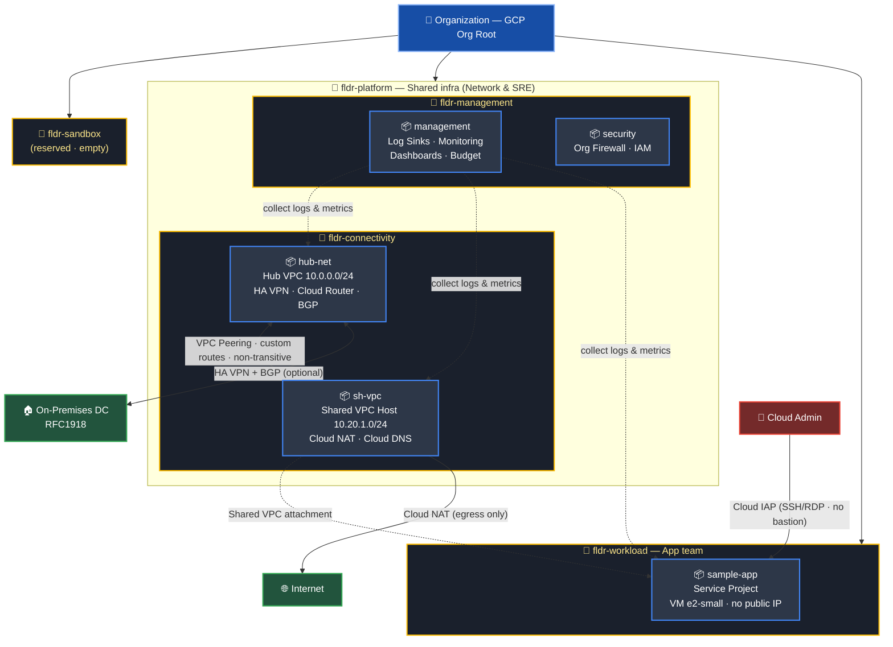

# Ảnh 1 — Tổng thể Landing Zone (Hero)

```mermaid
flowchart TD
    classDef org fill:#174ea6,stroke:#8ab4f8,stroke-width:2px,color:#fff;
    classDef folder fill:#1a202c,stroke:#fbbc04,stroke-width:2px,color:#fde68a;
    classDef proj fill:#2d3748,stroke:#4285F4,stroke-width:2px,color:#fff;
    classDef ext fill:#22543d,stroke:#34A853,stroke-width:2px,color:#fff;
    classDef actor fill:#742a2a,stroke:#EA4335,stroke-width:2px,color:#fff;

    ORG["🏢 Organization — GCP Org Root"]:::org

    subgraph PLATFORM["📁 fldr-platform — Shared infra (Network &amp; SRE)"]
      direction TB
      subgraph CONN["📁 fldr-connectivity"]
        HUB["📦 hub-net<br/>Hub VPC 10.0.0.0/24<br/>HA VPN · Cloud Router · BGP"]:::proj
        SHV["📦 sh-vpc<br/>Shared VPC Host 10.20.1.0/24<br/>Cloud NAT · Cloud DNS"]:::proj
      end
      subgraph MGMTF["📁 fldr-management"]
        MGMT["📦 management<br/>Log Sinks · Monitoring<br/>Dashboards · Budget"]:::proj
        SEC["📦 security<br/>Org Firewall · IAM"]:::proj
      end
    end

    subgraph WORK["📁 fldr-workload — App team"]
      APP["📦 sample-app<br/>Service Project<br/>VM e2-small · no public IP"]:::proj
    end

    SBX["📁 fldr-sandbox<br/>(reserved · empty)"]:::folder

    ONP["🏠 On-Premises DC<br/>RFC1918"]:::ext
    NET["🌐 Internet"]:::ext
    ADM["👤 Cloud Admin"]:::actor

    ORG --> PLATFORM
    ORG --> WORK
    ORG --> SBX

    HUB <-->|"VPC Peering · custom routes · non-transitive"| SHV
    SHV -.->|"Shared VPC attachment"| APP
    HUB <-->|"HA VPN + BGP (optional)"| ONP
    SHV -->|"Cloud NAT (egress only)"| NET
    ADM -->|"Cloud IAP (SSH/RDP · no bastion)"| APP
    MGMT -.->|"collect logs &amp; metrics"| HUB
    MGMT -.->|"collect logs &amp; metrics"| SHV
    MGMT -.->|"collect logs &amp; metrics"| APP

    class CONN,MGMTF,WORK folder;
```
