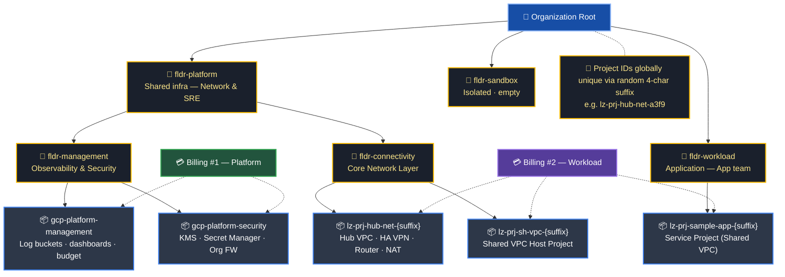

# Ảnh 2 — Resource Hierarchy + Billing Split

```mermaid
flowchart TD
    classDef root fill:#174ea6,stroke:#8ab4f8,stroke-width:2px,color:#fff;
    classDef folder fill:#1a202c,stroke:#fbbc04,stroke-width:2px,color:#fde68a;
    classDef proj fill:#2d3748,stroke:#4285F4,stroke-width:2px,color:#fff;
    classDef bill1 fill:#22543d,stroke:#34A853,stroke-width:2px,color:#fff;
    classDef bill2 fill:#553c9a,stroke:#9f7aea,stroke-width:2px,color:#fff;

    ROOT["🏢 Organization Root"]:::root

    PLAT["📁 fldr-platform<br/>Shared infra — Network &amp; SRE"]:::folder
    MGF["📁 fldr-management<br/>Observability &amp; Security"]:::folder
    CNF["📁 fldr-connectivity<br/>Core Network Layer"]:::folder
    WKF["📁 fldr-workload<br/>Application — App team"]:::folder
    SBF["📁 fldr-sandbox<br/>Isolated · empty"]:::folder

    PM["📦 gcp-platform-management<br/>Log buckets · dashboards · budget"]:::proj
    PS["📦 gcp-platform-security<br/>KMS · Secret Manager · Org FW"]:::proj
    HN["📦 lz-prj-hub-net-{suffix}<br/>Hub VPC · HA VPN · Router · NAT"]:::proj
    SV["📦 lz-prj-sh-vpc-{suffix}<br/>Shared VPC Host Project"]:::proj
    SA["📦 lz-prj-sample-app-{suffix}<br/>Service Project (Shared VPC)"]:::proj

    ROOT --> PLAT
    ROOT --> WKF
    ROOT --> SBF
    PLAT --> MGF
    PLAT --> CNF
    MGF --> PM
    MGF --> PS
    CNF --> HN
    CNF --> SV
    WKF --> SA

    B1["💳 Billing #1 — Platform"]:::bill1
    B2["💳 Billing #2 — Workload"]:::bill2
    B1 -.-> PM
    B1 -.-> PS
    B2 -.-> HN
    B2 -.-> SV
    B2 -.-> SA

    NOTE["🔑 Project IDs globally unique via random 4-char suffix<br/>e.g. lz-prj-hub-net-a3f9"]:::folder
    ROOT -.- NOTE
```
