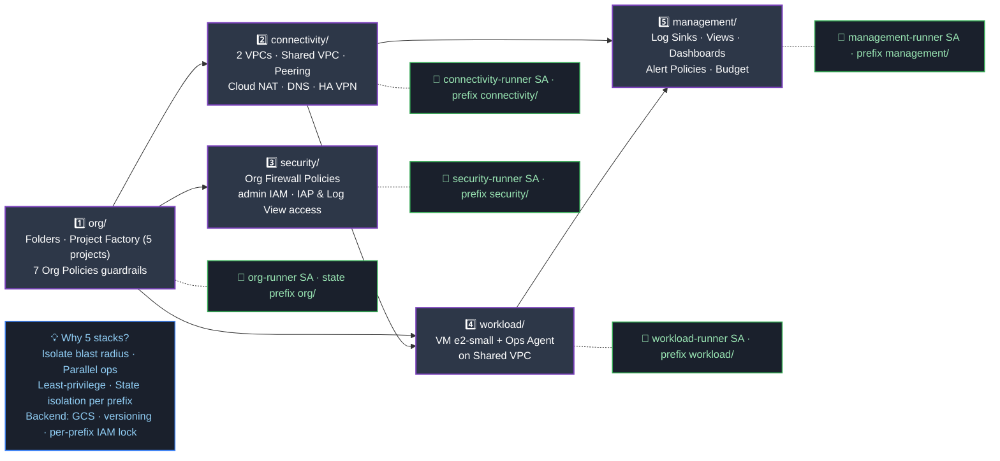

# Ảnh 3 — 5 Lớp Stack & thứ tự apply

```mermaid
flowchart LR
    classDef stack fill:#2d3748,stroke:#7B42BC,stroke-width:2px,color:#fff;
    classDef sa fill:#1a202c,stroke:#34A853,stroke-width:1.5px,color:#9ae6b4;
    classDef note fill:#1a202c,stroke:#4285F4,stroke-width:1.5px,color:#90cdf4;

    A["1️⃣ org/<br/>Folders · Project Factory (5 projects)<br/>7 Org Policies guardrails"]:::stack
    B["2️⃣ connectivity/<br/>2 VPCs · Shared VPC · Peering<br/>Cloud NAT · DNS · HA VPN"]:::stack
    C["3️⃣ security/<br/>Org Firewall Policies<br/>admin IAM · IAP &amp; Log View access"]:::stack
    D["4️⃣ workload/<br/>VM e2-small + Ops Agent<br/>on Shared VPC"]:::stack
    E["5️⃣ management/<br/>Log Sinks · Views · Dashboards<br/>Alert Policies · Budget"]:::stack

    A --> B
    A --> C
    A --> D
    B --> D
    B --> E
    D --> E

    SAA["🔑 org-runner SA · state prefix org/"]:::sa
    SAB["🔑 connectivity-runner SA · prefix connectivity/"]:::sa
    SAC["🔑 security-runner SA · prefix security/"]:::sa
    SAD["🔑 workload-runner SA · prefix workload/"]:::sa
    SAE["🔑 management-runner SA · prefix management/"]:::sa
    A -.- SAA
    B -.- SAB
    C -.- SAC
    D -.- SAD
    E -.- SAE

    WHY["💡 Why 5 stacks?<br/>Isolate blast radius · Parallel ops<br/>Least-privilege · State isolation per prefix<br/>Backend: GCS · versioning · per-prefix IAM lock"]:::note
```
