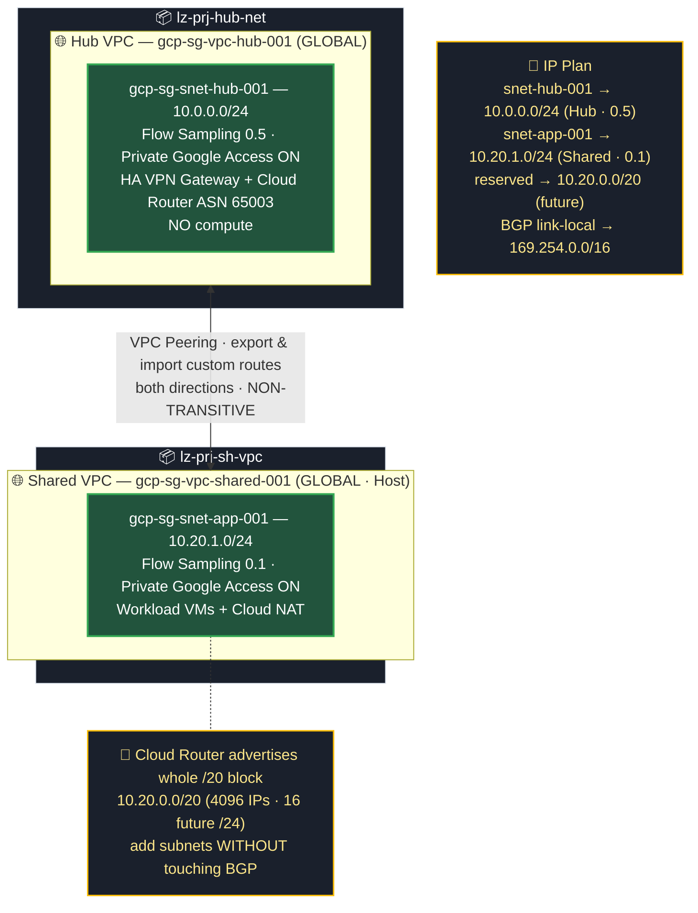

# Ảnh 4 — Hub-and-Spoke + IPAM

```mermaid
flowchart TD
    classDef proj fill:#1a202c,stroke:#e2e8f0,stroke-width:1px,color:#fff;
    classDef vpc fill:#2d3748,stroke:#4285F4,stroke-width:2px,color:#fff;
    classDef snet fill:#22543d,stroke:#34A853,stroke-width:2px,color:#fff;
    classDef note fill:#1a202c,stroke:#fbbc04,stroke-width:1.5px,color:#fde68a;

    subgraph HUBP["📦 lz-prj-hub-net"]
      subgraph HVPC["🌐 Hub VPC — gcp-sg-vpc-hub-001 (GLOBAL)"]
        HSN["gcp-sg-snet-hub-001 — 10.0.0.0/24<br/>Flow Sampling 0.5 · Private Google Access ON<br/>HA VPN Gateway + Cloud Router ASN 65003<br/>NO compute"]:::snet
      end
    end
    class HUBP proj
    class HVPC vpc

    subgraph SHP["📦 lz-prj-sh-vpc"]
      subgraph SVPC["🌐 Shared VPC — gcp-sg-vpc-shared-001 (GLOBAL · Host)"]
        SSN["gcp-sg-snet-app-001 — 10.20.1.0/24<br/>Flow Sampling 0.1 · Private Google Access ON<br/>Workload VMs + Cloud NAT"]:::snet
      end
    end
    class SHP proj
    class SVPC vpc

    HVPC <-->|"VPC Peering · export &amp; import custom routes<br/>both directions · NON-TRANSITIVE"| SVPC

    ADV["📢 Cloud Router advertises whole /20 block<br/>10.20.0.0/20 (4096 IPs · 16 future /24)<br/>add subnets WITHOUT touching BGP"]:::note
    SSN -.- ADV

    IPAM["🔢 IP Plan<br/>snet-hub-001 → 10.0.0.0/24 (Hub · 0.5)<br/>snet-app-001 → 10.20.1.0/24 (Shared · 0.1)<br/>reserved → 10.20.0.0/20 (future)<br/>BGP link-local → 169.254.0.0/16"]:::note
```
