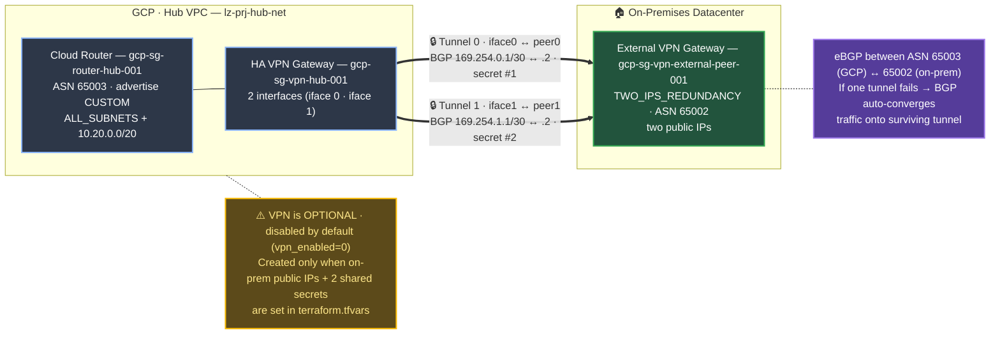

# Ảnh 5 — HA VPN + BGP (định tuyến động)

```mermaid
flowchart LR
    classDef gcp fill:#1a202c,stroke:#4285F4,stroke-width:2px,color:#fff;
    classDef comp fill:#2d3748,stroke:#8ab4f8,stroke-width:2px,color:#fff;
    classDef onp fill:#22543d,stroke:#34A853,stroke-width:2px,color:#fff;
    classDef tun fill:#553c9a,stroke:#9f7aea,stroke-width:2px,color:#fff;
    classDef warn fill:#5c4a1a,stroke:#fbbc04,stroke-width:2px,color:#fde68a;

    subgraph GCP["GCP · Hub VPC — lz-prj-hub-net"]
      direction TB
      ROUTER["Cloud Router — gcp-sg-router-hub-001<br/>ASN 65003 · advertise CUSTOM<br/>ALL_SUBNETS + 10.20.0.0/20"]:::comp
      GW["HA VPN Gateway — gcp-sg-vpn-hub-001<br/>2 interfaces (iface 0 · iface 1)"]:::comp
      ROUTER --- GW
    end
    class GCP gcp

    subgraph ONP["🏠 On-Premises Datacenter"]
      PEER["External VPN Gateway — gcp-sg-vpn-external-peer-001<br/>TWO_IPS_REDUNDANCY · ASN 65002<br/>two public IPs"]:::onp
    end

    GW ==>|"🔒 Tunnel 0 · iface0 ↔ peer0<br/>BGP 169.254.0.1/30 ↔ .2 · secret #1"| PEER
    GW ==>|"🔒 Tunnel 1 · iface1 ↔ peer1<br/>BGP 169.254.1.1/30 ↔ .2 · secret #2"| PEER

    BGP["eBGP between ASN 65003 (GCP) ↔ 65002 (on-prem)<br/>If one tunnel fails → BGP auto-converges<br/>traffic onto surviving tunnel"]:::tun
    PEER -.- BGP

    WARN["⚠️ VPN is OPTIONAL · disabled by default (vpn_enabled=0)<br/>Created only when on-prem public IPs + 2 shared secrets<br/>are set in terraform.tfvars"]:::warn
    GCP -.- WARN
```
