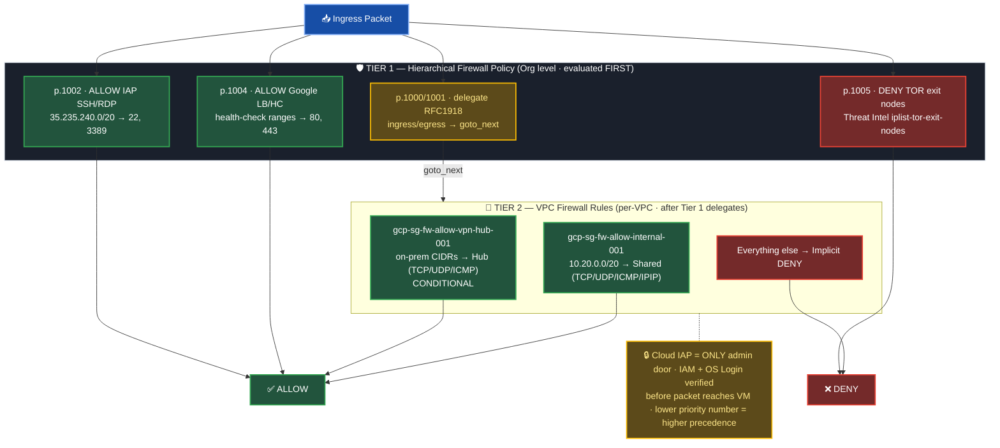

# Ảnh 6 — Firewall hai tầng (Defense in Depth)

```mermaid
flowchart TD
    classDef pkt fill:#174ea6,stroke:#8ab4f8,stroke-width:2px,color:#fff;
    classDef tier fill:#1a202c,stroke:#e2e8f0,stroke-width:1.5px,color:#fff;
    classDef allow fill:#22543d,stroke:#34A853,stroke-width:2px,color:#fff;
    classDef deny fill:#742a2a,stroke:#EA4335,stroke-width:2px,color:#fff;
    classDef goto fill:#5c4a1a,stroke:#fbbc04,stroke-width:2px,color:#fde68a;

    IN["📥 Ingress Packet"]:::pkt

    subgraph T1["🛡️ TIER 1 — Hierarchical Firewall Policy (Org level · evaluated FIRST)"]
      R1000["p.1000/1001 · delegate RFC1918<br/>ingress/egress → goto_next"]:::goto
      R1002["p.1002 · ALLOW IAP SSH/RDP<br/>35.235.240.0/20 → 22, 3389"]:::allow
      R1004["p.1004 · ALLOW Google LB/HC<br/>health-check ranges → 80, 443"]:::allow
      R1005["p.1005 · DENY TOR exit nodes<br/>Threat Intel iplist-tor-exit-nodes"]:::deny
    end
    class T1 tier

    subgraph T2["🧱 TIER 2 — VPC Firewall Rules (per-VPC · after Tier 1 delegates)"]
      F1["gcp-sg-fw-allow-vpn-hub-001<br/>on-prem CIDRs → Hub (TCP/UDP/ICMP)<br/>CONDITIONAL"]:::allow
      F2["gcp-sg-fw-allow-internal-001<br/>10.20.0.0/20 → Shared (TCP/UDP/ICMP/IPIP)"]:::allow
      F3["Everything else → Implicit DENY"]:::deny
    end
    class T2 tier

    IN --> R1000
    IN --> R1002
    IN --> R1004
    IN --> R1005
    R1000 -->|"goto_next"| T2
    R1002 --> AOK["✅ ALLOW"]:::allow
    R1004 --> AOK
    R1005 --> DNO["❌ DENY"]:::deny
    F1 --> AOK
    F2 --> AOK
    F3 --> DNO

    NOTE["🔒 Cloud IAP = ONLY admin door · IAM + OS Login verified<br/>before packet reaches VM · lower priority number = higher precedence"]:::goto
    T2 -.- NOTE
```
