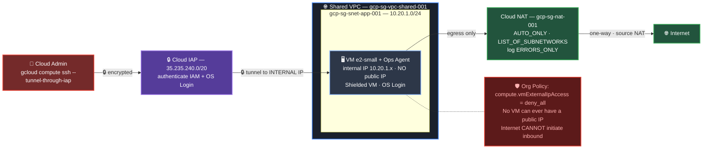

# Ảnh 7 — Zero External IP: Egress & Ingress

```mermaid
flowchart LR
    classDef vpc fill:#1a202c,stroke:#4285F4,stroke-width:2px,color:#fff;
    classDef vm fill:#2d3748,stroke:#8ab4f8,stroke-width:2px,color:#fff;
    classDef ext fill:#22543d,stroke:#34A853,stroke-width:2px,color:#fff;
    classDef actor fill:#742a2a,stroke:#EA4335,stroke-width:2px,color:#fff;
    classDef guard fill:#5c1a1a,stroke:#EA4335,stroke-width:2px,color:#feb2b2;
    classDef iap fill:#553c9a,stroke:#9f7aea,stroke-width:2px,color:#fff;

    ADM["👤 Cloud Admin<br/>gcloud compute ssh --tunnel-through-iap"]:::actor
    IAP["🔒 Cloud IAP — 35.235.240.0/20<br/>authenticate IAM + OS Login"]:::iap

    subgraph SVPC["🌐 Shared VPC — gcp-sg-vpc-shared-001"]
      subgraph SN["gcp-sg-snet-app-001 — 10.20.1.0/24"]
        VM["🖥️ VM e2-small + Ops Agent<br/>internal IP 10.20.1.x · NO public IP<br/>Shielded VM · OS Login"]:::vm
      end
    end
    class SVPC vpc

    NAT["Cloud NAT — gcp-sg-nat-001<br/>AUTO_ONLY · LIST_OF_SUBNETWORKS<br/>log ERRORS_ONLY"]:::ext
    NET["🌐 Internet"]:::ext

    ADM -->|"🔒 encrypted"| IAP
    IAP -->|"🔒 tunnel to INTERNAL IP"| VM
    VM -->|"egress only"| NAT
    NAT -->|"one-way · source NAT"| NET

    GUARD["🛡️ Org Policy: compute.vmExternalIpAccess = deny_all<br/>No VM can ever have a public IP<br/>Internet CANNOT initiate inbound"]:::guard
    VM -.- GUARD
```
