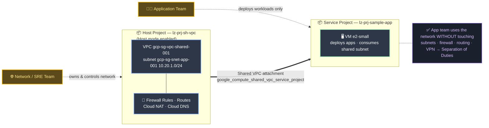

# Ảnh 8 — Shared VPC: Host vs Service Project (Separation of Duties)

```mermaid
flowchart LR
    classDef host fill:#1a202c,stroke:#4285F4,stroke-width:2px,color:#fff;
    classDef svc fill:#1a202c,stroke:#34A853,stroke-width:2px,color:#fff;
    classDef net fill:#2d3748,stroke:#8ab4f8,stroke-width:2px,color:#fff;
    classDef vm fill:#2d3748,stroke:#9ae6b4,stroke-width:2px,color:#fff;
    classDef team fill:#5c4a1a,stroke:#fbbc04,stroke-width:2px,color:#fde68a;
    classDef note fill:#1a202c,stroke:#9f7aea,stroke-width:1.5px,color:#d6bcfa;

    T1["🌐 Network / SRE Team"]:::team
    T2["🧑‍💻 Application Team"]:::team

    subgraph HOST["📦 Host Project — lz-prj-sh-vpc<br/>(Host mode enabled)"]
      direction TB
      VPC["VPC gcp-sg-vpc-shared-001<br/>subnet gcp-sg-snet-app-001 10.20.1.0/24"]:::net
      EXTRA["🔧 Firewall Rules · Routes<br/>Cloud NAT · Cloud DNS"]:::net
      VPC --- EXTRA
    end
    class HOST host

    subgraph SVC["📦 Service Project — lz-prj-sample-app"]
      VM["🖥️ VM e2-small<br/>deploys apps · consumes shared subnet"]:::vm
    end
    class SVC svc

    T1 -.->|"owns &amp; controls network"| HOST
    T2 -.->|"deploys workloads only"| SVC
    HOST ==>|"Shared VPC attachment<br/>google_compute_shared_vpc_service_project"| SVC

    NOTE["✅ App team uses the network WITHOUT touching<br/>subnets · firewall · routing · VPN → Separation of Duties"]:::note
    SVC -.- NOTE
```
