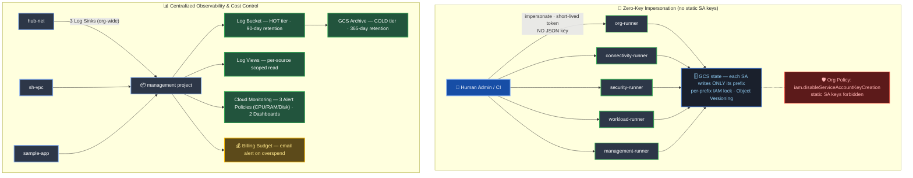

# Ảnh 9 — Zero-Key Impersonation + Centralized Observability

```mermaid
flowchart TD
    classDef actor fill:#174ea6,stroke:#8ab4f8,stroke-width:2px,color:#fff;
    classDef sa fill:#2d3748,stroke:#34A853,stroke-width:2px,color:#fff;
    classDef state fill:#1a202c,stroke:#4285F4,stroke-width:1.5px,color:#90cdf4;
    classDef guard fill:#5c1a1a,stroke:#EA4335,stroke-width:2px,color:#feb2b2;
    classDef proj fill:#2d3748,stroke:#8ab4f8,stroke-width:2px,color:#fff;
    classDef pipe fill:#22543d,stroke:#34A853,stroke-width:2px,color:#fff;
    classDef budget fill:#5c4a1a,stroke:#fbbc04,stroke-width:2px,color:#fde68a;

    subgraph LEFT["🔐 Zero-Key Impersonation (no static SA keys)"]
      ADM["👤 Human Admin / CI"]:::actor
      S1["org-runner"]:::sa
      S2["connectivity-runner"]:::sa
      S3["security-runner"]:::sa
      S4["workload-runner"]:::sa
      S5["management-runner"]:::sa
      ST["🗄️ GCS state — each SA writes ONLY its prefix<br/>per-prefix IAM lock · Object Versioning"]:::state
      ADM -->|"impersonate · short-lived token<br/>NO JSON key"| S1
      ADM --> S2
      ADM --> S3
      ADM --> S4
      ADM --> S5
      S1 --> ST
      S2 --> ST
      S3 --> ST
      S4 --> ST
      S5 --> ST
      POL["🛡️ Org Policy: iam.disableServiceAccountKeyCreation<br/>static SA keys forbidden"]:::guard
      ST -.- POL
    end

    subgraph RIGHT["📊 Centralized Observability &amp; Cost Control"]
      P1["hub-net"]:::proj
      P2["sh-vpc"]:::proj
      P3["sample-app"]:::proj
      MG["📦 management project"]:::proj
      HOT["Log Bucket — HOT tier · 90-day retention"]:::pipe
      COLD["GCS Archive — COLD tier · 365-day retention"]:::pipe
      VIEWS["Log Views — per-source scoped read"]:::pipe
      MON["Cloud Monitoring — 3 Alert Policies (CPU/RAM/Disk) · 2 Dashboards"]:::pipe
      BUD["💰 Billing Budget — email alert on overspend"]:::budget
      P1 -->|"3 Log Sinks (org-wide)"| MG
      P2 --> MG
      P3 --> MG
      MG --> HOT
      HOT --> COLD
      MG --> VIEWS
      MG --> MON
      MG --> BUD
    end
```
