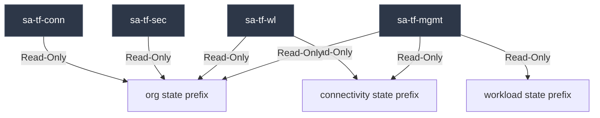

# 🔑 GCP Landing Zone — IAM & Impersonation Design Guide

This document describes the identity design, the dynamic impersonation model (no static key files), and the state file prefix isolation rules.

---

## 👥 1. The Zero-Key IaC Model

To achieve compliance with modern security frameworks (like CIS Benchmarks), this landing zone operates on a **zero static key file policy**:

```
[Personal User Identity] --(Authenticate via CLI)--> [gcloud Credential Store]
                                                            │
                                                     (Impersonate)
                                                            ▼
                                                [TF Runner Service Account]
                                                            │
                                                    (Short-Lived Token)
                                                            ▼
                                                 [Terraform IaC Actions]
```

- **No Static Keys**: There are no JSON credential keys saved in repositories, workspaces, or local computers.
- **Service Account Impersonation**: Users authenticate locally with `gcloud auth login`. When executing Terraform commands, the providers dynamically assume the role of the target Service Account using the `roles/iam.serviceAccountTokenCreator` permission.
- **Enhanced Audit Trail**: Every action in the GCP activity log is tied to the active service account *and* records the identity of the administrator who initiated the impersonation.

---

## 🏗️ 2. TF Runner Service Accounts (IaC Operations)

Infrastructure stacks are segregated into five operational layers. Each layer runs under its own designated runner Service Account located in the **Seed Project** (`gcp-platform-bootstrap-001`):

| Service Account | Managed Stack | Owner Group | Key Permissions |
| :--- | :--- | :--- | :--- |
| **`sa-tf-org-001`** | `org/` | Foundation Admins | Org Level: `resourcemanager.organizationAdmin`, `projectCreator`, `serviceusage.serviceUsageAdmin`, `orgpolicy.policyAdmin`. Billing: `billing.user` (all accounts). |
| **`sa-tf-conn-001`** | `connectivity/` | Network Operations | Org Level: `compute.xpnAdmin`. Folder Level (Platform + Workloads): `compute.networkAdmin`, `dns.admin`. |
| **`sa-tf-sec-001`** | `security/` | Security Ops | Org Level: `resourcemanager.organizationAdmin`, `compute.orgFirewallPolicyAdmin`. Management Project: `resourcemanager.projectIamAdmin`. |
| **`sa-tf-wl-001`** | `workload/` | Application Engineers | Workload Project (`lz-prj-astronomy-shop`): `compute.instanceAdmin.v1`. SA Scope: `iam.serviceAccountUser` on workload runtime SAs. |
| **`sa-tf-mgmt-001`** | `management/` | SRE Platform Team | Org Level: `logging.admin`. Management Project: `monitoring.admin`, `logging.admin`, `storage.admin`, `resourcemanager.projectIamAdmin`. Billing: `billing.costsManager`. |

---

## 🔒 3. State File Isolation via GCS IAM Conditions

To enforce a strict separation of duties, runner Service Accounts can only read or write to their specific GCS state paths. This is implemented using **Common Expression Language (CEL)** conditions on GCS bucket policies:

### 3.1 State Modification (`roles/storage.objectAdmin`)
- `sa-tf-org` can only modify `terraform/org/`
- `sa-tf-conn` can only modify `terraform/connectivity/`
- `sa-tf-sec` can only modify `terraform/security/`
- `sa-tf-wl` can only modify `terraform/workload/`
- `sa-tf-mgmt` can only modify `terraform/management/`

### 3.2 Read-Only Upstream Access (`roles/storage.objectViewer`)
To support cross-stack output consumption via `terraform_remote_state` data sources, downstream runners are granted read-only permissions on upstream state paths:



> [!WARNING]  
> If an SRE attempt to modify a state path outside their designated prefix, GCS will immediately return an Access Denied error, securing your environment state from accidental overwrites.
