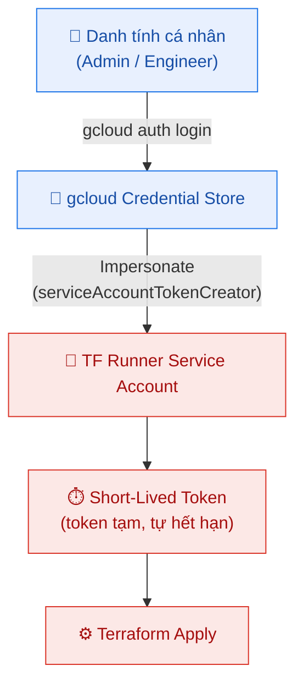
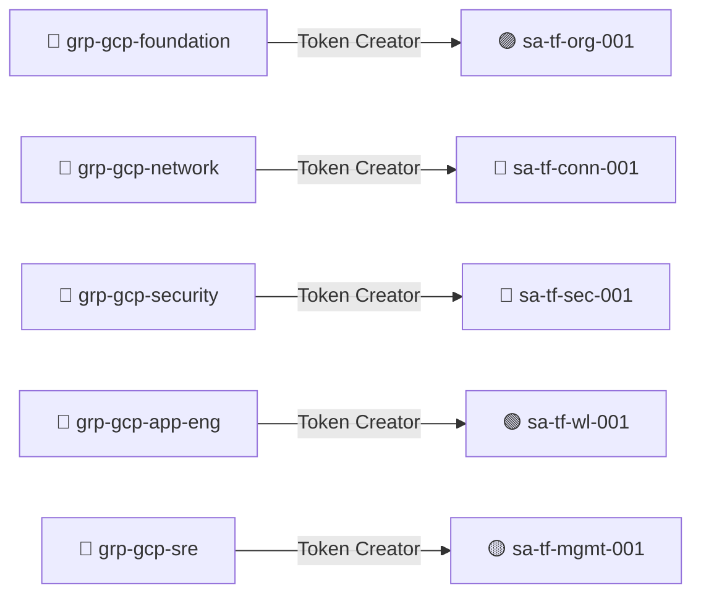
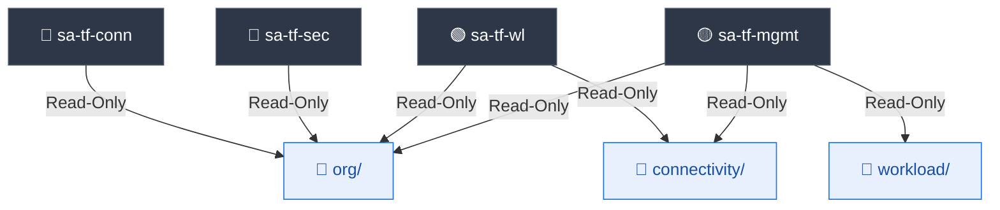

<div align="center">

# 🔑 IAM & Mô hình Danh tính

### *Thiết kế danh tính, cơ chế Impersonation không key tĩnh và cô lập State file*

<br>

🔐 **Zero-Key Impersonation** &nbsp;•&nbsp; 👥 **5 Runner SA tách biệt** &nbsp;•&nbsp; 🧱 **State Isolation theo prefix**

</div>

---

## 📌 Mục lục

- [💡 Triết lý thiết kế](#-triết-lý-thiết-kế)
- [🛡️ Mô hình IaC không key tĩnh (Zero-Key)](#️-mô-hình-iac-không-key-tĩnh-zero-key)
- [🏗️ 5 Terraform Runner Service Account](#️-5-terraform-runner-service-account)
- [👥 Ai được Impersonate SA nào?](#-ai-được-impersonate-sa-nào)
- [📜 Bảng phân quyền chi tiết](#-bảng-phân-quyền-chi-tiết)
- [🔒 Cô lập State file qua IAM Conditions](#-cô-lập-state-file-qua-iam-conditions)
- [👤 Quyền cho Quản trị viên (Human Identity)](#-quyền-cho-quản-trị-viên-human-identity)
- [🤖 Runtime SA cho Workload](#-runtime-sa-cho-workload)
- [⚙️ Quản lý phân quyền ở đâu?](#️-quản-lý-phân-quyền-ở-đâu)

---

## 💡 Triết lý thiết kế

Mô hình IAM của Landing Zone được xây dựng quanh ba nguyên tắc cốt lõi:

| Nguyên tắc | Ý nghĩa thực tiễn |
|:-----------|:------------------|
| 🚫 **Zero Static Key** | Không có bất kỳ file SA Key JSON nào được ghi ra đĩa, lưu trong repo hay máy cá nhân. |
| 🎭 **Impersonation** | Con người đăng nhập bằng danh tính cá nhân, rồi *mượn quyền* (impersonate) Service Account để chạy Terraform. |
| 🧩 **Separation of Duties** | Mỗi stack có một Runner SA riêng, chỉ chạm được đúng phạm vi của mình — cô lập bán kính ảnh hưởng (blast radius). |

---

## 🛡️ Mô hình IaC không key tĩnh (Zero-Key)

Để tuân thủ các khung bảo mật hiện đại (CIS Benchmarks, Google Cloud Architecture Framework), toàn bộ landing zone vận hành theo **chính sách không key tĩnh tuyệt đối**:



| Đặc tính | Mô tả |
|:---------|:------|
| 🚫 **Không key tĩnh** | Không có JSON credential nào trong repo, workspace hay máy local. |
| 🎭 **SA Impersonation** | Provider Terraform tự động mượn quyền SA đích nhờ `roles/iam.serviceAccountTokenCreator`. |
| 🔍 **Audit Trail kép** | Mỗi hành động trong Cloud Audit Log gắn với *cả* Service Account *lẫn* danh tính người đã khởi tạo phiên impersonation. |
| 🛡️ **Org Policy gia cố** | Chính sách `iam.disableServiceAccountKeyCreation` chặn tạo SA Key ngay từ gốc tổ chức. |

> [!TIP]
> Vì token là ngắn hạn và tự hết hạn, kể cả khi phiên làm việc bị lộ thì kẻ tấn công cũng không có credential dài hạn để tái sử dụng.

---

## 🏗️ 5 Terraform Runner Service Account

Hạ tầng được chia thành **5 lớp stack độc lập**. Mỗi lớp chạy dưới một Runner Service Account riêng, tất cả đều đặt trong **Seed Project** (`gcp-platform-bootstrap-001`):

| Service Account | Stack quản lý | Đội sở hữu | Phạm vi quyền chính |
|:----------------|:-------------:|:-----------|:--------------------|
| 🟣 **`sa-tf-org-001`** | [`org/`](../org/) | Foundation Admins | **Org:** `organizationAdmin`, `projectCreator`, `serviceUsageAdmin`, `orgpolicy.policyAdmin` · **Billing:** `billing.user` (cả 2 account) |
| 🔵 **`sa-tf-conn-001`** | [`connectivity/`](../connectivity/) | Network Ops | **Org:** `compute.xpnAdmin`, `compute.networkAdmin`, `dns.admin` |
| 🔴 **`sa-tf-sec-001`** | [`security/`](../security/) | Security Ops | **Org:** `organizationAdmin`, `compute.orgFirewallPolicyAdmin` · **Project (mgmt):** `projectIamAdmin` |
| 🟢 **`sa-tf-wl-001`** | [`workload/`](../workload/) | App Engineers | **Project (sample-app):** `compute.instanceAdmin.v1` · `iam.serviceAccountUser` trên runtime SA |
| 🟡 **`sa-tf-mgmt-001`** | [`management/`](../management/) | SRE Platform | **Org:** `logging.admin` · **Project (mgmt):** `monitoring.admin`, `logging.admin`, `storage.admin`, `projectIamAdmin` · **Billing:** `billing.costsManager` |

---

## 👥 Ai được Impersonate SA nào?

Mỗi nhóm con người (Google Group) chỉ được cấp `serviceAccountTokenCreator` trên đúng Runner SA của đội mình — không ai có thể mượn quyền của stack khác.



| Google Group | Impersonate được | Stack |
|:-------------|:-----------------|:------|
| `grp-gcp-foundation` | `sa-tf-org-001` | org |
| `grp-gcp-network` | `sa-tf-conn-001` | connectivity |
| `grp-gcp-security` | `sa-tf-sec-001` | security |
| `grp-gcp-app-eng` | `sa-tf-wl-001` | workload |
| `grp-gcp-sre` | `sa-tf-mgmt-001` | management |

> [!NOTE]
> Ánh xạ Group ↔ SA được khai báo trong bảng `TOKEN_CREATOR_BINDINGS` tại [scripts/roles.sh](../scripts/roles.sh); địa chỉ email các group được cấu hình trong [scripts/config.sh](../scripts/config.sh).

---

## 📜 Bảng phân quyền chi tiết

Toàn bộ quyền được khai báo dưới dạng **dữ liệu thuần** trong [scripts/roles.sh](../scripts/roles.sh) và gán qua 3 script setup theo thứ tự.

### 🟣 Cấp Organization — `[1] ORG_ROLE_BINDINGS`

| Service Account | Roles |
|:----------------|:------|
| `sa-tf-org-001` | `resourcemanager.organizationAdmin`, `resourcemanager.projectCreator`, `serviceusage.serviceUsageAdmin`, `orgpolicy.policyAdmin` |
| `sa-tf-conn-001` | `compute.xpnAdmin`, `compute.networkAdmin`, `dns.admin` |
| `sa-tf-sec-001` | `resourcemanager.organizationAdmin`, `compute.orgFirewallPolicyAdmin` |
| `sa-tf-mgmt-001` | `logging.admin` |

> 🟢 `sa-tf-wl-001` **không có** role cấp org — chỉ nhận quyền ở cấp project (xem bảng J).

### 💳 Cấp Billing — `[2] BILLING_ROLE_BINDINGS`

| Billing Account | Service Account | Role |
|:----------------|:----------------|:-----|
| Account #1 (Platform & Security) | `sa-tf-org-001` | `billing.user` |
| Account #2 (Networking & Workload) | `sa-tf-org-001` | `billing.user` |

### 📦 Cấp Project — `[6] POSTORG_PROJECT_BINDINGS` *(gán sau khi apply `org/`)*

| Project | Service Account | Role | Mục đích |
|:--------|:----------------|:-----|:---------|
| `management` | `sa-tf-sec-001` | `resourcemanager.projectIamAdmin` | Set IAM cho Log View |
| `sample-app` | `sa-tf-wl-001` | `compute.instanceAdmin.v1` | Tạo VM workload |
| `management` | `sa-tf-mgmt-001` | `logging.admin` | Log Sinks / Buckets / Views |
| `management` | `sa-tf-mgmt-001` | `monitoring.admin` | Dashboards / Alert Policies |
| `management` | `sa-tf-mgmt-001` | `storage.admin` | GCS Archive bucket |
| `management` | `sa-tf-mgmt-001` | `resourcemanager.projectIamAdmin` | `bucketWriter` cho Sink |

### 💰 Billing bổ sung — `[7] POSTORG_BILLING_BINDINGS`

| Billing Account | Service Account | Role |
|:----------------|:----------------|:-----|
| Budget Account | `sa-tf-mgmt-001` | `billing.costsManager` |

---

## 🔒 Cô lập State file qua IAM Conditions

Để thực thi nghiêm ngặt **Separation of Duties**, mỗi Runner SA chỉ được đọc/ghi đúng prefix state của mình trên GCS bucket (`STATE_BUCKET`). Việc này dùng điều kiện **CEL (Common Expression Language)** gắn trên IAM binding của bucket.

### ✍️ Quyền GHI prefix của chính mình — `[4] STATE_OWN_BINDINGS`

Mỗi SA được cấp `roles/storage.objectAdmin` **chỉ trên** prefix tương ứng:

| Service Account | Prefix được ghi |
|:----------------|:----------------|
| `sa-tf-org-001` | `terraform/org/` |
| `sa-tf-conn-001` | `terraform/connectivity/` |
| `sa-tf-sec-001` | `terraform/security/` |
| `sa-tf-wl-001` | `terraform/workload/` |
| `sa-tf-mgmt-001` | `terraform/management/` |

### 👁️ Quyền ĐỌC prefix upstream — `[5] STATE_UPSTREAM_BINDINGS`

Để hỗ trợ tiêu thụ output liên-stack qua `terraform_remote_state`, các stack downstream được cấp `roles/storage.objectViewer` (chỉ đọc) trên state của các stack upstream:



| Service Account | Đọc được state của |
|:----------------|:-------------------|
| `sa-tf-conn-001` | `org` |
| `sa-tf-sec-001` | `org` |
| `sa-tf-wl-001` | `org`, `connectivity` |
| `sa-tf-mgmt-001` | `org`, `connectivity`, `workload` |

> [!WARNING]
> Nếu một SA cố ghi vào prefix nằm ngoài phạm vi được cấp, GCS lập tức trả về **Access Denied** — bảo vệ state của môi trường khỏi việc ghi đè nhầm lẫn.

---

## 👤 Quyền cho Quản trị viên (Human Identity)

Khác với Runner SA (phục vụ IaC), quyền cho **con người** được quản lý khai báo trong stack `security/` tại [security/iam.tf](../security/iam.tf), áp cho danh sách `admin_principals` (user hoặc group).

### 🏛️ Role cấp Organization

Mỗi principal trong `admin_principals` được cấp các role org-level sau (tích Descartes role × principal):

`organizationAdmin` · `billing.user` · `projectCreator` · `folderAdmin` · `iam.serviceAccountAdmin` · `compute.osLogin` · `monitoring.viewer` · `logging.privateLogViewer`

### 🚪 Truy cập VM qua Cloud IAP — *không Bastion, không IP Public*

Trên các project `sample-app`, `hub-net`, `sh-vpc`, mỗi admin được cấp:

| Role | Mục đích |
|:-----|:---------|
| `roles/iap.tunnelResourceAccessor` | Mở SSH tunnel qua IAP |
| `roles/compute.osAdminLogin` | Đăng nhập SSH với quyền admin (đi cùng OS Login) |

```bash
gcloud compute ssh <VM> \
  --project <PROJECT> \
  --zone asia-southeast1-b \
  --tunnel-through-iap
```

### 🔍 Log View phân quyền (có điều kiện CEL)

Admin được cấp `roles/logging.viewAccessor` **giới hạn** đúng vào log view `gcp-sg-logview-sample-app-001` trong project `management` — chỉ đọc đúng logs của nguồn được phép, không thấy logs các project khác.

---

## 🤖 Runtime SA cho Workload

Ngoài 5 Runner SA phục vụ IaC, dự án còn tạo các **Runtime Service Account** gắn vào VM/workload (Phase B — script [scripts/03-runtime-sa.sh](../scripts/03-runtime-sa.sh)):

| Nhóm | Account ID | Project | `actAs` | Vai trò |
|:-----|:-----------|:--------|:-------:|:--------|
| `app` | `gcp-sg-sa-sample-app-001` | sample-app | ✅ | Runtime SA cho workload Sample-app |
| `tools` | `gcp-sg-sa-hub-net-001` | hub-net | ❌ | Runtime SA cho hub-net |
| `tools` | `gcp-sg-sa-sh-vpc-001` | sh-vpc | ❌ | Runtime SA cho sh-vpc |

Mọi Runtime SA đều nhận **role cố định** tối thiểu để gửi telemetry:

- `roles/monitoring.metricWriter`
- `roles/logging.logWriter`

> [!NOTE]
> Cờ `actAs = yes` nghĩa là `sa-tf-wl-001` được cấp `iam.serviceAccountUser` để gắn (attach) Runtime SA đó vào VM khi tạo instance.

---

## ⚙️ Quản lý phân quyền ở đâu?

Toàn bộ ma trận phân quyền tách bạch **dữ liệu** và **logic** để dễ bảo trì:

| File | Vai trò |
|:-----|:--------|
| [scripts/config.sh](../scripts/config.sh) | Biến cấu hình: Org ID, Billing, Group email, Seed Project, email 5 Runner SA |
| [scripts/roles.sh](../scripts/roles.sh) | **Bảng dữ liệu phân quyền** — file duy nhất cần sửa khi thêm/bớt role |
| [scripts/lib.sh](../scripts/lib.sh) | Hàm tiện ích dùng chung |
| [scripts/01-bootstrap.sh](../scripts/01-bootstrap.sh) | Tạo SA, gán role Org/Billing, Token Creator, State bucket |
| [scripts/02-post-org-roles.sh](../scripts/02-post-org-roles.sh) | Gán role cấp Project/Billing **sau khi** apply `org/` |
| [scripts/03-runtime-sa.sh](../scripts/03-runtime-sa.sh) | Tạo Runtime SA cho VM/workload (Phase B) |
| [security/iam.tf](../security/iam.tf) | Quyền cấp cho con người (admin_principals): Org roles, IAP, Log View |

> [!TIP]
> Muốn thêm một role cho Runner SA? Chỉ cần thêm một dòng vào bảng tương ứng trong [scripts/roles.sh](../scripts/roles.sh) rồi chạy lại script — không cần đụng vào logic.
